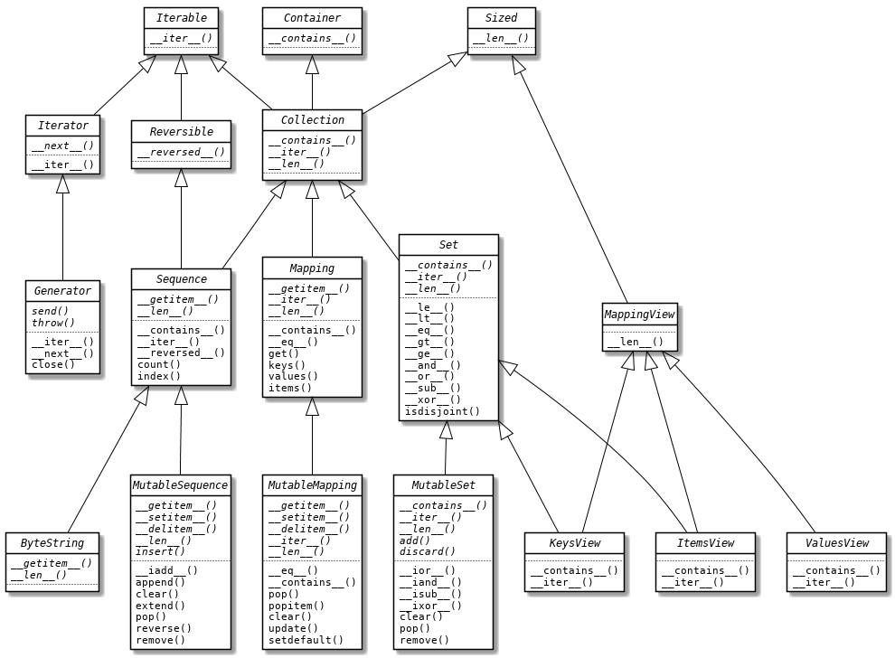

# 前言

在写该系列时我正在阅读《流畅的 Python》这本书，这本书作为 Python 进阶的必读书物确实名副其实，它不仅囊括了 Python 的诸多特性，包括一些 Python 独特的高级特性，更重要的是，它为我们展示了一种 Python 的设计理念，一种与我之前接触的 Java OOP 不尽相同的设计思想。在面向对象语言中，非常强调对象的类型，一切行为都是通过对象之间的相互协作完成的。Python 虽然也是一门面向对象语言，但它却将这种类型的限定模糊了，最为典型的就是 Python 中的“**鸭子类型**”：只要表现的像一个序列，就可以对它进行迭代操作。究其根本原因，是因为 Python 内置了许多特殊方法或称为魔法方法（magic methods），这种设计显然与 Java 纯面向对象截然不同。

总的来说，Python 是一门注重实用，专为程序员高效编码而生的语言，它有自己的设计风格，Python 程序员为这种风格取名为 “**Pythonic**”。我相信随着对这本书的深入阅读和更多 Python 的编码实践，我能够对这种风格以及 Python 的设计理念有一些更深的感悟。

代码已经托管到 Github 上，链接：https://github.com/s1mplecc/python-learning

本系列教程的工作环境：

- 系统版本：Mac OS 10.14
- 命令行工具：Terminal + Zsh
- 开发工具：PyCharm Professional 2020.3
- Python 版本：3.8.6

# 目录

* [第一章：准备工作](#%E7%AC%AC%E4%B8%80%E7%AB%A0%E5%87%86%E5%A4%87%E5%B7%A5%E4%BD%9C)
  * [环境准备](#%E7%8E%AF%E5%A2%83%E5%87%86%E5%A4%87)
  * [Python 编码规范](#python-%E7%BC%96%E7%A0%81%E8%A7%84%E8%8C%83)
  * [如何阅读 Python 源码](#%E5%A6%82%E4%BD%95%E9%98%85%E8%AF%BB-python-%E6%BA%90%E7%A0%81)
  * [单元测试](#%E5%8D%95%E5%85%83%E6%B5%8B%E8%AF%95)
* [第二章：语言特性](#%E7%AC%AC%E4%BA%8C%E7%AB%A0%E8%AF%AD%E8%A8%80%E7%89%B9%E6%80%A7)
  * [Python 是动态强类型语言](#python-%E6%98%AF%E5%8A%A8%E6%80%81%E5%BC%BA%E7%B1%BB%E5%9E%8B%E8%AF%AD%E8%A8%80)
  * [鸭子类型](#%E9%B8%AD%E5%AD%90%E7%B1%BB%E5%9E%8B)
  * [特殊方法](#%E7%89%B9%E6%AE%8A%E6%96%B9%E6%B3%95)
  * [运算符重载](#%E8%BF%90%E7%AE%97%E7%AC%A6%E9%87%8D%E8%BD%BD)
* [第三章：可迭代类型](#%E7%AC%AC%E4%B8%89%E7%AB%A0%E5%8F%AF%E8%BF%AD%E4%BB%A3%E7%B1%BB%E5%9E%8B)
  * [序列](#%E5%BA%8F%E5%88%97)
  * [map、filter 与列表推导](#mapfilter-%E4%B8%8E%E5%88%97%E8%A1%A8%E6%8E%A8%E5%AF%BC)
  * [可迭代对象、迭代器和生成器源码分析](#%E5%8F%AF%E8%BF%AD%E4%BB%A3%E5%AF%B9%E8%B1%A1%E8%BF%AD%E4%BB%A3%E5%99%A8%E5%92%8C%E7%94%9F%E6%88%90%E5%99%A8%E6%BA%90%E7%A0%81%E5%88%86%E6%9E%90)
  * [生成器](#%E7%94%9F%E6%88%90%E5%99%A8)
  * [itertools](#itertools)
* [第四章：函数](#%E7%AC%AC%E5%9B%9B%E7%AB%A0%E5%87%BD%E6%95%B0)
  * [函数是一等公民](#%E5%87%BD%E6%95%B0%E6%98%AF%E4%B8%80%E7%AD%89%E5%85%AC%E6%B0%91)
  * [闭包](#%E9%97%AD%E5%8C%85)
  * [装饰器](#%E8%A3%85%E9%A5%B0%E5%99%A8)
  * [可调用对象](#%E5%8F%AF%E8%B0%83%E7%94%A8%E5%AF%B9%E8%B1%A1)
  * [函数对象与方法对象](#%E5%87%BD%E6%95%B0%E5%AF%B9%E8%B1%A1%E4%B8%8E%E6%96%B9%E6%B3%95%E5%AF%B9%E8%B1%A1)
  * [函数的参数](#%E5%87%BD%E6%95%B0%E7%9A%84%E5%8F%82%E6%95%B0)
  * [lambda 表达式](#lambda-%E8%A1%A8%E8%BE%BE%E5%BC%8F)
  * [functools 模块](#functools-%E6%A8%A1%E5%9D%97)
* [第五章：类与元类](#%E7%AC%AC%E4%BA%94%E7%AB%A0%E7%B1%BB%E4%B8%8E%E5%85%83%E7%B1%BB)
  * [类的属性](#%E7%B1%BB%E7%9A%84%E5%B1%9E%E6%80%A7)
  * [特性](#%E7%89%B9%E6%80%A7)
  * [描述符](#%E6%8F%8F%E8%BF%B0%E7%AC%A6)
  * [元类](#%E5%85%83%E7%B1%BB)
* [第六章：面向对象](#%E7%AC%AC%E5%85%AD%E7%AB%A0%E9%9D%A2%E5%90%91%E5%AF%B9%E8%B1%A1)
  * [封装](#%E5%B0%81%E8%A3%85)
  * [抽象](#%E6%8A%BD%E8%B1%A1)
  * [继承](#%E7%BB%A7%E6%89%BF)
  * [多态](#%E5%A4%9A%E6%80%81)

# 第一章：准备工作

作为系列学习的开始，我一直在思考应当安排哪些内容，考虑到动手实践的重要性，最终我安排了以下这四个章节。**环境准备**，将引导你搭建一个自己的 Python 开发环境；**编码规范**以及**阅读源码**章节，我相信这对于任何语言的学习和实践都具有重要意义，阅读源码教会你拿到一份源码该如何下手，遵循编码规范则让你编写出令人赏心悦目的代码；以及最后的**单元测试**章节，我将其作为验证语言特性的最佳工具，也是作为特性学习的正式开始。

## 环境准备

### Python 版本

目前 Python 主要活跃的有 Python 2.x 和 Python 3.x 两个大版本，与 C++ 和 Java 这种向后兼容的语言不同，Python 的两个版本互不兼容。舍弃兼容性是一种设计上的取舍，在我看来 Python 这种尤为注重“简约”的语言，敢于大胆摒弃一些有设计缺陷的旧包袱，从而拥抱新特性的作风，未尝不是一种 Pythonic 的体现，很大程度上避免了走向像 C++ 一样越来越臃肿晦涩的道路。

Python 核心团队已于 2019 年正式宣布将在 2020 年停止对 Python 2 的更新，在此期间会对 Python 2 版本进行一些 bug 修复、安全增强以及移植等工作，以便使开发者顺利的从 Python 2 迁移到 Python 3。Python 2.7 是 2.x 系列的最后一个版本，官网上最新的 Python 2.7.18 版本发布于 2020 年 4 月 20 日。官方停止 Python 2 更新的主要动机是想进行 Python 3 的推广，以及同时维护两个版本给他们带来的工作负担。目前大部分 Python 开源项目已经兼容 Python 3 了，所以**强烈建议使用 Python 3 来开发新的项目**。

一般较新的 Linux 发行版已经预装了 Python 2 和 Python 3，如果没有，也可以通过各自的包管理器进行安装和更新。Mac OS 环境下可以通过 Homebrew 工具来安装 Python，可以附加 `@ + 版本号` 安装指定版本。在一般情况下（不手动修改软链接），命令行中的 `python` 通常是 python 2.7 或其旧版本的别名，`python3` 才指代 Python 3 版本，可以通过 `--version` 参数来查看安装的具体版本。由于两个版本互不兼容，在命令行运行 Python 脚本前需要先确定其所用的 Python 版本。

```sh
➜ brew install python  # brew install python@2.7
➜ python --version 
Python 2.7.10

➜ brew install python3  # brew install python@3.8
➜ python3 --version
Python 3.8.6
```

有时也需要在代码中，也就是**运行时确定 Python 版本**，此时用到的是内置的 sys 模块：

```python
>>> import sys
>>> print(sys.version)
3.8.6 (default, Oct  8 2020, 14:07:53) 
[Clang 11.0.0 (clang-1100.0.33.17)]
>>> print(sys.version_info)
sys.version_info(major=3, minor=8, micro=6, releaselevel='final', serial=0)
```

通常在运行时判断 Python 版本是为了达到较好的兼容性，这在 Python 的内置模块以及标准库中使用较多。由于 `version_info` 本身是个 tuple 类型，重载了比较运算符，所以可以像下面这样直接进行比较：

```python
# builtins.pyi
if sys.version_info >= (3, 9):
    from types import GenericAlias

# contextlib2.py
if sys.version_info[:2] >= (3, 4):
    _abc_ABC = abc.ABC
else:
    _abc_ABC = abc.ABCMeta('ABC', (object,), {'__slots__': ()})
```

上面的源码来自于两个不同的文件，阅读源码可以发现一些 Python 版本变更的内容。比如自 Python 3.9 引入的 GenericAlias 类型；而在 Python 3.4 之前继承抽象类时还得使用 ABCMeta 形式。

一般情况下，除非你开发的是供他人使用的第三方库，并不需要你在运行时显式判断版本。一方面是因为版本对于你是可控的，另一方面是因为如果滥用版本判断会降低代码的整洁性。如果不得不这么做，可以像内置模块 builtins.pyi 一样在存根文件中统一进行处理。

### 依赖管理

> **pip** - The Python Package Installer. You can use pip to install packages from the Python Package Index (PyPI) and other indexes.

[pip](https://pip.pypa.io/en/stable/) 是 Python 的包安装和管理工具，类似于 npm 之于 JavaScript。Python 3.x 以上的发行版本中都是自带 pip 的。在使用之前先确定 pip 的版本，Python 3 中的 pip 是 pip3 的别名，但如果安装了 Python 2 的 pip，那么在为 Python 3 项目安装依赖时请使用 pip3 命令，因为这两个命令会将依赖安装在不同的目录下。

```sh
➜ pip --version
pip 20.3.3 from /usr/local/lib/python3.8/site-packages/pip (python 3.8)
```

常见的 pip 命令使用可以查阅官方文档，或者 `pip -h` 查阅帮助文档。与 JavaScript 的 package.json 一样，Python 也提供了统一管理依赖的配置文件 **requirements.txt**。文件中可以指定依赖的版本号，如果缺省则默认安装最新依赖。

```
####### example-requirements.txt #######
beautifulsoup4              # Requirements without Version Specifiers
docopt == 0.6.1             # Version Matching. Must be version 0.6.1
keyring >= 4.1.1            # Minimum version 4.1.1
coverage != 3.5             # Version Exclusion. Anything except version 3.5
Mopidy-Dirble ~= 1.1        # Compatible release. Same as >= 1.1, == 1.*
```

使用 `-r` 参数指定通过 requirements.txt 文件安装依赖：

```sh
pip install -r requirements.txt
```

有时我们需要进行项目迁移，比如将本地项目部署至服务器，为了保证重新安装依赖时不影响项目的正常运行，可以使用 freeze 指令将所需的依赖和具体版本号写入 requirements.txt 文件中，再一次性安装所有依赖。

```sh
➜ pip freeze > requirements.txt
➜ cat requirements.txt 
certifi==2020.11.8
matplotlib==3.3.2
numpy==1.19.4
six==1.15.0
```

### 环境隔离

在 JavaScript 中，使用 npm 安装依赖会在当前目录下生成一个 node_modules 文件夹，依赖会被安装在这个文件夹中。除非指定 `-g` 或 `--global` 参数，将会在全局环境中安装依赖，在 Mac OS 或 Linux 系统中一般会被安装到 `/usr/local/lib/node_modules` 目录下。这样做的好处是将全局环境与局部环境隔离，避免依赖冲突，尤其是两个项目依赖同一个库的不同版本时。

Python 中也有类似的问题，《Effective Python -- 编写高质量Python代码的59个有效方法》一书中的协作开发章节就提到：**使用虚拟环境隔离项目**。问题在于，通过 pip 命令安装的依赖是全局性的，这意味着这些安装好的模块可能会影响系统内的所有 Python 程序。全局依赖会被安装在特定 Python 版本的目录下，如 `/usr/local/lib/python3.8/site-packages`，对于使用 Python 3.8 的所有项目来说依赖是共享的。

为此，Python 提供了一种解决方案，类似于 JavaScript 的局部环境，隔离出一个单独的 Python 局部环境，这种方案的典型就是 venv。

#### venv

> **venv** (for Python 3) and **virtualenv** (for Python 2) allow you to manage separate package installations for different projects. If you are using Python 3.3 or newer, the venv module is the preferred way to create and manage virtual environments. venv is included in the Python standard library and requires no additional installation.

从 Python 2.7 开始，Python 社区开发了一些较底层的创建**虚拟环境**（virtual environment）的工具，在 Python 2.7 中这个工具叫做 virtualenv，这是一个三方工具，需要使用 pip 安装。而《Effective Python》一书中提到的工具 pyvenv 是 Python 3.3 所引入的，但由于一些缺陷在 Python 3.6 中已被弃用。取而代之的是 Python 3.5 引入的内置模块 venv，可以通过 `python3 -m venv` 使用这个命令。

[官方文档](https://packaging.python.org/guides/installing-using-pip-and-virtual-environments/#creating-a-virtual-environment)中已经明确给出建议，如果使用的是 Python 3.3 及以后的版本，更加推荐使用 venv 去管理你的虚拟环境。下面我们扼要的介绍一下 venv 命令的使用方式。

首先创建一个空项目 myproject，在该目录下执行 `python3 -m venv venv` 命令，第二个 venv 是创建的虚拟环境的文件夹名，系统中的环境会被拷贝到该目录下，包括 bin 中的 pip 和 python 命令，而 pip 安装的依赖会存放在 lib 目录中。

```sh
➜ mkdir myproject; cd myproject
➜ python3 -m venv venv
➜ ls -F
venv/
➜ ls -F venv
bin/        include/    lib/        pyvenv.cfg
```

为了启用这套虚拟环境需要先运行**激活**脚本，启用后会发现命令行多了 `(venv)`  前缀，这明确的提示了开发者现在处于虚拟环境中。默认情况下虚拟环境只安装了 pip 和 setuptools 两个初始依赖，此时的环境已经独立于全局环境，全局依赖不会影响到此项目。pip 和 python3 命令都指向虚拟环境 bin 目录下的命令。

```sh
➜ source venv/bin/activate
(venv) ➜ pip list    
Package    Version
---------- -------
pip        20.2.1
setuptools 49.2.1
(venv) ➜ which python3
/Users/s1mple/Downloads/myproject/venv/bin/python3
(venv) ➜ python3 --version
Python 3.8.6
```

退出虚拟环境时使用 `deactivate` 命令。

```sh
(venv) ➜ deactivate
➜ which python3
/usr/local/bin/python3
```

为了代替手动的在命令行创建虚拟环境，PyCharm 集成了 virtualenv 工具，并且官方文档已经标明：Python 3.3 版本之前使用第三方的 virtualenv 工具，Python 3.3 之后使用内置的 venv 模块。在新建项目时可以选择 New Virtualenv Environment 自动创建虚拟环境。

有了虚拟环境，我们就可以使用 `pip freeze` 命令和 requirements.txt 文件很方便的重现一套环境。此外，在使用 venv 时，应当尽量避免移动环境目录，包括重命名项目名称，因为所有的路径（包括 python3 命令所指向的路径），都以硬编码的形式写在了安装目录中，更改目录路径将导致环境失效。解决办法是修改 `bin/active` 脚本中的 VIRTUAL_ENV 路径值，并重新激活。

```sh
# active
VIRTUAL_ENV="/Users/s1mple/Downloads/myproject/venv"
```

#### Anaconda

如果你觉得 pip + venv 的方式太过底层，也可以使用 Anaconda。Anaconda 是一个更高层次的包管理器和环境管理器，它依托于 conda 之上开发的，conda 可以理解为整合了 pip 和 venv 的功能，区别在于 conda 是跨平台和不限语言的（支持 R 语言）。PyCharm 也对 conda 提供了支持，可以直接通过 conda 创建虚拟环境。

Anaconda 的下载文件较大（500MB），不仅自带 Python 还附带了许多常用数据科学包，已经成为了数据科学方向百宝箱式的存在。Anaconda 也提供可视化界面。总的来说，对于不太熟悉底层操作的数据分析师来说，Anaconda 易于上手体验友好。但对于软件开发来说，Anaconda 显得过于臃肿，这也是我不选择使用它的原因。现如今的 Python 环境支持官方库已经做的很好，如果不是做数据科学方向的，建议使用原生的 pip + venv。

## Python 编码规范

> PEP，全称 Python Enhancement Proposals，译为 Python 增强提案。PEP 已经成为 Python 发布新特性的主要机制，它会收集社区对 Python 的改进意见，经过核心开发者的审查和认可最终形成提案向公众公示。[PEP 的官网首页](https://www.python.org/dev/peps/) 也是 PEP 0 的地址，在这里官方列举了所有的 PEP 的索引，你可以按序号、标题和类型进行检索。

### Python 之禅

Python 开发者喜欢用 “Pythonic” 这个单词来形容符合 Python 编码风格的代码。这种风格既不是严格的规范也不是编译器强加给开发者的规则，而是大家在使用 Python 语言协同工作的过程中逐渐形成的习惯。要记住：**Python 开发者不喜欢复杂的事物，他们崇尚直观、简洁而又易读的代码**。为此，Python 语言的早期贡献者 Tim Peters 提出了 [PEP 20 -- The Zen of Python](https://www.python.org/dev/peps/pep-0020/)，译为 Python 之禅，提出了共计 19 条 Python 编码的指导性原则。这已经作为一个彩蛋加入到 Python 标准库中，你可以在 Python 交互式命令行中敲入 `import this` 查看。

```
>>> import this
The Zen of Python, by Tim Peters

Beautiful is better than ugly.
Explicit is better than implicit.
Simple is better than complex.
Complex is better than complicated.
Flat is better than nested.
Sparse is better than dense.
Readability counts.
Special cases aren't special enough to break the rules.
Although practicality beats purity.
Errors should never pass silently.
Unless explicitly silenced.
In the face of ambiguity, refuse the temptation to guess.
There should be one-- and preferably only one --obvious way to do it.
Although that way may not be obvious at first unless you're Dutch.
Now is better than never.
Although never is often better than *right* now.
If the implementation is hard to explain, it's a bad idea.
If the implementation is easy to explain, it may be a good idea.
Namespaces are one honking great idea -- let's do more of those!
```

这 19 条指导思想强调了代码简约可读的重要性，其中的大多数条目不仅仅适用于 Python，也适用于任何一门其他语言。

### Python 风格指导

除此之外，[PEP 8 -- Style Guide for Python Code](https://www.python.org/dev/peps/pep-0008/) 也是每个 Python 程序员应当阅读的，相较于 Python 之禅它提出了更为细致的建议，目的是让 Python 程序员遵循一致的编码风格。PEP 8 中的大部分都能在 Pycharm IDE 中找到智能提示，缩进、空格与空行也可以通过代码格式化快捷键（Reformat Code）来一键规范化，在 Mac OS 中默认快捷键为 `Cmd + Alt + L`，Windows 中为 `Ctrl + Alt + L`。如果你不使用 PyCharm，也可以安装 Pylint，这是一款 Python 源码静态分析工具，可以自动检测代码是否符合 PEP 8 风格指南。

#### 命名规范

这里，我想强调一下 Python 中的命名规范。PEP 8 提倡采用不用的命名风格来区分 Python 语言中的不同角色：

- 文件名（模块名）使用小写字母，单词间以下划线连接，如 `base_futures.py`；私有模块使用单个下划线开头，如 `_collections_abc.py`；
- 函数、变量及属性名，使用小写字母，单词间以下划线连接，如 `dict_keys`；
- 受保护的属性和函数（子类可以访问），使用单个下划线开头，如 `_protected_method`；
- 私有的属性和函数（子类也不能访问），使用两个下划线开头，如 `__private_method`；
- 类与异常，以每个单词首字母大写来命名，如 `BaseHandler`、`TypeError`；
- 模块级别的常量，全部用大写字母，单词间以下划线连接，如 `STDIN_FILENO`；
- 类中的实例方法（instance method），首个参数命名为 `self` 表示对象自身；类方法（class method），首个参数命名为 `cls` 表示类自身。

有几点需要说明的是，Python 中**下划线前缀仅仅是个约定**，由于 Python 没有 public、protected、private 等访问权限控制关键字，只能以有没有下划线开头这种约定俗成的规范告诉程序员这个变量或函数的范围，注意这并不是强制约束。即使函数以下划线开头，在导入模块后仍能够通过 dot 运算符直接访问。

```python
>>> import another
>>> another.external_func()
This is a external_func.
>>> another._internal_func()
This is a _internal_func.
```

但需要注意的是，如果通过 * 通配符导入的模块，单下划线以及双下划线开头的函数和属性并不会被导入到当前模块中，除非导入模块显式定义了包含这些函数和属性的 `__all__` 列表（但通常不会这么做）。此外，也不建议通过通配符导入模块，应当按照最小导入原则，显式的导入需要用到的函数和属性。

```python
>>> from another import *
>>> external_func()
This is a external_func.
>>> _internal_func()
NameError: name '_internal_func' is not defined
```

在命名时，尤其要**避免以双下划线开头且结尾的命名格式**，如 `__foo__`，这是 Python 内置的魔法方法（magic methods，或称特殊方法，如 `__init__`），以及内置属性（如 `__code__`）的命名方式。因为你不能保证在后续版本中 Python 不会将 `__foo__` 作为内置方法或属性。

如果你阅读 Python 标准库源码，会发现基本上私有命名都是以单下划线开头，不论是私有函数还是私有类或是私有变量和常量，很少会看到以双下划线开头的。PEP 8 也提倡对于**非公有方法和属性使用单个下划线开头**，只有在避免子类命名冲突时才采用双下划线开头（且不以双下划线结尾），这是由于双下划线前缀会导致 Python 解释器改写属性名称（name mangling）。比如下面代码中的 `__v3` 就被改写为 `_Foo__v3` 类名 + 变量名的格式：

```python
>>> class Foo:
...     v1 = 1
...     _v2 = 2
...     __v3 = 3
...     __v4_ = 4 
...     __v5__ = 5
... 
>>> [_ for _ in dir(Foo) if 'v' in _]
['_Foo__v3', '_Foo__v4_', '__v5__', '_v2', 'v1']
```

上面代码使用一个**单独的下划线** `_` 作为循环中的变量名称，代表这个变量是临时的，名称无关紧要，你可以将其理解为**占位符**。

PEP 8 还提到，对于与 Python 保留关键字命名冲突的公有属性，可以采用**单个下划线结尾**的命名格式，这要优于使用缩略格式。比如下面的 `class_` 变量：

```python
tkinter.Toplevel(master, class_='ClassName')
```

另外，Python 在维持语义清晰的原则上为了保证简洁性，一些**简短的介词和连词间会省略下划线**，并没有严格的按照单词间下划线连接，而是直接拼接，比如 `isinstance`、`__setattr__` 和 `getstate`。

**Python 的私有属性命名**：对于 Python 私有属性到底是用单下划线还是双下划线开头，我想除了 PEP 8，《流畅的 Python》9.7 节 ”Python 的私有属性和受保护的属性“中也已经给出了答案。它引用了 pip 和 virtualenv 的构建者 Ian Bicking 的话：“绝对不要使用两个前导下划线，这是很烦人的自私行为。“Python 解释器不会对使用单个下划线的属性名做特殊处理，不过这是很多 Python 程序员严格遵守的约定，他们不会在类外部访问这种属性。尽管有些 Python 文档将使用一个下划线前缀标记的属性称为“受保护的”属性，并且使用 `self._x` 这种形式保护属性的做法也很常见，但是很少有人把这种属性叫作“受保护的”属性，有些人甚至将其称为“私有”属性。所以，**使用单独的下划线命名私有属性是一种最佳实践**。

## 如何阅读 Python 源码

阅读源码是每个程序员都应当具备的技能，阅读源码不仅能帮助你理解一个模块实现的细节，也能让你从优秀的源码中汲取经验，遵循更好的编码规范，编写出更 Pythonic 的代码。但不可否认的是，阅读源码需要一定的编码功底，盲目的阅读并不能取得应有的效果。在阅读源码之前我们要明白阅读的目的，如果是想了解一个模块的实现细节自不必多说，但如果是想提高自己的 Python 编码水平，那么就应该从 Python 标准库以及一些优秀的第三方开源代码下手。

在《Python编程之美：最佳实践指南》这本书中，作者 Kenneth Reitz 从简单的 HowDoI 项目，到大一点的 requests 库（他本身也是这个库的开发者），再到后面的 Web 框架 Flask，逐步递进地展示如何阅读高质量的代码。如果想阅读优秀的第三方库源码，可以从他在书中罗列出的经典项目开始。除此之外，GitHub 上也有人整理了比较详尽的目录：[Python 开源库及示例代码](https://github.com/programthink/opensource/blob/master/libs/python.wiki)。项目很多，但不是每个都必读。还是强调的那一点：不要盲目的阅读源码，确定有必要的时候再去阅读。

抛开这些问题不谈，本篇我想结合我自己在阅读标准库源码（主要是 typing 模块和 re 模块）时的一点理解，介绍一些阅读源码前需要掌握的先验知识，以及如何结合开发工具在 PyCharm IDE 中高效地阅读源码。让我们先从 Python 代码的类型提示开始。

### 函数注解

> **PEP 3107 -- Function Annotations** : Python Version 3.0, Created Time 2-Dec-2006. This PEP introduces a syntax for adding arbitrary metadata annotations to Python functions.

Python 3 添加了对类型提示（Type Hints）的支持，在此之前 Python 2.x 一直缺乏一种统一的方式去对函数参数和返回值进行标注，一些工具或三方库通过 docstring、注释或者函数装饰器等其他方法尝试去弥补这种缺陷。而自从 Python 3.0 开始，Python 通过 PEP 3107 提案引入了**函数注解**，也就是 Function Annotations，提供了一种标准的解决方案，用于**为函数声明中的参数和返回值附加元数据**。

函数注解的语法如下所示：

```python
def foo(a: expression, b: expression = 5) -> expression:
    ...
```

函数声明中的各个参数可以在 `:` 之后添加注解表达式。如果参数有默认值，表达式后可以跟 `=` 指定默认值，且与常规函数声明一样，指定默认值参数要出现在无默认值参数之后。注解表达式最常使用的是类型（如 str 或 int），也可以是一个字符串（如 'int > 0'）。如果想注解返回值，在 `)` 与 `:` 之间添加 `->` 和一个表达式，表达式可以是任意类型，如果函数无返回值则为 None。

本质上来说，PEP 3107 只是一种前导的语法规范，不对注解任何实质处理，你可以将其理解为官方规定的函数声明的注释。换句话说，**注解只是元数据**，Python 解释器对其不做检查、不做强制、不做验证。Python 对注解所做的唯一的事情，就是将它们存储在函数的 `__annotations__` 属性中：

```python
>>> def foo(a: 'x', b: 5 + 6, c: list) -> max(2, 9): ...
>>> foo.__annotations__
{'a': 'x', 'b': 11, 'c': <class 'list'>, 'return': 9}
```

其中 return 键保存的是返回值的注解，即函数声明里以 `->` 标记的部分。从这个例子我们可以看出，注解表达式的约束非常的宽泛，不管你是类型，还是字符串，或是个表达式。

注解可以供 IDE、框架和装饰器等工具使用，举个例子，框架可以对 `price: 'int > 0'` 这样的字符串注解转换为对参数的验证。注解最大的作用是为 IDE 和 lint 程序中的**静态类型检查**功能提供额外的类型信息，也就是我们接下来要讨论的类型提示。

**延伸**：Java 中的注解也称为 Annotation，使用 `@` 符号标注，本质上也是元数据，本身 Java 解释器不会对其做任何处理，只有结合 Java 运行时的反射（getAnnotation 方法）才能获取注解内容从而针对性地制定处理逻辑，这在一些框架例如 Spring 中使用颇多。这与 Python 中的注解是否存在异曲同工之处呢？我们有理由相信，Python 中的静态类型检查工具也是获取了函数的 `__annotations__` 属性从而进行处理。

### 类型提示

> **PEP 484 -- Type Hints** : Python Version 3.5, Created Time 29-Sep-2014. This PEP aims to provide a standard syntax for type annotations, opening up Python code to easier static analysis and refactoring, potential runtime type checking, and (perhaps, in some contexts) code generation utilizing type information.

在 PEP 3107 提案提出后，已经有一些第三方工具结合函数注解做了静态类型检查方面的工作，其中被采用较多的就是 Jukka Lehtosalo 开发的 mypy 项目。PEP 484 提案受 mypy 的强烈启发（Jukka 也参与了提案的制订），规定了如何给 Python 代码添加**类型提示（Type Hints）**，主要方式就是使用注解，以及引入了一个新模块：**typing 模块**。

#### typing 模块

为了给 Python 静态类型检查提供统一的命名空间，标准库以渐进定型（gradual typing）的方式引入名为 [typing](https://docs.python.org/3/library/typing.html) 的新模块，新模块不会影响现有程序的正常运行，只会对不规范的类型作出提示。

在 typing 模块中，定义了一些**特殊类型**（\_SpecialForm），包括 Any, NoReturn, ClassVar, Union, Optional 等，从名称可以大概猜出这些类型的作用，比如：Any 代表任意类型；联合类型 `Union[X, Y]` 表示类型非 X 即 Y；Optional 作用则与 Java8 中的 Optional 类似，允许传入参数为空，可以避免空值引用的问题。

除此之外，还有一些常见的数据类型，比如 List、Tuple、Dict、Sequence，它们只是作为标准库类型的别名存在，如：`List = _alias(list, T, inst=False)`。typing 模块也提供了对于**泛型**（Generics）的支持，让我们得以像 `List[int]` 这样去定义特定类型集合。想了解更多 typing 模块的功能，建议阅读 PEP 484文档或者直接阅读源码，源码的文档注释介绍了该模块的结构，通过 `__all__` 属性也可以查明 typing 模块都提供了哪些功能。

PEP 484 旨在为类型注解提供一种标准语法，让 Python 代码更易于静态分析和重构，尽管 typing 模块也提供了一些潜在的用于运行时类型检查的功能模块，尤其是 `get_type_hints()` 函数，但它本身不对其做直接支持，仍然需要开发第三方库才能实现特定的运行时类型检查功能，比如使用装饰器或元类。`get_type_hints` 函数用于获取对象的类型提示，它的源码中包含这么一行：

```python
hints = getattr(obj, '__annotations__', None)
```

这验证了我们之前猜想的类型提示会去查询对象的 `__annotations__` 属性，此外该方法还会对注解字符串进行验证，我们将这个方法再应用到之前随意注解的 foo 函数时就会报错：找不到 “x” 类型。

```python
>>> from typing import get_type_hints
>>> def foo(a: 'x', b: 5 + 6, c: list) -> max(2, 9): ...
>>> foo.__annotations__  # No error
{'a': 'x', 'b': 11, 'c': <class 'list'>, 'return': 9}
>>> get_type_hints(foo)  # Error
NameError: name 'x' is not defined
>>>
>>> def bar(a: int) -> str: ...
>>> get_type_hints(bar)
{'a': <class 'int'>, 'return': <class 'str'>}
```

#### 变量注解

> **PEP 526 -- Syntax for Variable Annotations** : Python Version 3.6, Created Time 09-Aug-2016. This PEP aims at adding syntax to Python for annotating the types of variables (including class variables and instance variables), instead of expressing them through comments.

为了丰富类型提示的功能，Python 随即在 3.6 版本中引入了**变量注解（Variable Annotations）**，用于规定变量的类型。与函数注解相同，变量注解也只是元数据，Python 解释器不对其做任何处理，仅供框架和工具做类型检查。语法上变量注解与函数注解类似，使用 `:` 后接参数类型。

```python
primes: List[int] = []

def signal(flag: bool):
    color: str  # Note: no initial value!
    if flag: color = 'green'
    else: color = 'red'
    return color

class Starship:
    captain: str = 'Picard'  # instance variable with initial value
    stats: ClassVar[Dict[str, int]] = {}  # class variable
```

变量注解适用于全局变量、局部变量、类属性以及实例属性。上述代码中的 ClassVar 是由 typing 模块定义的特殊类型，向静态类型检查程序标示在类实例中不允许对该变量进行赋值。注解的同时可以对变量进行初始化，如果省略初始化，也能很方面的在后续的条件分支中进行初始化。

全局变量的注解存储在当前模块的 `__annotations__` 字典中，如果在 Python 交互式命令行中就是 `__main__`：

```python
>>> a: int = 1
>>> b: str
>>> __annotations__
{'a': <class 'int'>, 'b': <class 'str'>}
>>> 
>>> import __main__
>>> get_type_hints(__main__)
{'a': <class 'int'>, 'b': <class 'str'>}
```

#### 何时使用类型提示

PEP 484 中强调了 Python 将继续维持作为动态语言的特性，从来没有将类型提示强制化或是惯例化的想法。那么何时采用类型提示呢？一般而言，如果你开发的是供他人使用的第三方库（尤其是在  PyPI 上发布的库中），或是在一个多人协作的稍大项目中，推荐使用类型提示。一方面，这会帮助使用库的用户正确地调用接口。另一方面，类型提示也可以帮助理解类型是如何在代码中传播的。

Bernat Gabor 认为类型提示与单元测试重要性一致，本质上都是为了验证你的代码库的输入输出类型，只是表现形式不同。在他的文章 [the state of type hints in Python](https://www.bernat.tech/the-state-of-type-hints-in-python/) 的最后总结中提到：**只要值得编写单元测试，就应该添加类型提示**，哪怕代码只有十行，只要你日后需要维护它。所以他给出的建议是，在编写单元测试的同时添加类型提示。虽然这会添加额外的代码量，但为了代码平稳工作值得付出这个代价，尤其是发生代码变更时。

我们可以在存根文件中使用类型注解来启用类型提示。并且如果参数声明带有默认值，则可以不指定实际的默认值而使用省略号 `...` 代替，这与冒号后的函数体使用省略号一样，将省略号用作占位符。对于变量，一般只声明类型不给出初值。例如：

```python
def foo(x: AnyStr, y: AnyStr = ...) -> AnyStr: ...

stream: IO[str]
```

### .pyi 存根文件

由于 Python 是动态语言，不对类型做强制约束，所以 IDE 在类型检查、类型推断、代码补全以及重构等方面必然不如 Java 等静态语言来的方便。**存根文件是包含类型提示信息的文件**，运行时不会用到，而是**提供给第三方工具做静态类型检查和类型推断**，这方面 PyCharm 做的很好。

在 PyCharm 中，如果某一行的左边有 * 号标识，则说明这一行（可以是类、属性或函数）在存根文件中有定义，你可以点击 * 号跳转到该文件对应的存根文件，通常是存放在 Python 库文件的 Typeshed Stubs 目录中，文件名以 `.pyi` 后缀结尾。同时，存根文件也是 GitHub 上一个单独的项目，项目地址：https://github.com/python/typeshed ，Python 的标准库以及内置 builtins 存根可以在该项目的 stdlib 目录下找到。

我们来看看 Python 正则库 re 的存根文件和源文件：

```python
# re.pyi
@overload
def compile(pattern: AnyStr, flags: _FlagsType = ...) -> Pattern[AnyStr]: ...
@overload
def compile(pattern: Pattern[AnyStr], flags: _FlagsType = ...) -> Pattern[AnyStr]: ...
  
# re.py
def compile(pattern, flags=0):
    "Compile a regular expression pattern, returning a Pattern object."
    return _compile(pattern, flags)
```

这里只截取了源码中的一段 compile 函数。从形式上看，存根文件与 C 语言中的头文件有相似之处，将函数声明与函数定义分文件存放，但与其将存根文件理解为函数声明文件，不如理解为函数接口（Interface）文件，接口的意义就是让用户在调用时可以清晰地查看函数的参数和返回值类型。这也是为什么 PEP 484 的作者之一 Jukka Lehtosalo 说可以将 `.pyi` 中的 i 理解为 Interface。

上述源文件中的 compile 函数，调用了私有的 \_compile 函数并返回一个 Pattern 对象，作用是将字符串处理（编译）成正则表达式模版。进一步 \_compile 的源码会发现，如果传入的 pattern 参数本来就是 Pattern 类型的，为了避免重复处理，方法会直接返回 pattern，如下面的代码所示。

```python
def _compile(pattern, flags):
    if isinstance(pattern, Pattern):
        if flags:
            raise ValueError(
                "cannot process flags argument with a compiled pattern")
        return pattern
    ...
```

这也解释了为什么存根文件中会存在两个 compile 函数声明，其中的第二个就是接收 Pattern 类型作为参数的。除了 compile 函数之外，re 存根文件中的大多数函数都有两个重载函数，原因就是它们实现时都调用了 \_compile 函数。事实上，为了防止用户多次调用 \_compile 引起不必要的开销，\_compile 也设置了缓存优化，这点留给读者自行阅读源码分析。

在最新的 PyCharm 2020.3 版本中，支持直接创建 Python stub 类型的 Python File，只需要存根文件与源文件同名，PyCharm 就会自动按照存根文件中指定的类型进行静态类型检查。并且，你也可以像 Typeshed 项目为存根文件分配单独的文件夹，具体操作详见 JetBrains 官网的 PyCharm 手册：[Python Stubs](https://www.jetbrains.com/help/pycharm/stubs.html)。

### PyCharm 高效阅读源码

除了标注存根文件，PyCharm 还对子类父类方法重载进行了标注，分别用 `O↑` 表示这一行重载了父类方法，点击可以跳转到父类实现；`O↓` 表示这一行有子类重载，点击可以跳转到子类实现。其中 O 代表的是 Override 的含义。

比如我们阅读 Python 内置的列表 list 的源码，append 方法这一行既是重载自父类也有子类重载（存根文件中标注的）：

```python
class list(MutableSequence[_T], Generic[_T]):
    def append(self, __object: _T) -> None: ...
```

可以看到 list 多重继承自 MutableSequence 和 Generic，如果点击 append 左侧 `O↑`，就会跳转到父类 MutableSequence 的 append 实现处。如果点击 `O↓`，可以选择某个子类并进行跳转（list 存在多个子类）。这在阅读一个具有继承结构的源码时会有所帮助。

当然，如果想在 PyCharm 中高效阅读源码，需要结合快捷键来使用。这里列出一些 Mac OS 下的快捷键，Windows 下一般是将 Cmd 替换为 Ctrl，你也可以打开 PyCharm 设置自行查阅 Keymap 快捷键：

| 快捷键                | 作用            | PyCharm Keymap  |
|:--------------------|:---------------|:-----------------------------|
| Cmd + U            | 跳转到父类实现       | Go to Super Method          |
| Cmd + Alt + B/Left Click      | 跳转到子类实现       | Go to Implementations       |
| Cmd + B/Left Click | 跳转到定义处或调用处    | Go to Declaration or Usages |
| Cmd + [            | 跳转到鼠标停留的上一个位置 | Back                        |
| Cmd + ]            | 跳转到鼠标停留的下一个位置 | Forward                     |
| Cmd + E            | 跳转到最近浏览的文件    | Iterate Recent Files        |
| Cmd + Shift + O    | 以文件名查询并跳转      | Go to File                  |
| Cmd + O            | 以类名查询并跳转      | Go to Class                 |
| Cmd + Alt + O            | 以符号查询并跳转，可以查询函数和全局变量 | Go to Symbol                |
| 双击 Shift                 | 整合了所有查询            |                             |
| Cmd + F                  | 搜索当前文件下内容          | Find                        |
| Cmd + Shift + F       | 搜索项目文件中的内容      | Find in Files               |

这些都是 PyCharm 中非常实用的快捷键，不管是阅读源码还是自己编码，熟悉这些快捷键有助于快速定位到某个文件，某个函数或是某个变量，从而提高我们的效率。

## 单元测试

我已经不止一次被强调单元测试的重要性，单元测试作为一个黑盒接受输入验证输出，可以有效的测试一个方法的健壮性。此外，我想尽量给这个学习系列带入些测试驱动的思想。所以以单元测试作为特性学习的开始，应当还算合理。一方面，熟练掌握一门语言其实是语言特性掌握的累积，为了验证一个特性而编写一个单元测试看来最适合不过了（当然可能不止需要一个单元测试）。另一方面，如果验证结果的时候还是使用一堆 print 方法，就会显得相当凌乱而且不那么专业，而通过运行测试时打印的一系列方法名，可以清楚这些模块涉及了哪些 Python 特性。

### 使用 pytest 编写测试用例

选择 pytest 作为单元测试框架，是因为它简单实用。我个人不太欣赏 Python 自带的 unittest 模块的写法，测试类需要继承一个测试基类，并且到处充斥着 `self`。而 pytest 编写的测试用例只需要符合一定的命名规范，就会被框架自动检测到并运行。此外 pytest 还重写了 assert 关键字，打印信息也更加人性化。

**编写 pytest 测试用例需要符合如下规范**：

- 测试文件如果不指定，必须以 `test_` 开头或结尾；
- 测试类必须以以 `Test` 开头，且不能含有 `__init__` 构造函数；
- 测试函数必须以 `test_` 开头；
- 断言使用 Python 原生的 assert 关键字，pytest 框架没有提供特殊的断言方法。

需要注意的是，测试类不是必须的，在类之外的函数只要符合以 `test_` 开头的规范，也会被 pytest 测试框架检测到。同样，测试类中的测试方法也必须以 `test_` 开头。而非测试类（不以 `Test ` 开头的类）中的 `test_` 方法也不会被执行。

pytest 不包含在 Python 标准库中，需要另行安装依赖。有两种方式运行 pytest 测试。**第一种**，在命令行中使用 `pytest` 命令，可以后接文件名指定待测文件，如果不指定，将测试当前文件夹下的所有符合命名规则的文件。下面这条命令可以避免生成 pytest_cache 测试缓存文件。

```sh
pytest -p no:cacheprovider
```

**第二种**，在 main 函数中运行 pytest，提供的接口是 `pytest.main()`，该方法接收一个参数数组。这样做的好处是可以在 PyCharm 等 IDE 中直接 run 或者 debug 调试，也可以方便地控制测试的粒度，譬如只跑某个测试方法或者某个测试类（命令行通过参数也可以限定）。除了 pytest，目前 PyCharm 2020 版本集成的测试工具还包括 原生的 unittest、Nosetests 以及 Twisted Trial。

```python
import pytest

class TestClass:
    def test_one(self):
        assert 1 + 1 == 2

if __name__ == "__main__":
    pytest.main(['-p', 'no:cacheprovider'])
```

如果测试均通过了，打印结果如下图所示，以 `.` 代表文件中成功通过的测试方法，右侧的百分比代表的是测试进度，即已跑完的测试占总测试比例。

```
============================= test session starts ==============================
platform darwin -- Python 3.8.6, pytest-6.1.2, py-1.9.0, pluggy-0.13.1
rootdir: /Users/s1mple/Projects/PycharmProjects/python-learning-lecture/lecture2
collected 4 items

test_example.py ...                                                      [ 75%]
vector_test.py .                                                         [100%]

============================== 4 passed in 0.01s ===============================
```

如果某个测试方法未通过（断言报错），pytest 会提示你具体的出错位置，方便定位问题。

```
=================================== FAILURES ===================================
____________________ TestVector.test_should_print_correctly ____________________

self = <vector_test.TestVector object at 0x110e15eb0>

    def test_should_print_correctly(self):
        v1 = Vector()
>       assert str(v1) == 'Vector(0,)'
E       AssertionError: assert 'Vector(0)' == 'Vector(0,)'
E         - Vector(0,)
E         ?         -
E         + Vector(0)
```

**关于测试用例命名**：尽管我的测试用例命名不严格遵循 TDD 中的  “Given-When-Then” 格式，但是通过 “should + 下划线”这种命名规范，也可以清晰的明白某个测试用例测试了什么功能。比如，看到 `test_should_add_two_vectors_with_add_operator()`，你可能能猜到这个测试用例测试的是加法运算符的重载。

# 第二章：语言特性

## Python 是动态强类型语言

> **Dynamic programming language**: In computer science, a dynamic programming language is a class of high-level programming languages, which at runtime execute many common programming behaviours that **static programming languages perform during compilation**. These behaviors could include an extension of the program, by **adding new code, by extending objects and definitions, or by modifying the type system**.

以上内容摘自维基百科对于动态编程语言（Dynamic programming language）的定义。动态语言是相对于静态语言而言的。相比之下，静态语言有更严格的语法限制，在编译阶段就能够确定数据类型，典型的静态语言包括 C、C++ 和 Java 等。这一类语言的优势在于代码结构规范，易于调试和重构。缺点则是语法冗杂，编码方式不灵活。

而动态语言最典型的特点在于不需要编码时指定数据类型，类型信息由运行时推断得出。常见的动态语言都是一些脚本语言，比如 JavaScript、Python、PHP 等。这类语言虽然调试和重构的支持不如静态语言，但由于没有类型约束编码更加灵活。

Python 就是一门动态编程语言，编码时不用指定类型，且运行时可以变更数据类型：

```python
>>> a = 1
>>> type(a)
<class 'int'>
>>> a = '1'
>>> type(a)
<class 'str'>
```

尽管 “PEP 484 -- Type Hints” 引入了类型提示，但它明确指出：Python 依旧是一门动态类型语言，作者从未打算强制要求使用类型提示，甚至不会把它变成约定。但是 API 作者能够添加可选的类型注解，执行某种静态类型检查。

另外值得注意的是，虽然 Python 支持运行时变更数据类型，但变量所指向的内存地址空间已经在变更时发生了变化。也就是说，数据类型变更后不再指向原先的内存地址空间。我们可以用查看对象内存地址的 `id()` 函数加以验证：

```python
>>> a = '123456'
>>> id(a)
4316699376
>>> a = 123456
>>> id(a)
4316579216
```

### 强弱类型

确定了 Python 是动态语言后，接下来我们讨论**强弱类型**语言。首先，强弱类型与是否是动态语言没有必然联系，动态语言并不一定就是弱类型语言，Python 就是一门动态强类型语言。这里的“强弱”可以理解为用以**描述编程语言对于混入不同类型的值进行运算时的处理方式**。

比如在弱类型语言 JavaScript 中，我们可以直接对字符串和数值类型进行相加，虽然得出的结果并不一定是我们想要的：

```js
> '1' + 2
'12'
```

出现这种现象的原因是 JavaScript 支持**变量类型的隐式转换**。上面的例子就是将数值类型隐式转换为了字符串类型再进行相加。也因此，JavaScript 中才会存在三个等号的判等运算符 `===`。与 `==` 不同，`===` 在判等时不会进行隐式转换，所以才会有下面这样的结果：

```js
> 1 == '1'
true
> 1 === '1'
false
```

而 Python 作为强类型语言，不支持类型的隐式转换，所以整型和字符型相加会直接报错：

```python
>>> 1 + '2'
Traceback (most recent call last):
  File "<stdin>", line 1, in <module>
TypeError: unsupported operand type(s) for +: 'int' and 'str'
```

所以，强弱类型语言的区别体现在：强类型语言在遇到函数声明类型和实际调用类型不符合的情况时会直接出错或者编译失败；而弱类型的语言可能会进行隐式转换，从而产生难以意料的结果。

## 鸭子类型

在面向对象的静态类型语言中，如果要实现一个带特定功能的序列类型，你可能会想到使用继承，以期能在添加特定功能的同时尽可能的重用代码。这符合面向对象的设计原则，但在 Python 中，继承却不是首选方案。

在 Python 这类动态类型语言中，有一种风格叫做**鸭子类型**（duck typing）。在这种风格中，一个对象有效的语义，不是由继承自特定的类或实现特定的接口决定的，而是由"**当前方法和属性的集合**"决定。这个概念最早来源于 James Whitcomb Riley 提出的“鸭子测试”，“鸭子测试”可以这样表述：“如果一只鸟走起来像鸭子、游泳起来像鸭子、叫起来也像鸭子，那么它就可以被称为鸭子。”

在 Python 中创建功能完善的序列类型无需使用继承，只需实现符合序列协议的方法。那么，协议又是什么呢？在面向对象编程中，协议是非正式的接口，只在文档中定义，不在代码中定义，可以看作是约定俗成的惯例。例如，Python 的迭代器协议就包含 `__iter__` 和 `__next__` 两个方法，任何实现了 `__iter__` 和 `__next__` 方法的类，Python 解释器会将其视为迭代器，所有迭代器支持的操作，该类也会支持，譬如 `next()` 方法和 `for` 循环。用鸭子类型来解释就是：这个类看起来像是迭代器，那它就是迭代器。

```python
>>> from collections.abc import Iterator
>>> class IterDuck:
...     def __iter__(self): return self
...     def __next__(self): return 1
... 
>>> i = IterDuck()
>>> issubclass(IterDuck, Iterator)
True
>>> isinstance(i, Iterator)
True
>>> next(i)
1
```

由于实现了迭代器协议，上面代码中的 IterDuck 类甚至不需要显式的继承 Iterator 类，Python 解释器就已经将它绑定为 Iterator 类的子类。

**在鸭子类型中，关注点在于对象的行为，即提供的方法，而不在于对象所属的类型。**

### 序列协议

序列协议之所以要专门作为单独的一节，是因为序列在 Python 中尤为重要，Python 会特殊对待看起来像是序列的对象。序列协议包含 `__len__` 和 `__getitem__` 两个方法。任何类，只要实现了 `__len__` 和 `__getitem__` 方法，就可以被看作是一个序列，即使这一次 Python 解释器不再将其绑定为 Sequence 类的子类。

由于序列的特殊性，如果你知道类的具体应用场景，甚至只需要实现序列协议的一部分。下面的代码演示了一个只实现了 `__getitem__` 方法的类，对于序列操作的支持程度：尽管只实现了 `__getitem__` 方法，但 SeqDuck 实例却可以使用 `for` 循环迭代以及 `in` 运算符。

```python
>>> class SeqDuck:
...     def __getitem__(self, index):
...         return range(3)[index]
... 
>>> s = SeqDuck()
>>> s[2]  # __getitem__
2
>>> for i in s: print(i)  # __iter__
... 
0
1
2
>>> 2 in s  # __contains__
True
```

即使没有 `__iter__` 方法，SeqDuck 实例依然是可迭代的对象，因为当 Python 解释器发现存在 `__getitem__` 方法时，会尝试调用它，传入从 0 开始的整数索引进行迭代（这是一种后备机制）。同样的，即使没有 `__contains__` 方法，但 Python 足够智能，能够迭代 SeqDuck 实例检查有没有指定元素。

综上，鉴于序列协议的重要性，如果没有 `__iter__` 和 `__contains__` 方法，Python 会尝试调用 `__getitem__` 方法设法让迭代和 `in` 运算符可用。

### 绑定虚拟子类

你也许会有个疑问，为什么 IterDuck 和 SeqDuck 都没有显示继承父类，但 IterDuck 却是 Iterator 类的子类，而 SeqDuck 不是 Sequence 的子类呢？这要归因于 Python 的**虚拟子类**机制。一般情况下，使用 `register()` 方法可以将一个类注册为另一个类的虚拟子类，比如 `collections.abc` 模块中是这样将内置类型 tuple、str、range 和 memoryview 注册为序列类 Sequence 的虚拟子类的：

```python
Sequence.register(tuple)
Sequence.register(str)
Sequence.register(range)
Sequence.register(memoryview)
```

这也是为什么这些类的显示继承父类是 object，但同样能应用序列类的诸多方法。而对于用户自定义的类型来说，**即使不注册，抽象基类也能把一个类识别为虚拟子类，这需要抽象基类实现一个名为 `__subclasshook__` 的特殊的钩子方法**。如下是 `collections.abc` 模块中 Iterator 抽象基类的源码：

```python
# _collections_abc.py
class Iterator(Iterable):
    # ...
    @classmethod
    def __subclasshook__(cls, C):
        if cls is Iterator:
            return _check_methods(C, '__iter__', '__next__')
        return NotImplemented
```

对于实现了迭代器协议，即 `__iter__` 和 `__next__` 方法的类来说，它就会被钩子方法检测到并绑定为 Iterator 的虚拟子类，这解释了为什么 `issubclass(IterDuck, Iterator)` 会验证通过。类似的，可迭代对象 Iterable 协议要更加宽松，因为它只检查了 `__iter__` 方法。

那么为什么 SeqDuck 没有被绑定为 Sequence 的子类呢？因为 Sequence 类没有实现 `__subclasshook__` 钩子方法。Python 对序列的子类要求更加严格，即使实现了序列协议 `__len__` 和 `__getitem__` 方法的类可以被视为一个序列，但依然不能称之为序列的子类。最典型的例子就是内置类型字典。虽然字典实现了这两个方法，但它不能通过整数偏移值获取元素，且字典内的元素顺序是无序的，所以不能将其视为 Sequence 的子类型。

```python
>>> from collections.abc import Sequence
>>> '__getitem__' in dir(dict) and '__len__' in dir(dict)
True
>>> issubclass(dict, Sequence)
False
>>> d = {'a': 1, 'b': 2}
>>> isinstance(d, Sequence)
False
>>> d['a']
1
>>> d[1]
Traceback (most recent call last):
  File "<stdin>", line 1, in <module>
KeyError: 1
```

## 特殊方法

想要更深入地理解鸭子类型，必须要了解 Python 中的特殊方法。前面我们提到的以双下划线开头和结尾的方法，比如 `__iter__`，就称为**特殊方法**（special methods），或称为**魔法方法**（magic methods）。

Python 标准库和内置库包含了许多特殊方法，需要注意的是，永远不要自己命名一个新的特殊方法，因为你不知道下个 Python 版本会不会将其纳入到标准库中。我们需要做的，是重写现有的特殊方法，并且通常情况下，不需要显式的调用它们，应当使用更高层次的封装方法，比如使用 `str()` 代替 `__str__()`，对特殊方法的调用应交由 Python 解释器进行。

Python 对于一些内置方法及运算符的调用，本质上就是调用底层的特殊方法。比如在使用 `len(x)` 方法时，实际上会去查找并调用 x 对象的 `__len__` 方法；在使用 `for` 循环时，会去查找并调用对象的 `__iter__` 方法，如果没有找到这个方法，那会去查找对象的 `__getitem__` 方法，正如我们之前所说的这是一种后备方案。

可以说，特殊方法是 Python 语言灵活的精髓所在，下面我们结合鸭子类型一章中的 SeqDuck 类与特殊方法，尝试还原 Python 解释器运行的逻辑。

```python
class SeqDuck:
    def __getitem__(self, pos):
        return range(3)[pos]
```

1. Python 解释器读入 SeqDuck 类，对所有双下划线开头结尾的特殊方法进行检索。
2. 检索到 `__getitem__` 方法，方法签名符合序列协议。
3. 当需要对 SeqDuck 实例进行循环迭代时，首先查找 `__iter__` 方法，未找到。
4. 执行 `__getitem__` 方法，传入从 0 开始的整数索引进行迭代直至索引越界终止循环。

该过程可以理解为 Python 解释器对 SeqDuck 类的功能进行了**运行时扩充**。显然这增强了 Python 语言的动态特性，但另一方面也解释了为什么 Python 运行效率较低。

下面我将对一些常用特殊方法进行介绍。

### `__new__` & `__init__`

在 Java 和 C# 这些语言中，可以使用 `new` 关键字创建一个类的实例。Python 虽然没有 `new` 关键字，但提供了 `__new__` 特殊方法。在实例化一个 Python 类时，最先被调用的就是 `__new__` 方法。大多数情况下不需要我们重写 `__new__` 方法，Python 解释器也会执行 object 中的 `__new__` 方法创建类实例。但如果要使用单例模式，那么 `__new__` 方法就会派上用场。下面的代码展示了如何通过 `__new__` 控制只创建类的唯一实例。

```python
>>> class Singleton:
...     _instance = None
...     def __new__(cls):
...         if cls._instance is None:
...         cls._instance = object.__new__(cls)
...         return cls._instance
... 
>>> s1 = Singleton()
>>> s2 = Singleton()
>>> s1 is s2  ## id(s1) == id(s2)
True
```

`__init__` 方法则类似于构造函数，如果需要对类中的属性赋初值，可以在 `__init__` 中进行。在一个类的实例被创建的过程中，`__new__` 要先于 `__init__` 被执行，因为要先创建好实例才能进行初始化。`__new__` 方法的第一个参数必须是 `cls` 类自身，`__init__` 方法的第一个参数必须是 `self` 实例自身。

```python
>>> class Employee:
...     def __new__(cls):
...         print('__new__ magic method is called')
...         return super().__new__(cls)
...
...     def __init__(self):
...         print ("__init__ magic method is called")
...         self.name = 'Jack'
... 
>>> e = Employee()
__new__ magic method is called
__init__ magic method is called
>>> e.name
'Jack'
```

由于 Python 不支持方法重载，即同名方法只能存在一个，所以 Python 类只能有一个构造函数。如果需要定义和使用多个构造器，可以使用带默认参数的 `__init__` 方法，但这种方法实际使用还是有局限性。另一种方法则是使用带有 `@classmethod` 装饰器的类方法，可以像使用类的静态方法一样去调用它生成类的实例。

```python
class Person:
    def __init__(self, name, sex='MAlE'):
        self.name = name
        self.sex = sex

    @classmethod
    def male(cls, name):
        return cls(name)

    @classmethod
    def female(cls, name):
        return cls(name, 'FEMALE')
        
p1 = Person('Jack')
p2 = Person('Jane', 'FEMALE')
p3 = Person.female('Neo')
p4 = Person.male('Tony')
```

### `__str__` & `__repr__`

> str() is used for creating output for end user while repr() is mainly used for debugging and development. repr’s goal is to be **unambiguous** and str’s is to be **readable**.

`__str__` 和 `__repr__` 都可以用来输出一个对象的字符串表示。使用 `str()` 时会调用 `__str__` 方法，使用 `repr()` 时则会调用 `__repr__` 方法。`str()` 可以看作 string 的缩写，类似于 Java 中的 `toString()` 方法；`repr()` 则是 representation 的缩写。

这两个方法的区别主要在于受众。`str()` 通常是输出给终端用户查看的，可读性更高。而 `repr()` 一般用于调试和开发时输出信息，所以更加强调含义准确无异义。在 Python 控制台以及 Jupyter notebook 中输出对象信息会调用的 `__repr__` 方法。

```python
>>> x = list(("a", 1, True))
>>> x  # list.__repr__
['a', 1, True]
```

如果类没有定义 `__repr__` 方法，控制台会调用 object 类的 `__repr__` 方法输出对象信息：

```python
>>> class A: ...
... 
>>> a = A()
>>> a  # object.__repr__
<__main__.A object at 0x104b69b50>
```

`__str__` 和 `__repr__` 也可以提供给 `print` 方法进行输出。如果只定义了一个方法则调用该方法，如果两个方法都定义了，会优先调用 `__str__` 方法。

```python
>>> class Foo:
...     def __repr__(self):
...         return 'repr: Foo'
...     def __str__(self):
...         return 'str: Foo'
... 
>>> f = Foo()
>>> f
repr: Foo
>>> print(f)
str: Foo
```

### `__call__`

在 Python 中，函数是一等公民。这意味着 Python 中的函数可以作为参数和返回值，可以在任何想调用的时候被调用。为了扩充类的函数功能，Python 提供了 `__call__` 特殊方法，允许类的实例表现得与函数一致，可以对它们进行调用，以及作为参数传递。这在一些需要保存并经常更改状态的类中尤为有用。

下面的代码中，定义了一个从 0 开始的递增器类，它保存了计数器状态，并在每次调用时计数加一：

```python
>>> class Incrementor:
...     def __init__(self):
...         self.counter = 0
...     def __call__(self):
...         self.counter += 1
...         return self.counter
... 
>>> inc = Incrementor()
>>> inc()
1
>>> inc()
2
```

允许将类的实例作为函数调用，如上面代码中的 `inc()`，本质上与 `inc.__call__()` 直接调用对象的方法并无区别，但它可以以一种更直观且优雅的方式来修改对象的状态。

`__call__` 方法可以接收可变参数, 这意味着可以像定义任意函数一样定义类的 `__call__` 方法。当 `__call__` 方法接收一个函数作为参数时，那么这个类就可以作为一个函数装饰器。基于类的函数装饰器就是这么实现的。如下代码我在 func 函数上使用了类级别的函数装饰器 Deco，使得在执行函数前多打印了一行信息。

```python
>>> class Deco:
...     def __init__(self, func):
...         self.func = func
...     def __call__(self, *args, **kwargs):
...         print('decorate...')
...         return self.func(*args, **kwargs)
... 
>>> @Deco
... def func(name):
...     print('execute function', name)
... 
>>> func('foo')
decorate...
execute function foo
```

实际上类级别的函数装饰器必须要实现 `__call__` 方法，因为本质上函数装饰器也是一个函数，只不过是一个接收被装饰函数作为参数的高阶函数。有关装饰器可以详见装饰器一章。

### `__add__`

Python 中的运算符重载也是通过重写特殊方法实现的。比如重载 “+” 加号运算符需要重写 `__add__`，重载比较运算符 “==” 需要重写 `__eq__` 方法。合理的重载运算符有助于提高代码的可读性。下面我将就一个代码示例进行演示。

考虑一个平面向量，由 x，y 两个坐标构成。为了实现向量的加法（按位相加），重写了加号运算符，为了比较两个向量是否相等重写了比较运算符，为了在控制台方便验证结果重写了 `__repr__` 方法。完整的向量类代码如下：

```python
class Vector:
    def __init__(self, x, y):
        self.x = x
        self.y = y

    def __repr__(self):
        return f'Vector({self.x}, {self.y})'

    def __add__(self, other):
        return Vector(self.x + other.x, self.y + other.y)

    def __eq__(self, other):
        return self.x == other.x and self.y == other.y

    def __ne__(self, other):
        return not self.__eq__(other)
```

在控制台验证结果：

```python
>>> from vector import Vector
>>> v1 = Vector(1, 2)
>>> v2 = Vector(2, 3)
>>> v1 + v2
Vector(3, 5)
>>> v1 == v2
False
>>> v1 + v1 == Vector(2, 4)
True
```

重载了 “+” 运算符后，可以直接使用 `v1 + v2` 对 Vector 类进行向量相加，而不必要编写专门的 `add()` 方法，并且重载了 `==` 运算符取代了 `v1.equals(v2)` 的繁冗写法。从代码可读性来讲直接使用运算符可读性更高，也更符合数学逻辑。

当然，运算符重载涉及的知识点不止于此，《流畅的 Python》将其作为单独的一章，可见其重要性。下一节我们将就运算符重载进行深入的讨论。

## 运算符重载

运算符重载这个语言特性其实一直备受争议，鉴于太多 C++ 程序员滥用这个特性，Java 之父 James Gosling 很干脆的决定不为 Java 提供运算符重载功能。但另一方面，正确的使用运算符重载确实能提高代码的可读性和灵活性。为此，Python 施加了一些限制，在灵活性、可用性和安全性之间做到了平衡。主要包括：

* 不能重载内置类型的运算符
* 不能新建运算符，只能重载现有的
* is、and、or 和 not 运算符不能重载（但位运算符 &、\| 和 ~ 可以）

Python 的运算符重载非常方便，只需要**重写对应的特殊方法**。在上面一节我们已经介绍了如何重载一个向量类的 "+" 和 "==" 运算符，实现还算简单，接下来我们考虑一个更复杂的情形：不只限于二维向量相加的 Vector 类，以引入 Python 运算符重载更全面的知识点。

### 改进版的 Vector

考虑到高维向量的应用场景，我们应当支持不同维度向量的相加操作，并且为低维向量的缺失值做默认添 0 处理，这也是一些统计分析应用的常用缺失值处理方式。基于此，首先要确定的便是，Vector 类的构造函数不再只接收固定数量和位置的参数，而应当接收可变参数。

通常情况下，Python 函数接收可变参数有两种处理方式。一种是接收不定长参数，即 `*args`，这样我们就可以用类似 `Vector(1, 2)` 或 `Vector(1, 2, 3)` 的方式来初始化不同维数的向量类。在这种情况下，函数会将不定长参数打包成名为 `args` 的元组进行处理，当然能满足迭代的需求。虽然这种方式看上去很直观，但考虑到向量类从功能上讲也是一个序列类，而 Python 中的内置序列类型的构造方法基本上都是接收**可迭代对象**（Iterable）作为参数，考虑到一致性我们也采取这种形式，并且通过重写 `__repr__` 输出更直观的向量类的数学表示形式。

```python
class Vector:
    def __init__(self, components: Iterable):
        self._components = array('i', components)

    def __repr__(self):
        return str(tuple(self._components))
```

为了方便之后对向量分量的处理，将其保存在一个数组中，第一个参数 ‘i’ 标明这是一个整型数组。这样做还有一个好处就是，保证了向量序列的不可变性，这一点同 Python 内置类型不可变列表 tuple 类似。如此定义后，我们可以这样实例化 Vector 类：

```python
>>> from vector import Vector
>>> Vector([1, 2])
(1, 2)
>>> Vector((1, 2, 3))
(1, 2, 3)
>>> Vector(range(4))
(0, 1, 2, 3)
```

由于 Vector 类接收 Iterable 对象作为构造参数，而任何实现了 `__iter__` 方法的类都会被绑定为 Iterable 的子类，所以可以传入 list、tuple 和 range 等可迭代对象。

接下来，重载 Vector 类的加号运算符，为了满足之前所说的低维向量默认添 0 处理，我们引入迭代工具包下的 `zip_longest` 方法，它可以接收多个可迭代对象，将其打包成一个个的元组，如 `zip_longest(p, q, ...) --> (p[0], q[0]), (p[1], q[1]), ...`。同时关键字参数 fillvalue 可以指定填充的默认值。但在这之前，由于 `zip_longest` 参数必须是可迭代对象，我们还需要为 Vector 类实现 `__iter__` 方法。

```python
class Vector:
    def __iter__(self):
        return iter(self._components)

    def __add__(self, other):
        pairs = itertools.zip_longest(self, other, fillvalue=0)
        return Vector(a + b for a, b in pairs)
```

`__add__` 的实现逻辑很简单，按位相加返回一个新的 Vector 对象，在构造 Vector 对象时使用到了生成器表达式，而生成器 Generator 是 Iterable 的子类，所以也符合构造参数的要求。

为了验证效果，还需要重载 `==` 运算符，考虑到两个向量维度可能不同，首先要对维度，也就是向量分量的个数进行比较，为此需要重写 `__len__` 方法。其次是进行按位比较，内置的 zip 函数可以将两个迭代对象打包从而同时进行遍历。

```python
class Vector:
    def __len__(self):
        return len(self._components)

    def __eq__(self, other):
        return len(self) == len(other) and all(a == b for a, b in zip(self, other))
```

**最佳实践：用 zip 函数同时遍历两个迭代器**。《Effective Python》的第 11 条提到了这一点。在 Python 中经常会遇到需要平行地迭代两个序列的情况。一般的做法是，写一个 for 循环对一个序列进行迭代，然后想办法获得其索引，通过索引访问第二个序列的对应元素。常见的做法是借助 enumerate 函数，通过 `for index, item in enumerate(items)` 的方式获取索引。现在有一种更优雅的写法，使用内置的 zip 函数，它可以将两个及以上的迭代器封装成生成器，这个生成器能在每次迭代时从每个迭代器中取出下一个值构成元组，再结合元组拆包就能达到平行取值的目的，如上述代码中的 `for a, b in zip(self, other)`。显然，这种方式可读性更高。但如果待遍历序列不等长，zip 函数会提前终止，这可能导致意外的结果。所以在**不确定序列是否等长**的条件下，可以考虑使用 itertools 模块中过的 `zip_longest` 函数。

至此，重载的 "+" 和 "==" 运算符初步完成了，可以编写测试用例进行验证了，作为本系列第一个比较全面的测试类，我将在文末贴出完整的测试代码，这里先在控制台演示重载之后的效果。

```python
>>> v1 = Vector([1, 2])
>>> v1 == (1, 2)
True
>>> v1 + Vector((1, 1))
(2, 3)
>>> v1 + [1, 1]
(2, 3)
>>> v1 + (1, 1, 1)
(2, 3, 1)
```

由于 `__add__` 方法中的 other 只要求是可迭代对象而没有类型限制，所以重载的加号运算符不止可以对两个 Vector 实例进行相加，也支持 Vector 实例与一个可迭代对象相加，不管是 list、tuple 还是其他 Iterable 类型。但需要注意的是，可迭代对象必须作为第二个操作数，也就是 "+" 右侧的操作数。理解这一点并不难，因为我们只实现了 Vector 的 `__add__` 方法，而 Python 的内置类型类可不明白怎么对加上一个向量进行处理，比如下面报错提示的 tuple 类。

```python
>>> (1, 1) + v1
Traceback (most recent call last):
  File "<stdin>", line 1, in <module>
TypeError: can only concatenate tuple (not "Vector") to tuple
```

#### 反向运算符

那么有什么方法，不需要重写 tuple 类中的 `__add__` 方法（显然这种方式也不合理），也能使重载的加号运算符支持 `(1, 1) + v1` 呢？答案是有的，在此之前，不得不提到 Python 的**运算符分派机制**。

对于中缀运算符，Python 提供了特殊的分派机制。对于表达式 `a + b`，解释器会执行以下几步操作：

1. 如果 a 有 `__add__` 方法且不返回 NotImplemented，调用 `a.__add__(b)`；
2. 如果 a 没有 `__add__` 方法或调用返回 NotImplemented，检查 b 有没有 `__radd__` 方法，如果有且不返回 NotImplemented，调用 `b.__radd__(a)`；
3. 如果 b 没有 `__radd__` 方法或调用返回 NotImplemented，抛出 TypeError。

注：NotImplemented 是 Python 内置的特殊单例值，如果运算符特殊方法不能处理给定的操作数，那么要把它返回给解释器。

如果将 `__add__` 称为正向方法，那么 `__radd__` 就可以称为 `__add__` 方法的**反向方法**，或者右向方法，这个方法的作用是支持操作数从右至左进行计算。因此，为了支持 `(1, 1) + v1`，我们需要定义 Vector 类的反向方法。而反向方法只需要委托给已经定义好的 `__add__` 方法。

```python
class Vector:
    def __add__(self, other):
        try:
            pairs = itertools.zip_longest(self, other, fillvalue=0)
            return Vector(a + b for a, b in pairs)
        except TypeError:
            return NotImplemented

    def __radd__(self, other):
        return self + other
```

`__radd__` 通常就是这么简单，由于解释器调用的是 `b.__radd__(a)`，而这里的 b 即 v1 是一个 Vector 实例，能够与一个元组相加，所以这时 `(1, 1) + v1` 不会再报错。同时，还对 `__add__` 方法做了些修改：**捕获 TypeError 异常并返回 NotImplemented**。这也是一种重载中缀运算符时的最佳实践，抛出异常将导致算符分派机制终止，而抛出 NotImplemented 则会让解释器再尝试调用反向运算符方法。当运算符左右操作数是不同类型时，反向方法也许能够正常运算。

现在，验证重载的反向运算符：

```python
>>> v1 = Vector([1, 2])
>>> (1, 1) + v1
(2, 3)
>>> [1, 1, 1] + v1
(2, 3, 1)
```

#### 比较运算符

对于比较运算符，正向和反向调用使用的是同一系列方法，只不过对调了参数。注意是同一系列而不是同一方法。例如，对 "==" 来说，正向调用是 `a.__eq__(b)`，那么反向调用就是 `b.__eq__(a)`；而对 "&gt;" 来说，正向 `a.__gt__(b)` 的反向调用是 `b.__lt__(a)`。

如果正向调用左操作数的 `__eq__` 方法返回 NotImplemented，Python 解释器会去尝试反向调用右操作数的 `__eq__` 方法，若右操作数也返回 NotImplemented，解释器不会抛出 TypeError 异常，而是会比较对象的 ID 作最后一搏。

对元组和 Vector 实例比较的具体步骤如下：

1. 尝试调用 tuple 的 `__eq__` 方法，由于 tuple 不认识 Vector 类，返回 NotImplemented；
2. 尝试调用 Vector 的 `__eq__` 方法，返回 True。

```python
>>> (1, 2) == Vector([1, 2])
True
```

另外，对于 "!=" 运算符，Python 3 的最佳实践是只实现 `__eq__` 方法而不实现它，因为从 object 继承来的 `__ne__` 方法会对 `__eq__` 返回的结果取反。而 Python 2 则不同，重载 "==" 的同时也应重载 "!=" 运算符。Python 之父 Guido 曾提到这是 Python 2 的一个设计缺陷且已在 Python 3 中修复了。

#### 就地运算符

增量赋值运算符，也称就地运算符，如 "+="，有两种运算方式。对于不可变类型来说，`a += b` 的作用与 `a = a + b` 完全一致，增量赋值不会修改不可变目标，而是**新建实例**，然后重新绑定，也就是说运算前后的 a 不是同一对象。对于不可变类型，这是预期的行为。

而对于实现了就地运算符方法，如 `__iadd__`，的可变类型来说，`a += b` 会调用该方法就地修改左操作数，而不是创建一个新的对象。这一点，Python 的内置类型，不可变的 tuple 和可变的 list 就可以很好的说明。

```python
>>> t = (1, 2)
>>> id(t)
4359598592
>>> t += (3,)
>>> id(t)
4359584960
>>> l = [1, 2]
>>> id(l)
4360054336
>>> l += [3, 4]
>>> id(l)
4360054336
```

阅读源码你会发现，list 类 实现了 `__iadd__` 方法而 tuple 类没有实现。对 list 而言，"+=" 就地运算符的逻辑与其 `extend()` 方法相同，将一个可迭代对象的元素依次追加到当前列表的末尾。而对 tuple 而言，即使没有定义 `__iadd__` 方法，使用 "+=" 也会委托给 `__add__` 方法进行运算返回一个新的 tuple 对象。

从设计层面考虑，Vector 应当与元组一致，被设计成不可变类型，即每次对向量进行运算后生成一个新的向量。站在函数式编程的角度，这种设计无副作用（不在函数内部修改传入参数状态），从而避免一些难以预料的问题。因此**对于不可变类型，一定不能实现就地特殊方法**。对 Vector 使用 "+=" 运算符会调用现有的 `__add__` 方法生成一个新的 Vector 实例。`v1 += (1, 1)` 与 `v1 = v1 + (1, 1)` 行为一致。

```python
>>> v1 = Vector([1, 2])
>>> id(v1)
4360163280
>>> v1 += (1, 1)
>>> v1
(2, 3)
>>> id(v1)
4359691376
```

### 附录：代码

#### vector.py

```python
import itertools
from array import array
from collections.abc import Iterable


class Vector:
    def __init__(self, components: Iterable):
        self._components = array('i', components)

    def __iter__(self):
        return iter(self._components)

    def __len__(self):
        return len(self._components)

    def __repr__(self):
        return str(tuple(self._components))

    def __eq__(self, other):
        return len(self) == len(other) and all(a == b for a, b in zip(self, other))

    def __add__(self, other):
        try:
            pairs = itertools.zip_longest(self, other, fillvalue=0)
            return Vector(a + b for a, b in pairs)
        except TypeError:
            return NotImplemented

    def __radd__(self, other):
        return self + other
```

#### vector\_test.py

```python
from vector import Vector


class TestVector:
    def test_should_compare_two_vectors_with_override_compare_operators(self):
        v1 = Vector([1, 2])
        v2 = Vector((1, 2))
        v3 = Vector([2, 3])
        v4 = Vector([2, 3, 4])

        assert v1 == v2
        assert v3 != v2
        assert v4 != v3
        assert (1, 2) == v2
        assert v2 == [1, 2]

    def test_should_add_two_same_dimension_vectors_with_override_add_operator(self):
        v1 = Vector([1, 2])
        v2 = Vector((1, 3))
        result = Vector([2, 5])

        assert result == v1 + v2

    def test_should_add_two_different_dimension_vectors_with_override_add_operator(self):
        v1 = Vector([1, 2])
        v2 = Vector((1, 1, 1))
        result = Vector([2, 3, 1])

        assert result == v1 + v2

    def test_should_add_vector_and_iterable_with_override_add_operator(self):
        v1 = Vector([1, 2])

        assert v1 + (1, 1) == (2, 3)
        assert v1 + [1, 1, 1] == (2, 3, 1)

    def test_should_add_iterable_and_vector_with_override_radd_method(self):
        v1 = Vector([1, 2])

        assert (1, 1) + v1 == (2, 3)
        assert [1, 1, 1] + v1 == (2, 3, 1)

    def test_should_create_new_vector_when_use_incremental_add_operator(self):
        v1 = Vector([1, 2])
        id1 = id(v1)
        v1 += (1, 1)

        assert id(v1) != id1
```

### 附录：常见可重载运算符

#### 一元运算符

| 运算符 | 特殊方法 | 备注 |
| :---: | :---: | :--- |
| - | `__neg__` | 一元取负算术运算符 |
| + | `__pos__` | 一元取正算术运算符 |
| ~ | `__invert__` | 对整数按位取反，定义为 ~x == -\(x+1\) |

#### 二元运算符

| 运算符 | 正向方法 | 反向方法 | 就地方法 | 说明 |
| :---: | :---: | :---: | :---: | :---: |
| + | `__add__` | `__radd__` | `__iadd__` | 加法或拼接 |
| - | `__sub__` | `__rsub__` | `__isub__` | 减法 |
| \* | `__mul__` | `__rmul__` | `__imul__` | 乘法或重复复制 |
| / | `__truediv__` | `__rtruediv__` | `__itruediv__` | 除法 |
| // | `__floordiv__` | `__rfloordiv__` | `__ifloordiv__` | 整除 |
| % | `__mod__` | `__rmod__` | `__imod__` | 取模 |
| `divmod()` | `__divmod__` | `__rdivmod__` | `__idivmod__` | 返回由整除的商和模数组成的元组 |
| \*\*，`pow()` | `__pow__` | `__rpow__` | `__ipow__` | 取幂 |
| @ | `__matmul__` | `__rmatmul__` | `__imatmul__` | 矩阵乘法 |
| & | `__and__` | `__rand__` | `__iand__` | 按位与 |
| \| | `__or__` | `__ror__` | `__ior__` | 按位或 |
| ^ | `__xor__` | `__rxor__` | `__ixor__` | 按位异或 |
| &lt;&lt; | `__lshift__` | `__rlshift__` | `__ilshift__` | 按位左移 |
| &gt;&gt; | `__rshift__` | `__rrshift__` | `__irshift__` | 按位右移 |

#### 比较运算符

| 分组 | 中缀运算符 | 正向方法调用 | 反向方法调用 | 后备机制 |
| :---: | :---: | :---: | :---: | :---: |
| 相等性 | a == b | `a.__eq__(b)` | `b.__eq__(a)` | 返回 `id(a) == id(b)` |
|  | a != b | `a.__ne__(b)` | `b.__ne__(a)` | 返回 `not (a == b)` |
| 排序 | a &gt; b | `a.__gt__(b)` | `b.__lt__(a)` | 抛出 TypeError |
|  | a &lt; b | `a.__lt__(b)` | `b.__gt__(a)` | 抛出 TypeError |
|  | a &gt;= b | `a.__ge__(b)` | `b.__le__(a)` | 抛出 TypeError |
|  | a &lt;= b | `a.__le__(b)` | `b.__ge__(a)` | 抛出 TypeError |

# 第三章：可迭代类型

## 序列

之前我们已经讨论过，Python 的“序列协议”是指：任何类，只要使用标准的签名和语义实现了 `__getitem__` 和 `__len__` 方法，就能用在任何期待序列的地方，解释器会为这些类做特殊的支持，比如支持迭代和 in 运算符。序列协议的接口定义可以查阅官方的 CPython API 接口文档：[Python/C API Reference Manual -- Sequence Protocol](https://docs.python.org/3.8/c-api/sequence.html)，其中有这样一个函数：

```c
int PySequence_Check(PyObject *o)
/* Return 1 if the object provides sequence protocol, and 0 otherwise. Note that it returns 1 for Python classes with a __getitem__() method unless they are dict subclasses since in general case it is impossible to determine what the type of keys it supports. This function always succeeds. */
```

这个函数的作用是检查并返回对象是否支持序列协议 —— 只在实现了 `__getitem__` 方法且不是字典子类时才返回 1。这也符合我们之前所说的，协议是非正式的，没有强制力，只要你知道类的具体使用场景，可以只实现协议的一部分。比如，仅为了支持迭代，甚至不需要提供 `__len__` 方法。

Python 常用的内置序列类型包括：字符串 str、列表 list、元组 tuple 和范围 range。尽管字典 dict 和集合 set 实现了序列协议中的 `__getitem__` 和 `__len__` 方法，但它们并不算序列类型，因为它们的特征与序列有本质差异，比如这两个类型不支持通过整数下标索引访问元素，不支持切片，并且字典和集合内的元素是无序的。

序列类 Sequence，定义在标准库 `collections.abc` 模块中，继承自 Reversible 和 Collection 类，而 Collection 又继承自 Sized、Iterable 和 Container，体现了序列类可反转、具有规模、可迭代和是一个容器的语义。

从 `collections.abc` 模块的源码中，我们还能了解到序列类包含哪些子类。除了显示继承了 Sequence 的子类，如 ByteString 和 MutableSequence，还有通过 register 关键字绑定为 Sequence 虚拟子类的一些内置类型，在绑定虚拟子类一节中也提到过这一点。

```python
>>> from collections.abc import Sequence
>>> all([issubclass(i, Sequence) for i in (str, list, tuple, range, bytes, bytearray, memoryview)])
True
>>> any([issubclass(i, Sequence) for i in (dict, set)])
False
```

上面列表推导表达式中的所有类型都是定义在 builtsin 模块中的内置类型，可以看到，除了 dict 和 set 之外，第二行的所有内置类型都是序列类型。除此之外，标准库中还定义了其他序列类型，比如 array 模块的 array 数组类型，collections 模块中的 deque 双端队列类型。

对于这些序列类型，按照序列内可容纳的类型，可以划分为以下两组：

- **容器序列**：list、tuple 和 collections.deque 这些序列类能存放不同类型的数据；
- **扁平序列**：str、bytes、bytearray、memoryview、array.array 和 range 这类序列类只能容纳一种或某种特定类型的数据。

容器序列存放的是它们所包含的任意类型的对象的引用，而扁平序列存放的是值而不是引用。扁平序列存储在一段连续的内存空间之上，只能存放诸如字符、字节和数值这种基础类型。

序列类型还能按照能否被修改来分类：

- **可变序列**：list、bytearray、memoryview、array.array 和 collections.deque；
- **不可变序列**：tuple、str、bytes 和 range。

可变序列 MutableSequence 也定义在 `collections.abc` 模块中，并在继承 Sequence 的基础上还添加了一些支持序列修改的默认方法，如 `append()`、`pop()` 方法等。除了 Sequence 基类中要实现的 `__getitem__` 和 `__len__` 方法外，可变序列还要求具体子类必须实现 `__setitem__`、`__delitem__` 和 `insert()` 方法。

序列不可变意味着序列一旦被声明赋值，序列的大小就固定下来，其内的元素也不能被修改。这里用来说明序列可变不可变的典型案例是列表和元组。在 Python 中，列表是可变的，元组是不可变的。列表可变体现在它支持对元素的增加删除和直接赋值，且列表支持**就地运算**，比如使用 "+=" 运算符可以直接将一个可迭代对象中的元素添加到当前列表的末尾。而元组是不可变的，元组一经定义大小就已固定，不能增加删除元素，也不对其内元素重新赋值。即使元组也支持就地运算符，但会生成一个新的元组对象重新绑定。

```python
>>> l = [1, 2]  # list
>>> id(l)
4411278528
>>> l[0] = 0
>>> l += [3, 4]
>>> l
>>> [0, 2, 3, 4]
>>> id(l)
4411278528
>>> t = (1, 2)  # tuple
>>> id(t)
4410964416
>>> t += (3, 4)
>>> id(t)
4411277824
>>> t[0] = 0
Traceback (most recent call last):
  File "<stdin>", line 1, in <module>
TypeError: 'tuple' object does not support item assignment
>>> t
(1, 2, 3, 4)
```

此外，Python 中的可散列对象一定是不可变类型，散列方法 `__hash__` 通常和 `__eq__` 方法一起用来判断两个对象是否相等，如集合 set 和字典的键要求元素是可散列的，这被用来判断元素是否重复。所以，元组可以作为集合的元素和字典的键，而列表却不可以。

```python
>>> t1 = (1, 2)
>>> t2 = (1, 2)
>>> id(t1) == id(t2)
False
>>> hash(t1) == hash(t2)
True
>>> set([(1, 2), (3,)])
{(1, 2), (3,)}
>>> dict({(1, 2): 1})
{(1, 2): 1}
```

注：在散列时，元组内的每一项元素会被散列然后进行 XOR 异或运算，因此只有当元组中的每个元素都是不可变类型时，该元组才能被散列。

## map、filter 与列表推导

列表是 Python 中非常重要且常用的内置类型，列表被注册为可变序列的虚拟子类，`MutableSequence.register(list)`，所以列表的性质与可变序列性质相符，可以阅读 `collections.abc` 模块中 MutableSequence 类的源码进行了解。列表的性质不做过多介绍，这一节我想介绍一下列表推导。在上一节中就曾经使用 `all()`、`any()` 方法结合列表推导，巧妙地展示了哪些内置类型是序列类的子类。

在介绍列表推导之前，有必要先介绍以下几个函数：`map()`、`filter()` 和 `reduce()` 函数。这几个函数是函数式编程的范例函数。它们都是用于处理可迭代序列的基本函数，所以被视为可迭代数据集函数式编程的基石，包含了数据集的映射、过滤和规约三个思想。所有支持函数式编程的语言都提供了这些函数的接口。Java 8 新增的 Stream API 配合箭头函数可以写出很优雅的链式函数，同样，JavaScript 中也支持链式写法：

```js
> l = [1, 2, 3, 4, 5]
[ 1, 2, 3, 4, 5 ]
> l.map(x => x * x)
[ 1, 4, 9, 16, 25 ]
> l.map(x => x * x).filter(x => x > 10)
[ 16, 25 ]
> l.map(x => x * x).filter(x => x > 10).reduce((x, y) => x + y)
41
```

相比之下，Python 中的写法就不那么优雅了，map、filter 和 reduce 函数作为内置库或者标准库中的函数提供，序列本身并没有实现这些方法，所以不能通过 dot 运算符直接调用，而需要将序列作为这些函数的参数传入。

### `map()`

> `map(func, *iterables) --> map object`
>
> Make an iterator that computes the function using arguments from each of the iterables.  Stops when the shortest iterable is exhausted.

map 函数，又称映射函数，定义在内置模块 builtins 模块中。map 函数将可迭代对象的每个元素依次应用于 func 函数进行映射，返回的 map object 是一个可以依次产出映射后元素的生成器对象，可以使用 `list()` 包装一次性输出。传入的函数 func 可以是预先定义好的函数，也可以是 lambda 表达式定义的匿名函数。

```python
>>> def square(x):
...     return x * x
... 
>>> map(square, range(10))
<map object at 0x106ebb910>
>>> list(map(square, range(10)))
[0, 1, 4, 9, 16, 25, 36, 49, 64, 81]
>>> list(map(lambda x: x * x, range(10)))
[0, 1, 4, 9, 16, 25, 36, 49, 64, 81]
```

从函数签名来看，map 函数能够接受多个可迭代对象，映射时将依次从每个可迭代对象中各取出一个元素应用于 func 函数，因此 func 也须接受同样数量的参数。如果这些可迭代对象的元素个数不一致，以个数最少的为标杆，即个数最少的可迭代对象遍历完毕时终止迭代。

```python
>>> list(map(lambda x, y: x * y, range(5), range(1, 6)))
[0, 2, 6, 12, 20]
>>> list(map(lambda x, y: x * y, range(10), range(1, 6)))
[0, 2, 6, 12, 20]
```

### `filter()`

> `filter(function or None, iterable) --> filter object`
>
> Return an iterator yielding those items of iterable for which function(item) is true. If function is None, return the items that are true.

filter 函数，又称过滤函数，定义在内置模块 builtins 模块中。过滤函数将可迭代对象中的每个元素应用于谓词函数 function 后为 True 的保留下来。返回的 filter object 也是一个生成器对象，可以依次产出过滤后为真的元素。如果 function 为 None，直接判断元素是否为真值。

```python
>>> list(filter(lambda x: x > 5, range(10)))
[6, 7, 8, 9]
>>> list(filter(None, [0, 1, True, False, 0.0, -1, [], (1, 2)]))
[1, True, -1, (1, 2)]
```

### `reduce()`

> `reduce(function, sequence[, initial]) -> value`
>
> Apply a function of two arguments cumulatively to the items of a sequence, from left to right, so as to reduce the sequence to a single value. For example, reduce(lambda x, y: x + y, [1, 2, 3, 4, 5]) calculates ((((1 + 2) + 3) + 4) + 5).  If initial is present, it is placed before the items of the sequence in the calculation, and serves as a default when the sequence is empty.

reduce 函数，又称规约函数，定义在 functools 模块中。规约函数的参数除了函数和序列之外，还接收一个可选的初始值。规约函数会将一个序列从左至右逐步规约为一个值。参数 function 接收两个参数，第一个参数代表每步规约后的累积值（首次规约为初始值），第二个参数代表每次迭代的序列中的元素，返回值为规约的结果，作为下一步规约的第一个参数传入。也就是说，function 函数的第一个参数、每步规约的返回值和 reduce 函数的返回值应为同一类型，function 的第二个参数为迭代序列的元素类型，两者可以是相同类型也可以是不同类型。

```python
>>> from functools import reduce
>>> reduce(lambda x, y: x + y, range(10))
45
>>> def concat_string(s, ch):
...     return s + str(ch)
... 
>>> reduce(concat_string, ['a', 1, 'b'], '0')
'0a1b'
```

### 列表推导

如果想像 JavaScript 代码演示的那样，依次对一个序列数据流进行映射、过滤和规约操作，Python 的写法会显得不那么优雅。由于序列必须作为参数传入，无法放在左侧使用 dot 运算符进行链式书写，我们不得不编写多层嵌套的表达式：

```python
>>> import operator
>>> from functools import reduce
>>> list(filter(lambda x: x < 50, map(lambda x: x * x, range(10))))
[0, 1, 4, 9, 16, 25, 36, 49]
>>> reduce(operator.add, (filter(lambda x: x < 50, map(lambda x: x**2, range(10)))))
140
```

且不说冗余的 lambda 关键字，即使预先定义了函数使用函数名代替，整个表达式从右至左的执行循序也会不利于理解。所幸的是，Python 提供了一种精炼的表达式，来代替多层嵌套下纠缠不清的 map 和 filter 方法，那就是**列表推导**（list comprehension）。

列表推导是一个语法糖，可以根据可迭代对象构建出一个新的列表。列表推导使用一对中括号 "[]"，内部至少包含一个 for 循环表达式，对应 map 方法；以及可选的 if 条件表达式，对应 filter 方法。列表推导返回的是列表类型。

```python
>>> [x * x for x in range(10)]
[0, 1, 4, 9, 16, 25, 36, 49, 64, 81]
>>> [x * x for x in range(10) if x < 5]
[0, 1, 4, 9, 16]
>>> [_ * _ for _ in range(10) if _ < 5]
[0, 1, 4, 9, 16]
>>> [x * y for x in range(1, 3) for y in ('a', 'b', 'c')]
['a', 'b', 'c', 'aa', 'bb', 'cc']
>>> [x for y in [(1, 2), (3, 4), (5,)] for x in y]
[1, 2, 3, 4, 5]
```

表达式内的变量是一个局部变量，作用域仅限于该列表推导表达式。但 Python2 中的列表推导存在变量泄漏问题，表达式内的变量会影响到上下文中的同名变量，在 Python 3 中这个缺陷已被修复。

列表推导也支持**多重循环**，即多个 for 循环表达式，这些 for 表达式会按照从左至右的顺序来嵌套。与多层嵌套的 for 循环函数一致，先定义（左侧）的 for 循环在外层，后定义（右侧）的 for 循环在内层。外层定义的变量可用作内层的 for 循环，如上述代码中的最后一个列表推导式。如果用函数形式书写，那么代码如下：

```python
>>> [x for y in [(1, 2), (3, 4), (5,)] for x in y]
[1, 2, 3, 4, 5]
>>> def flat():
...     for y in [(1, 2), (3, 4), (5,)]:
...         for x in y:
...             yield x
... 
>>> list(flat())
[1, 2, 3, 4, 5]
```

字典和集合也有类似的推导机制，可以通过这些推导机制创建衍生的数据结构。字典推导可以从任何以键值对为元素的可迭代对象中构建出字典。集合推导可以从可迭代对象中去除重复元素，构建集合。

```python
>>> d = {'a': 1, 'b': 2, 'c': 3}
>>> {i: j for j, i in d.items()}  # 字典推导
{1: 'a', 2: 'b', 3: 'c'}
>>> {i for i in d.keys()}  # 集合推导
{'a', 'c', 'b'}
```

#### 列表推导的最佳实践

使用列表推导的原则是：**只用于创建新的列表，并且尽量保持简短，不建议使用含有两个以上表达式的列表推导**。依照函数式编程中的纯函数定义，函数不应该对传入的参数进行修改，否则会产生副作用。所以列表推导不该对传入序列做修改，而应该只用于创建新的列表。尽量保持简短则是出于可读性的考量。如果包含两个较长的表达式，可以考虑拆分为两行。Python 会忽略 []、{} 和 () 中换行，所以可以省略不太好看的续行符 \\。

```python
>>> [(i, j) for i in range(2)
...         for j in range(3)]
[(0, 0), (0, 1), (0, 2), (1, 0), (1, 1), (1, 2)]
```

如果列表推导式过长，就要考虑是否需要使用函数形式改写，有时命名清晰且带有缩进的函数可读性要更高。

列表推导也不是银弹，相较于生成器表达式的惰性求值，它会**及早求值**（eager evaluation）。在声明了一个列表推导式时，序列中的所有数据都会被即时处理，并将处理后的完整列表存放在内存中。并且在推导过程中，对于输入序列的每个值都可能创建一个仅含一项元素的全新列表。所以当序列的数据量很大时，如读文件或读数据库，将会消耗大量内存并导致程序崩溃。所以，列表推导另一个最佳实践是：**使用生成器表达式代替数据量较大的列表推导**。生成式表达式将在后续章节进行介绍。

## 可迭代对象、迭代器和生成器源码分析

迭代，或称循环，是数据处理的基石。Python 中的可迭代类型的抽象基类定义在 `collections.abc` 模块中，从抽象层次来说，可以分为以下三类：

- **可迭代对象**，`class Iterable(metaclass=ABCMeta)`，抽象类；
- **迭代器**，`class Iterator(Iterable)`，继承自 Iterable 的抽象类；
- **生成器**，`class Generator(Iterator)`，继承自 Iterator 的抽象类。

在这三个抽象基类的实现中，都有一个名为 `__subclasshook__` 的钩子方法，用于将实现了特定方法的类绑定为这些抽象基类的虚拟子类。如下是可迭代对象 Iterable 的部分代码，钩子方法检查了类中有无实现 `__iter__` 方法，对于实现了的类，会被绑定为 Iterable 的虚拟子类。

```python
class Iterable(metaclass=ABCMeta):
    @classmethod
    def __subclasshook__(cls, C):
        if cls is Iterable:
            return _check_methods(C, "__iter__")
        return NotImplemented
```

联系到鸭子类型一节中所说的“协议”的概念，可以得出结论：可迭代对象的协议需要实现 `__iter__` 方法；类似的，迭代器协议需要同时实现 `__iter__` 和 `__next__` 方法；生成器协议要更复杂一些，除了这两个方法外还需要实现  `send()`、`throw()` 和 `close()` 方法，这三个方法体现了生成器除了迭代之外的功能：可以用作**协程**。

除了钩子方法之外，`collections.abc` 模块中还使用 register 关键字手动绑定了 Iterator 和 Generator 的虚拟子类。这里截取了部分源码：

```python
dict_keyiterator = type(iter({}.keys()))
dict_valueiterator = type(iter({}.values()))
dict_itemiterator = type(iter({}.items()))
list_iterator = type(iter([]))
range_iterator = type(iter(range(0)))
set_iterator = type(iter(set()))
str_iterator = type(iter(""))
tuple_iterator = type(iter(()))

Iterator.register(dict_keyiterator)
Iterator.register(dict_valueiterator)
Iterator.register(dict_itemiterator)
Iterator.register(list_iterator)
Iterator.register(range_iterator)
Iterator.register(set_iterator)
Iterator.register(str_iterator)
Iterator.register(tuple_iterator)

generator = type((lambda: (yield))())
Generator.register(generator)
```

上述代码出现的所有内置类型，包括 list、range、set、str 和 tuple，都实现了 `__iter__` 方法，所以都是可迭代对象。特殊一点的是字典的键、值和键值对，也都分别被定义为可迭代的视图类型 KeysView、ValuesView 和 ItemsView。这些类型都是 Python 的集合类型，集合由于继承了 Iterable 类，所以 **Python 中的所有集合都是可迭代对象**。此处说的集合不是内置类型 set 而是 Collection，定义在 `collections.abc` 模块中。也有人将 Collection 称之为“容器”的，这里将其称之为集合而不是容器是为了与 `collections.abc` 模块中的另一个类 Container 做区分。集合类的钩子方法会去检测是否实现了 `__len__`、`__iter__` 和 `__contains__` 这三个方法。

尽管上述所说的这些内置类型都是可迭代对象，但要注意它们并不是迭代器，被注册的是经过 `iter()` 方法包装后的类型。也就是说，访问这些内置类型的 `__iter__` 方法将会返回一个迭代器，即 `iter(iterable) -> iterator`。迭代器除了能被 for 循环遍历外，还能使用 `next()` 方法产出下一个值。编码时如果要使用 `next()` 方法，首先要注意对象是不是一个迭代器。

```python
>>> l = [1, 2]
>>> isinstance(l, Iterator)
False
>>> iter(l)
<list_iterator object at 0x106e2f640>
>>> next(iter(l))
1
```

除了可迭代对象和迭代器之外，`collections.abc` 模块中还定义了生成器类 Generator，并将形如 `type((lambda: (yield))())` 的类型注册为了生成器的虚拟子类。其中，yield 是一个关键字，意为产出一个值。**只要 Python 函数的定义中含有 yield 关键字，该函数就是生成器函数，调用生成器函数时会返回一个生成器对象**。`lambda: (yield)` 语句其实是定义了一个返回生成器函数的匿名函数，再调用这个生成器函数得到生成器对象，如下：

```python
>>> def gen():
...     return (yield)
... 
>>> gen()
<generator object gen at 0x104b36660>
>>> type(gen())
<class 'generator'>
>>> type((lambda: (yield))())
<class 'generator'>
```

生成器尤为重要，有必要将其作为单独的一节进行介绍。下一节我们将介绍生成器函数的执行过程，以及如何使用生成器表达式返回一个生成器对象。

## 生成器

所有生成器都是迭代器，因为生成器完全实现了迭代器接口。不过，根据《设计模式：可复用面向对象软件的基础》一书的定义，迭代器用于从集合中取出元素，而生成器用于“凭空”生成元素。通过斐波那契数列能很好地说明二者之间的区别：斐波纳契数列中的数有无穷多个，无法将它们都装在一个集合里，但是生成器可以在每次需要时生成一项元素。因此，尽管 Python 社区中经常将迭代器和生成器视为同一概念，你也要明白生成器所具有的特殊语义。

### 生成器函数

前面我们说到，生成器函数是包含了 yield 关键字的函数，调用生成器函数时会返回一个生成器对象。也就是说，生成器函数是生成器的工厂函数。因此，生成器函数和普通的函数有着显著的行为差异：即使没有 return 语句，生成器函数依然会返回一个生成器对象。就算有，定义在 yield 语句后的 return 返回值也会被忽略。

```python
>>> def gen():
...     yield 1
...     return 'a'
... 
>>> gen()
<generator object gen at 0x10ddd9820>
>>> list(gen())
[1]
```

"yield" 这个单词，除了产出还有**让步**的含义，对于生成器函数中的 yield 来说，这两个含义都成立。让步体现在，生成器函数在执行到 yield 语句产出值后，会作出让步，暂停执行生成器，让调用方继续工作，直到需要下一个值时再调用 `next()`。下面使用 for 循环来更清楚地说明生成器函数定义体的执行过程。

```python
>>> def gen_AB():
...     print('start')
...     yield 'A'
...     print('continue')
...     yield 'B'
...     print('end')
... 
>>> for c in gen_AB():
...     print('-->', c)
... 
start
--> A
continue
--> B
end
```

迭代时，for 机制的作用与 `g = iter(gen_AB())` 一样，生成器的 `__iter__` 方法会返回生成器对象本身，然后每次迭代时调用 `next(g)`。

- 在 for 循环中第一次隐式调用 next 函数时，会打印 'start'，然后停留在第一个 yield 语句，产出值 'A'；
- 第二次隐式调用 next 函数时，会打印 'continue'，然后停留在第一个 yield 语句，产出值 'B'；
- 第三次隐式调用 next 函数时，打印 'end'，到达函数定义体的末尾，导致生成器对象抛出 StopIteration 异常。for 机制会捕获异常，因此循环终止时不会报错。

如果显式调用 `next()` 方法，那么生成器函数定义体被执行的过程如下：

```python
>>> g = iter(gen_AB())
>>> next(g)
start
'A'
>>> next(g)
continue
'B'
>>> next(g)
end
Traceback (most recent call last):
  File "<stdin>", line 1, in <module>
StopIteration
```

在这个例子中你可以看到，定义在生成器函数体内的 print 语句并没有在生成器函数被调用时就立即打印，而被延迟到调用 `next(g)` 时才打印。同样，如果在生成器函数中加入复杂的处理逻辑，该逻辑只在被 `next()` 调用时才进行处理，从而达到延迟处理的目的。我们将生成器的这一特性归纳为**惰性求值**（lazy evaluation），即尽可能地延后求值，只在需要时才进行求值。这样做的优点是可以节省内存，还可能避免无用的处理。

与惰性求值相对的是**及早求值**（eager evaluation），比如之前介绍的列表推导，列表这种数据结构一定要求内部的元素是已明确其值的，并且会将完整的列表保存在内存中。因此，《Effective Python》中提出这么一条：**考虑用生成器来改写直接返回列表的函数**。实际上，Python 3 已经对一些原本原本返回列表的函数使用生成器进行了改写。比如 Python 2 中返回完整列表的 `range()` 函数，现在也返回一个类似生成器的对象。如果一定要让 `range()` 函数返回列表，必须明确指明，如 `list(range(100))`。

定义生成器函数时，唯一需要留意的就是：**函数返回的那个迭代器是有状态的**，调用者不应该反复使用它。

### 生成器表达式

除了定义包含 yield 关键字的生成器函数可以返回生成器外，生成器表达式也可以返回生成器对象。相比于列表推导的及早求值，生成器表达式能够进行惰性求值：不会迫切地构建列表，而是返回一个生成器，按需产出元素。也就是说，如果说列表推导时构建列表的工厂，那么生成器表达式就是构建生成器的工厂。

生成器表达式与列表推导的唯一区别是使用了一对圆括号 "()" 代替列表推导中的中括号 "[]"。我们使用之前定义的生成器函数 `gen_AB()` 来演示生成器表达式与列表推导之间的区别。

```python
>>> res1 = [x for x in gen_AB()]  # list comprehension
start
continue
end
>>> res1
['A', 'B']
>>> for x in res1:
...     print('-->', x)
... 
--> A
--> B
>>> res2 = (x for x in gen_AB())  # generator expression
>>> res2
<generator object <genexpr> at 0x10dea8f20>
>>> for x in res2:
...     print('-->', x)
... 
start
--> A
continue
--> B
end
```

归因于列表的及早求值，在声明列表推导表达式时，`gen_AB()` 函数中的 print 语句被立即执行了，函数产出的两个值 'A'、'B' 也被存放在构建出的列表中。而生成器表达式则将这个过程推迟到值真正需要之时，即 for 循环隐式调用 `next()` 之时。

前面提到，生成器对象是有状态的，这里体现在，一个生成器对象产出的值只能被消费一次，除非定义一个新的个生成器对象重新绑定。你可以想象成，生成器对象中存在不能回头的“指针”，每次调用 `next()` 方法时指向下一个元素，这个过程不可逆。所以对于同一个生成器对象重复调用时可能会产生意想不到的结果。比如下面代码中第二次调用 `list(res2)` 返回一个空列表，因为第一次调用时“指针”就已经到头了。

```python
>>> res2 = (x for x in gen_AB())
>>> list(res2)
start
continue
end
['A', 'B']
>>> list(res2)
[]
>>> next(res2)
Traceback (most recent call last):
  File "<stdin>", line 1, in <module>
StopIteration
```

所以如果要对生成器对象进行多次迭代，一种方法是使用列表将生成器中的所有元素备份下来，另一种是定义一个新的生成器对象重新绑定。由此可见，尽管生成器对象相比列表能够通过惰性求值节省内存，但如果每次迭代时定义新的生成器对象，求值过程也会被重复多次。而列表推导只会在声明时进行一次求值，并将结果保存在列表中可供多次迭代调用，这其实是一种空间消耗和时间消耗的权衡。

### yield from

刚才所提到的生成器产出值被消费的概念，也侧面体现了生成器可以作为“协程”的语义。“协程”从字面意思理解就是协作的进程，协作的进程之间需要进行通信，就需要消费者和生产者之间建立通道。从 Python 3.3 开始引入了一个新的句法：`yield from`，类似于其他语言中的 await 关键字。它可以在两个生成器之间建立通道，将产出的值从一个生成器传输到另一个生成器。

如果生成器函数需要产出其他生成器的值，传统的做法是使用 for 循环遍历生成器的元素并产出。以下定义了一个能够产出多个生成器产出值的生成器函数。

```python
>>> def chain(*iterables):
...     for it in iterables:
...         for i in it:
...             yield i
... 
>>> g1 = (x for x in 'ABC')
>>> g2 = (x for x in (0, 1))
>>> list(chain(g1, g2))
['A', 'B', 'C', 0, 1]
```

引入的 `yield from` 句法可以直接将一个生成器的所有产出值产出，而不用遍历生成器对象。因此我们可以编写只有一层的 for 循环：

```python
>>> def chain(*iterables):
...     for it in iterables:
...         yield from it
... 
>>> g1 = (x for x in 'ABC')
>>> g2 = (x for x in (0, 1))
>>> chain(g1, g2)
<generator object chain at 0x10dea8e40>
>>> list(chain(g1, g2))
['A', 'B', 'C', 0, 1]
```

chain 函数依然返回一个生成器对象，其中的 `yield from it` 语句对 it 对象所做的第一件事是调用 `iter(it)` 获得一个迭代器，所以 it 对象可以是任何可迭代对象。我们将 `yield from <iterable>` 表达式中用于获取值的 `<iterable>` 称为**子生成器**（subgenerator），即上面代码中的 g1、g2；将包含了 `yield from` 语句的生成器函数，即 chain 函数，称为委派生成器。`yield from` 的主要功能是打开双向通道，把最外层的调用层与最内层的子生成器连接起来，这样二者可以直接发送和产出值。

上述的例子只能勉强算一个协程的案例，其中的“协作”部分体现的不够明显，只是简单的将一个生成器的值传输给另一个生成器产出。真正的协作应该是通过生成器对象的 `send()` 方法将值从客户端传输给生成器。在后面章节我们会专门介绍协程，里面会提及生成器的 `send()`、`throw()` 和 `close()` 方法，以及 `yield from` 句法的其他作用。

## itertools

# 第四章：函数

## 函数是一等公民

虽然《流畅的Python》作者一再强调 Python 不是一门函数式编程语言，但它的的确确具备了一些函数式编程的特性。其中的一个重要特性是：Python 将**函数作为一等公民**。这与 JavaScript、Scala 等语言一样，意味着在这类语言中：**函数与其他数据类型处于同等地位，函数可以定义在函数内部，也可以作为函数的参数和返回值**。基于这个特性，我们可以很容易的定义高阶函数。来看一个 JavaScript 的例子：

```js
const add = function(x) {
  return function(y) {
    return x + y
  }
}
```

这个函数将一个函数作为了返回值，很明显它是一个高阶函数，那么问题来了：这样定义有什么作用或者是好处呢？事实上，这段代码是 JavaScript 中的一个优雅的函数式编程库 [Ramda](https://ramdajs.com/) 对于加法实现的基本思路（还需要可变参数以及参数个数判断）。最终我们可以这样去使用它：

```js
const R = require('ramda')
R.add(1, 2) // -> 3
const increment = R.add(1) // 返回一个函数
increment(2) // -> 3
R.add(1)(2) // -> 3
```

既可以像代码第二行一次性传入两个参数，也可以像代码第三、四行分两个阶段传入，这与代码第五行效果一致。我们将这种特性称为**函数柯里化（Currying）**，这样做的好处一是可以**代码重用**，就像特意将 `R.add(1)` 取名为 increment 一样，它可以单独地作为一个递增函数；二是可以实现**惰性求值**，只有当函数收集到了所有所需参数，才进行真正的计算并返回结果，这一点在许多流处理框架中有广泛使用。

Python 中的函数之所以可以作为一等公民，究其原因，是因为 Python 中的**一切皆是对象**，即 *Everything in Python is an object*。使用 `def` 关键字定义的任何函数，都是 `function` 类的一个实例。

```python
>>> def func():
...     pass
... 
>>> type(func)
<class 'function'>
```

既然函数是对象，那就可以持有属性，这也是为什么 Python 中函数可以持有外部定义的变量（也就是闭包问题）的根本原因。这一点与 Java 和 C++ 这类语言是有本质区别的。以 Java8 为例，虽然 Java8 提供了一些语法糖让我们得以编写所谓的“高阶函数”，但 Java 中的函数（方法）依然不能脱离类或者对象而存在：

```java
Arrays.asList(1, 2, 3, 4, 5)
        .stream()
        .filter(i -> i >= 3)
        .forEach(System.out::println);
```

上述代码第三行接收一个 Lambda 表达式作为参数，第四行接收一个方法引用，看上去函数可以作为参数传入。但实际上，Java 编译器会将它们转换为**函数接口（Functional Interfaces）**的具体实现，函数接口是 Java8 函数式编程引入的核心概念。例如上述代码中的 `System.out::println` 方法引用会被实例化为 Consumer 函数接口的具体实现，Consumer 是 Java8 提供的四类函数接口中的一类，称为消费者接口，它有一个 accept 抽象方法接受一个输入且返回值为空，编译器将会用 `System.out.println(t)` 重写这个方法。

```java
@FunctionalInterface
public interface Consumer<T> {
    void accept(T t);
    // ...
}    

// Consumer consumer = System.out::println;
// consumer.accept("hello");
```

所以在 Java8 中，看似函数可以作为参数传入，但实际上传入的依旧是类的实例。如果对 Java8 的函数式编程感兴趣可以参考这篇：[Java8 函数接口](https://s2mple.xyz/2018/11/16/Java8%20%E5%87%BD%E6%95%B0%E6%8E%A5%E5%8F%A3/)。

言归正传，既然已经清楚了 Python 中可以定义高阶函数，那么接下来就可以探讨一下 Python 怎么使用高阶函数实现装饰器的。但在这之前，不得不提及一下什么是闭包。

## 闭包

首先注意，只有涉及到**嵌套函数**才会存在闭包问题。而不要将闭包与匿名函数搞混，是不是匿名函数不是必要条件，只是人们通常将闭包与匿名函数搭配使用罢了（尤其是在 JavaScript 中）。

实际上，闭包是指**延伸了作用域的函数**，关键在于它**能够访问定义体之外定义的非全局变量**。听上去有些绕，不过看看下面这段代码就很好理解了：

```python
def make_average():
    series = []

    def average(new_value):
        series.append(new_value)
        total = sum(series)
        return total / len(series)

    return average
```

关注点放在 series 这个变量。它定义在内层函数 average 之外并在内层函数中做了修改（末尾追加了一个值）。并且，内层函数被当作外层函数的返回值返回。显然，内层函数 average 设计出来是为了多次调用的，然而 series 是在内层函数之外定义的，当多次调用 average 时 series 作用域是否已经消亡了呢？答案是否。看看下面的输出：

```python
>>> avg = make_average()  # 返回 average 函数
>>> avg(1)  # (1) / 1
1.0
>>> avg(2)  # (1 + 2) / 2
1.5
>>> avg(3)  # (1 + 2 + 3) / 3
2.0
```

原因在于，上述代码中的 series 变量声明语句与 average 函数定义体构成了一个闭包，average 函数的作用域延伸到函数外部，换句话说，series 已经绑定到 average 函数对象上了。我们将 series 这种变量称为**自由变量**（free variable）。可以通过 Python 提供的内省属性访问：

```python
>>> avg.__code__.co_freevars
('series',)
>>> avg.__closure__
(<cell at 0x104301400: list object at 0x1041a9580>,)
>>> avg.__closure__[0].cell_contents
[1, 2, 3]
```

`__code__.co_freevars` 以元组形式存放了自由变量的**名称**。要想访问自由变量的值，需要通过 `__closure__` 属性，也就是说，实际上 series 是绑定到 `avg.__closure__` 中的。Python 在自由变量之上包装了一个 cell 对象，用 `cell_contents` 存放其真正的值。

## 装饰器

装饰器，又称函数装饰器，本质上是一个**可调用对象**（实现了 `__call__` 方法），可以是一个函数或者一个类。它的作用是可以让其他函数或类在不需要做任何代码修改的前提下增加额外功能。装饰器接受一个函数作为参数，即被装饰的函数，可能会对这个函数进行处理然后将它返回，或者替换为另一个函数或可调用对象。

先来看一个最简单的装饰器示例：

```python
>>> def decorate(func):
...     print('running decorator...')
...     return func
... 
>>> @decorate
... def target():
...     print('running target...')
... 
running decorator...
>>> target()
running target...
```

上述代码定义了一个名为 decorate 的装饰器，然后通过 `@decorate` 标注在 target 函数上表明用它来装饰 target 函数。乍一看，这与 Java 中的注解语法是一样的，但其实两者作用是完全不同的。Java 中的注解只是元数据，不会对被修饰的对象做任何修改，必须通过运行时的反射（`getAnnotation` 方法）才能发挥它的作用。而在 Python 中，**装饰器的作用就是定义一个嵌套函数**。你可以理解为，通过装饰器装饰后，target 函数被重新定义为了如下形式：

```python
target = decorate(target)
```

但装饰器与这样直接定义还是有几点区别的。第一点，**装饰器是在被装饰的函数定义之后立即执行的**，这通常是在**导入时**（import），也就是 Python 加载模块时发生的。如果你足够细心，就会发现上述代码中的 `'running decorator...'` 是在 target 函数定义后就被立即打印了，并且调用 target 函数时也没有重复打印。也就是说，**函数装饰器在导入模块时立即执行，而被装饰的函数只在明确调用时运行**。这突出了 Python 的导入时和运行时的区别。

第二点，函数装饰器既然要体现它的“装饰”语义，就需要接收一个函数作为参数然后返回一个函数，无论返回的函数是原封不动的原函数还是“装饰”后的函数。也就是说，**装饰器对于函数调用者是透明的**。那么，装饰器返回一个其他类型就没有意义。事实证明，如果返回了其他类型，代码运行将会报出 TypeError 错误（没有找到 `__call__` 方法）。而如果只是嵌套函数 `decorate(target)` 的写法是没有返回类型的限制的。

```python
def decorate(func):
    print('running decorator...')
    return 1

# TypeError: 'int' object is not callable
```

### 函数装饰器

事实上，**大多数装饰器会在内部定义一个函数然后将其返回**，原封不动地返回被装饰的函数是没有多大用处的。像这样的双层嵌套函数足以应对绝大多数的装饰器需求了，其最大的好处是：可以**支持带有参数的被装饰函数**。

```python
def logger(func):
    def target(*args, **kwargs):
        print(f'[INFO]: the function {func.__name__}() is running...')
        return func(*args, **kwargs)
    return target
```

不管原函数（被装饰函数）func 接收什么类型的参数，在使用 logger 装饰器时都将被打包成定位参数 `*args` 和仅限关键字参数 `**kwargs`，原封不动的传入到装饰器的内部函数 target 中，执行完装饰逻辑后通过 `func(*args, **kwargs)` 执行原函数。从而能够实现“不修改原有函数接口、不影响原有函数执行”的前提下添加额外功能。如下所示：

```python
>>> @logger
... def person(name, age=18):
...     print(name, age)
... 
>>> person('Jack')
[INFO]: the function person() is running...
Jack 18
```

除了被装饰函数可以带有参数外，装饰器本身也可以带有参数，如 `@logger(Level.INFO)` 在装饰器中指定日志等级，根据业务逻辑标注在不同的函数上，从而最大程度的发挥装饰器的灵活性。

接下来，我会结合一个更实用的例子 —— 记录被装饰函数运行时间的计时器，展示如何定义并使用一个带参装饰器。同时，你还将看到闭包问题是如何在装饰器中体现的。

```python
def clock(unit=TimeUnit.SECONDS):  # ①
    def decorate(func):
        def wrapper(*args, **kwargs):  # ②
            start = time.perf_counter()
            result = func(*args, **kwargs)  # ③
            end = time.perf_counter()
            arg_str = ', '.join(repr(arg) for arg in args)
            if unit == TimeUnit.SECONDS:
                print(f'running {func.__name__}({arg_str}): {end - start}s')
            else:
                print(f'running {func.__name__}({arg_str}): {(end - start) * 1000}ms')
            return result
        return wrapper
    return decorate
```

带参装饰器比无参装饰器多了一层嵌套，这是一种妥协，原因是**装饰器只能且必须接收一个函数作为参数**，所以为了使装饰器接收其他参数，不得不在之上再包装一层函数。在上述代码的三层函数中，最外层定义的 clock 函数是参数化装饰器**工厂函数**，第二层 decorate 函数才是真正的装饰器，wrapper 函数则是执行装饰逻辑的包裹函数（被装饰函数在其中执行）。

此外代码中用带圈数字标注的几个需要注意的点是：

- ① 最外层的 clock 工厂函数接收一个名为 unit 的时间单位的参数，默认值为秒（这里采用枚举类型）；
- ② **如果被装饰的函数带参数，只需要把装饰器最内层函数跟被装饰函数的参数列表保持一致即可**。这里 wrapper 函数接收任意个定位参数 `*args` 和仅限关键字参数 `**kwargs`，写成这样的目的是想体现 clock 计时器的泛用性，你可以在 ③ 处原封不动地将这些参数传给被装饰函数 func 调用；
- ③ func 实际上是定义在 wrapper 外层的自由变量（作为 decorate 的参数传入），所以它已经被绑定到 wrapper 的闭包中。

③ 处是被装饰函数真正执行的地方，上下两行使用计时器记录并统计了 func 函数运行前后的时间差值，在打印时根据传入 clock 的参数决定打印时间单位采用秒还是毫秒。我们来看看如何使用这个装饰器：

```python
>>> @clock()
... def sleep(secs):
...     time.sleep(secs)
... 
>>> @clock(unit=TimeUnit.SECONDS)
... def sleep_secs(secs):
...     time.sleep(secs)
... 
>>> @clock(unit=TimeUnit.MILL_SECONDS)
... def sleep_ms(ms):
...     time.sleep(ms / 1000)
... 
>>> sleep(0.1)
running sleep(0.1): 0.10221230299998751s
>>> sleep_secs(1)
running sleep_secs(1): 1.000441283999976s
>>> sleep_ms(100)
running sleep_ms(100): 103.84234799994374ms
```

需要注意，第一个空参装饰器 `@clock()`，其中的 `()` 是不能省略的，它使用了 `TimeUnit.SECONDS` 作为默认参数，这是在 clock 定义处声明的。此外，clock 装饰器中的参数并不是和函数名绑定的，打印的时间单位完全取决于传入 clock 装饰器的参数。比如，也可以让 sleep_ms 按照秒的格式打印时间：

```python
>>> @clock(unit=TimeUnit.SECONDS)
... def sleep_ms(ms):
...     time.sleep(ms / 1000)
... 
>>> sleep_ms(100)
running sleep_ms(100): 0.10072612899966771s
```

### 类装饰器

前面提到，装饰器本质上是一个可调用对象。到目前为止，给出的示例都是函数类型的装饰器，函数当然是可调用对象。但如果阅读 Python 源码，会发现许多装饰器是用类定义的，比如内置模块中的 property、classmethod 和 staticmethod 类。这些类都可调用对象（callable），对于用户来说，自定义一个类装饰器需要让这个类实现 `__call__` 方法，这样解释器在运行时会将这个类绑定为 Callable 类的子类。

```python
>>> callable(property)
True
>>> callable(staticmethod)
True
>>> class Foo:
...     def __call__(self): ...
...
>>> callable(Foo())
True
>>> from collections.abc import Callable
>>> issubclass(Foo, Callable)
True
```

对于不含参数的类装饰器来说，除了需要实现 `__call__` 方法之外，唯一要做的就是在构造函数 `__init__` 中初始化被装饰函数。下面定义了一个基于类的无参装饰器。

```python
class Logger:
    def __init__(self, func):
        self._func = func

    def __call__(self, *args, **kwargs):
        print(f'[INFO]: the function {self._func.__name__}() is running...')
        return self._func(*args, **kwargs)
```

函数类型的装饰器是将装饰逻辑定义在嵌套函数的内部函数中，而无参类装饰器则是将装饰逻辑定义在类中的 `__call__` 方法内，类装饰器同样可以装饰带有参数的函数。两者的区别只不过是，定义函数装饰器时被装饰函数 func 作为参数传入，定义类装饰器时 func 作为属性传入。类装饰器同样是以 `@ + 类名` 的形式标注在被装饰函数上：

```python
>>> from class_decorator import Logger
>>> @Logger
... def person(name, age=18):
...     print(name, age)
... 
>>> person('Jack')
[INFO]: the function person() is running...
Jack 18
```

定义类形式的装饰器与函数形式的装饰器并无太大差别，本质上 Python 解释器都将它们作为可调用对象进行处理。只不过现在最外层的装饰器工厂函数变成了类，传入的装饰器的参数变成了类的属性；而第二层对应的是 `__call__` 方法，接收被装饰函数作为参数；`__call__` 方法内还需定义执行装饰逻辑的包裹函数。用类改写的日志装饰器的代码如下所示：

```python
class Logger:
    def __init__(self, level='INFO'):
        self._level = level

    def __call__(self, func):
        def wrapper(*args, **kwargs):
            print(f'[{self._level}]: the function {func.__name__}() is running...')
            return func(*args, **kwargs)
        return wrapper
```

使用时可以指定日志的输出级别：

```python
>>> @Logger('Debug')
... def person(name, age=18):
...     print(name, age)
... 
>>> person('Jack')
[Debug]: the function person() is running...
Jack 18
```

### 面向切面的程序设计

面向切面的程序设计是一种程序设计思想，旨在将横切关注点与业务主体进行分离。**横切关注点**指的是一些具有横越多个模块的行为，使用传统的软件开发方法不能够达到有效的模块化的一类特殊关注点。通俗点说，面向切面编程就是**使得解决特定领域问题的代码从业务逻辑中独立出来**。业务逻辑的代码中不再含有针对特定领域问题代码的调用，业务逻辑同特定领域问题的关系通过切面来封装、维护。

联系到本文所编写的几个装饰器，日志记录 logger、性能测试 clock 计时器，这些都是较为常见的**横切关注点**。试想一下，如果需要记录多个函数的运行时间，在这些函数内部硬编码计时代码是否合适？显然，这不仅会造成代码重复，更关键的是破坏了函数的存粹性（将不该属于它的计时功能强加于它），造成了代码的紧耦合。现在有了装饰器，只需要在需要计时的函数之上添加 `@clock` 标注即可，计时器的逻辑统一在装饰器中定义和维护，实现了与业务代码的解耦。

因此，装饰器非常适用于有切面需求的场景，诸如：插入日志、性能测试、事务处理、缓存、权限校验等。装饰器是解决这类问题的绝佳设计。通过装饰器，我们可以抽离出与函数功能本身无关的代码到装饰器中，从而实现面向切面编程。

## 可调用对象

除了用户定义的函数，调用运算符，即 "()" 括号对，还能应用到其他对象上。我们将能应用调用运算符的对象称为**可调用对象**，通过内置的 `callable()` 方法可以判断对象是否是可调用对象。在 Python 3 的[数据模型文档](https://docs.python.org/3/reference/datamodel.html)中，一共列出了 7 种可调用对象：

- **内置函数和内置方法**：使用 C 语言（CPython）实现的函数和方法，如 `len()` 和 `alist.append()`；
- **用户定义的函数**：包括使用 def 创建的普通函数和 lambda 创建的匿名函数；
- **实例方法与类方法**：定义在类中的方法，实例方法是指第一个参数为 `self` 的方法，类方法是指第一个参数为 `cls` 的方法；
- **类**：对类使用调用运算符，如 `C()`，会执行类的 `__new__` 方法创建类的实例，然后执行 `__init__` 初始化；
- **类的实例**：如果类定义了 `__call__` 方法，那它的实例可以作为函数调用；
- **生成器函数**：内部使用了 yield 关键字的函数，调用生成器函数会返回生成器对象；
- **协程函数和异步生成器函数**：从 Python 3.5 开始支持使用 `async def` 关键字来定义协程函数，如果内部包含 yield 关键字则被称为异步生成器函数。该函数被调用时会返回一个异步迭代器对象。

### 自定义的可调用类型

在装饰器一节，我们已经认识到了，装饰器不仅可以是函数，也可以是类。任何类只要实现了 `__call__` 方法，那它就是可调用对象，就可以表现的如同函数。因此，我们可以编写用户自定义的可调用类型，将其用在任何期待函数的地方。下面我将通过 Java 和 Python 两种语言，展现它们在可调用类型上的异同。

假设现有一副扑克，要求按照 `A, 2 ~ 10, J, Q, K` 的顺序进行排序。在 Java 中，可以通过 `Collections.sort()` 集合类的接口对一个集合进行排序。Python 也提供了内置的 `sorted()` 方法，对可迭代对象进行排序。但两种语言都不支持直接对字符串和数字类型进行比较，所以还需要实现特定的排序逻辑。

Java 中要实现排序逻辑通常有两种方法。一种是让类实现 Comparable 接口，重写其中的 `compareTo()` 抽象方法：

```java
public class Poker implements Comparable<Poker> {
    @Override
    public int compareTo(Poker otherPoker) {
        // return ...
    }
}
```

这里重点想展示第二种方法：新建一个实现了 Comparator 接口的比较器类，重写其 `compare()` 抽象方法。

```java
public class PokerComparator implements Comparator<Poker> {
    @Override
    public int compare(Poker firstPoker, Poker secondPoker) {
       // return ...
    }
}

PokerComparator pokerComparator = new PokerComparator();
Collections.sort(pokers, pokerComparator);
```

对于这种方法，需要将比较器对象作为第二个参数传入 `Collections.sort()` 接口中。由于 Java 对象不能将函数作为参数的限制，我们定义了一个辅助类，实际上这个类对我们而言只有一个方法有用，那就是 `compare()` 方法，`Collections.sort()` 接口会去调用该方法，所以它就是对应的排序逻辑，只不过是用类实现的。

Python 的函数可以直接作为参数传递，但我们接下来要讲的是如何定义一个类似 Comparator 的类，让它能实现排序逻辑。

Python 内置的排序方法 `sorted()`，**允许接收一个关键字参数 key 作为排序的键**，比如 `key=len` 时依照元素的长度进行排序。对于扑克牌 A ~ K，可以维护一个映射数字类型的字典，比如将 'K' 映射到 13，排序时直接通过映射的数值大小排序。维护一个字典，函数当然可以做到，但将其作为类的属性更加合适。可以定义一个扑克序列类，在初始化这个类时就构建好字典。为了让类可被调用，还需要实现 `__call__` 方法，直接返回字典中扑克牌对应的数值作为排序的键。

```python
class PokerOrder:
    def __init__(self):
        self._seq = {str(i): i for i in range(2, 11)}
        self._seq.setdefault('J', 11)
        self._seq.setdefault('Q', 12)
        self._seq.setdefault('K', 13)
        self._seq.setdefault('A', 1)

    def __call__(self, item):
        return self._seq.get(item)

    def show(self):
        print(self._seq)
```

由于 PokerOrder 类实现了 `__call__` 方法，它的实例会被 `callable()` 方法判定为可调用对象，可以直接应用调用运算符，传入扑克牌值返回对应数值。在排序时，将 PokerOrder 类的实例作为关键字传入，相当于将序列中的每项元素执行 `__call__` 方法返回的值作为键进行排序。

```python
>>> pokerorder = PokerOrder()
>>> pokerorder.show()
{'2': 2, '3': 3, '4': 4, '5': 5, '6': 6, '7': 7, '8': 8, '9': 9, '10': 10, 'J': 11, 'Q': 12, 'K': 13, 'A': 1}
>>> callable(pokerorder)
True
>>> pokerorder('K')
13
>>> sorted(['K', '3', 'A', '7', 'J', 'Q', '2'], key=pokerorder)
['A', '2', '3', '7', 'J', 'Q', 'K']
```

将类定义为可调用类型，不仅能维护内部属性，还能自定义方法，比如如上代码中的 `show()` 方法。除此之外，在实现更复杂的排序逻辑时，比如按照花色排序等，使用类要比使用函数更合适。甚至如果你觉的 PokerOrder 类应该被实现为单例模式，还可以添加 `__new__` 方法保证创建类中的字典只会被创建一次。

## 函数对象与方法对象

Python 中一切皆对象，不管是函数还是类中定义的方法都是对象。对于类中的实例方法来说，通过类访问该实例方法，如 `C.foo`，会返回一个**函数对象**，即 `function` 类型；通过实例访问实例方法，如 `c.foo`，会返回一个**绑定方法对象**，即 `method` 类型，该方法对象绑定在实例上。对于类方法而言，无论是通过类还是实例访问，都返回绑定方法对象，该方法对象绑定在类上。

```python
>>> class C:
...     def foo(self, x): print(x)
...     @classmethod
...     def bar(cls, x): print(x)
... 
>>> C.foo
<function C.foo at 0x10d613f70>
>>> type(C.foo)
<class 'function'>
>>> c = C()
>>> c
<__main__.C object at 0x10b0a5820>
>>> c.foo
<bound method C.foo of <__main__.C object at 0x10b0a5820>>
>>> type(c.foo)
<class 'method'>
>>> C.bar
<bound method C.bar of <class '__main__.C'>>
>>> c.bar
<bound method C.bar of <class '__main__.C'>>
```

方法对象中包含一些特殊的只读属性：

- `__self__` 为类实例对象本身；
- `__func__` 为函数对象；
- `__doc__` 为方法的文档，与 `__func__.__doc__` 作用相同；
- `__name__` 为方法名称，与 `__func__.__name__` 作用相同；
- `__module__` 为方法所属模块的名称，没有则为 None。

**访问方法对象的 `__func__` 属性会获得函数对象**。虽然两者都能通过调用运算符 "()" 调用，但函数对象还需要手动传入第一个位置的参数，即 `self` 和 `cls` 参数，方法对象则不需要。原因在于，**调用方法对象会调用对应的下层函数对象 `__func__`，并将 `__self__` 参数插入到参数列表的开头**，如果是实例方法则插入类实例，如果是类方法则插入类本身。

```python
>>> class C:
...     def foo(self, x): print(x)
...     @classmethod
...     def bar(cls, x): print(x)
... 
>>> c = C()
>>> c.foo(1)
1
>>> c.foo.__func__(c, 1)
1
>>> C.bar(1)
1
>>> C.bar.__func__(C, 1)
1
```

就如同上述代码所展示的，对于实例方法 `foo()` 来说，调用 `c.foo(1)` 相当于调用 `c.foo.__func__(c, 1)`。对于类方法 `bar()` 来说，无论是调用 `c.bar(1)` 还是 `C.bar(1)` 都相当于调用 `C.bar.__func__(C, 1)`。

### 函数内省

将函数作为对象处理，可以用于运行时内省，类似于 Java 中的反射，可以在运行时获取函数的信息，比如注解、闭包、参数默认值等。下面列出了一些函数对象特有的属性和方法：

```python
>>> def func(): ...
... 
>>> sorted(set(dir(func)) - set(dir(object)))
['__annotations__', '__call__', '__closure__', '__code__', '__defaults__', '__dict__', '__get__', '__globals__', '__kwdefaults__', '__module__', '__name__', '__qualname__']
```

`dir()` 函数可以查看一个模块或一个类中的所有属性，当然方法也算方法属性。上述代码将 func 函数对象与常规对象 object 的属性集合做了一个差集，只打印函数对象特有的属性。下表对这些特有属性做了简要说明。

| 名称                | 类型             | 说明                      |
|-------------------|----------------|-------------------------|
| `__annotations__` | dict           | 参数和返回值的注解               |
| `__call__`        | method-wrapper | 实现 () 运算符，即可调用对象协议        |
| `__closure__`     | tuple          | 函数闭包，即自由变量的绑定（没有则是None）  |
| `__code__`        | code           | 编译成字节码的函数元数据和函数定义体      |
| `__defaults__`    | tuple          | 形式参数的默认值                |
| `__get__`         | method-wrapper | 实现只读描述符协议               |
| `__globals__`     | dict           | 函数所在模块中的全局变量            |
| `__kwdefaults__`  | dict           | 仅限关键字形式参数的默认值           |
| `__name__`        | str            | 函数名称                    |
| `__qualname__`    | str            | 函数的限定名称，如 Random.choice |

函数内省经常被一些框架使用发挥出强大效果。比如 `__defaults__`、`__code__` 和 `__annotations__` 属性，经常被 IDE 用来提取关于函数签名的信息，我们之前也提到过 IDE 和 lint 工具使用函数注解做静态类型检查。还比如一些 Python Web 后端框架，可以自动解析 HTTP 请求中的参数将其注入到接口函数中执行，而不用程序员手动处理。

## 函数的参数

Python 最好的特性之一就是提供了极为灵活的参数处理机制。除了基础的定位参数（positional argument）之外，Python 还支持传入关键字参数（keyword argument），如我们之前所使用的内置方法 `sorted()`，就支持关键字参数 key 与 reverse。关键字参数允许提供默认值，如果无默认值一般为 None。

```python
'''
Return a new list containing all items from the iterable in ascending order.
 
A custom key function can be supplied to customize the sort order, and the
reverse flag can be set to request the result in descending order.
'''
sorted(iterable, /, *, key=None, reverse=False)
```

Java 5 中引入了不定长参数，允许在形参后添加 `...` 表示该形参可以接收多个参数值，多个参数将被当做数组传入，如 `void foo(String... args)`。Python 也支持**不定长参数**，它的形式是在参数名称前添加星号运算符，如 `*args`，不定长参数将被打包成**元组**传入。除此之外，Python 还支持传入**非具名关键字参数**，即没有明确指定名称的关键字参数，如 `**kwargs`，参数将会被打包成一个**字典**传入。

```python
>>> def func(*args, **kwargs):
...     print('args: ', args)
...     print('kwargs: ', kwargs)
... 
>>> func(0, 'a', key1=1, key2='b') 
args: (0, 'a')
kwargs: {'key1': 1, 'key2': 'b'}
```

如果同时使用 `*args` 和 `**kwargs`，`*args` 参数必须要在 `**kwargs` 之前。它们可以与其他类型的参数混合使用，但**参数的顺序必须是：定位参数，默认参数，不定长参数，具名关键字参数和非具名关键字参数**。即如下形式：

```python
>>> def record(name, age=18, *phones, email=None, **other):
...     print('name: ', name)
...     print('age: ', age)
...     print('phones: ', phones)
...     print('email: ', email)
...     print('other: ', other)
... 
>>> record('Jack', 20, 123456, 654321, email='abc@email.com', height=180, weight=90)
name: Jack
age: 20
phones: (123456, 654321)
email: abc@email.com
other: {'height': 180, 'weight': 90}
```

其中，默认参数与具名关键字参数形式上一样，默认参数通常是用来简化函数调用者的传参的。这两者可以通过位置进行区分，在不定长参数之前的是默认参数，之后的是关键字参数。如果要传入不定长参数，默认参数就不能省略，此时默认参数被视为定位参数（默认值失去了意义），其后的非关键字参数会被不定长参数 `*phones` 捕获。如果省略了默认参数，那么不定长参数的第一个元素会被赋值给默认参数。具名关键字参数则没有这一限制。

```python
>>> record('Jack', 123456, 654321, height=180)
name:  Jack
age:  123456
phones:  (654321,)
email:  None
other:  {'height': 180}
```

**仅限关键字参数**（keyword-only argument）是 Python 3 新增的特性。如果定义函数时想指定仅限关键字参数，需要将它们放在带有 `*` 的不定长参数之后。如果不想支持不定长参数，可以在签名中放一个 `*`，标志着定位参数到此终结，之后的参数只能以关键字形式提供，即仅限关键字参数。如下所示：

```python
>>> def func(a, *, b, c=3): 
...     return a, b, c
... 
>>> func(1, b=2)
(1, 2, 3)
>>> func(1, b=2, c=4)
(1, 2, 4)
```

可以看到，仅限关键字参数不一定要有默认值，但如果没有默认值，调用函数时必须传入该参数。内置方法 `sorted()` 的参数就包含一个 `*`，其后的 key 和 reverse 参数就是带有默认值的仅限关键字参数。

### 函数参数的最佳实践

对于函数参数如何正确的使用，《Effective Python》给出了一些建议。我结合自己的一些看法，给出如下几点建议。

第一点，**使用不定长参数减少视觉杂讯**。这是一种比喻，目的是使函数签名内容不要过于过多，而应凸显重要部分。如果一个函数支持传入多个相同类型的对象，或对不同类型的对象做相同处理，可以考虑不定长参数（或者组合成一个可迭代对象传入）。拿 Python 的内置方法来举例，`map()` 的最后一个参数就是不定长参数 `*iterables`，支持传入多个可迭代对象；`print()` 方法的第一个参数 `*values` 也是不定长参数，对于传入多个参数，不管它们是什么类型都能将其打印。

第二点，**使用关键字参数来表达可选的行为**。关键字参数的名称可以辅助调用者明确参数的用途，比如 `sorted()` 方法中的 reverse 参数用来反向排序。关键字参数还能提供默认值，就如同一个开关，如果使用函数默认功能，就不需要操心这些参数，还可以避免传参时的重复代码。如果想开启附加功能，可以传入指定的关键字参数。带有默认值的关键字参数还能在不改变调用代码的基础上为函数添加新功能，保证了代码的兼容性。从另一种角度看，带有默认值的关键字参数提供了类似多态重载的动态语言特性，虽然 Python 并不支持函数重载。

第三点，**使用仅限关键字参数来确保代码清晰**。关键字参数可以提高可读性，但不能保证调用者一定使用关键字来明确指出参数的含义，关键字参数可以通过位置来赋值，比如定义的函数 `def func(a, b=1)` 可以通过 `func(1, 2)` 来为关键字参数 b 赋值。如果有必要，可以使用仅限关键字参数来强制调用者使用关键字。比如 `sorted()` 方法签名 `*` 后指定的仅限关键字参数 key 和 reverse。

第四点，**使用 None 而不是可变序列为参数默认值赋空**。绝对不要将参数默认值指定为空的可变序列 `[]` 和 `{}`。参数的默认值会在模块被加载时执行一次并绑定，如果默认值定义为了可变序列，那么以默认形式调用函数的代码都会共享同一份序列，从而导致难以预料的结果。比如如下解析 JSON 的函数，默认值为空字典，在解析出错时将其返回，导致两个对象共用一个字典。解决的方法是使用 None 作为参数默认值，在函数内重新赋值为空字典，并添加文档说明参数默认值的实际行为。如果参数默认值是动态变化的，如当前时间，也应如此做。总之，要避免参数默认值是可变的。

```python
>>> def decode(data, default={}):
...     try:
...         return json.loads(data)
...     except ValueError:
...         return default
... 
>>> foo = decode('bad data')
>>> bar = decode('also bad')
>>> foo['a'] = 1
>>> bar
{'a': 1}
>>> foo is bar
True
```

第五点，**避免修改传入参数的值**。函数式编程中非常强调的一点是，函数要无副作用。无副作用指的是函数内部不与外部互动（最典型的情况是，修改全局变量的值），产生除函数本身运算以外的其他效果。函数无副作用，意味着函数要保持独立，不依赖于上下文环境，不得修改外部变量包括传入参数的值。即使函数要在传入参数本身上做运算，也应该新建一个副本将其返回。就拿 `sorted()` 来说，即使排序前后元素位置没有变化，也返回一个全新的列表。除此之外，`map()`、`filter()` 等其他内置方法也都遵循这一点，不对参数本身做修改。

```python
>>> l = [1, 2, 3]
>>> sorted(l)
[1, 2, 3]
>>> sorted(l) is l
False
```

### 自定义的 `sorted()` 函数

在本章中我一直拿内置的 `sorted()` 函数来举例，不妨自己来实现一个。借此案例我想演示：如何使用仅限关键字参数，如何编写高阶函数，以及如何使用卫语句对异常参数进行处理。

这里的排序算法不是关键，使用的是最简单的冒泡排序算法。函数签名上尽可能与 `sorted()` 保持一致，为了保证函数无副作用，函数内部新建了一个列表副本保存传入可迭代序列的值。

```python
def sort(iterable, *, key=None, reverse=False):
    if key is not None and not callable(key):
        raise TypeError(f'{type(key)} object is not callable')

    _l = list(iterable)
    for i in range(len(_l)):
        for j in range(i):
            if key is None:
                if _l[j] > _l[i]:
                    _l[j], _l[i] = _l[i], _l[j]
            else:
                if key(_l[j]) > key(_l[i]):
                    _l[j], _l[i] = _l[i], _l[j]
    if reverse:
        _l.reverse()
    return _l
```

仅限关键字参数是指在 `*` 运算符之后定义的关键字参数，在调用时必须指定关键字名称，如上述函数中的 key 和 reverse 关键字。

在函数的开头，首先判断传入的 key 参数在非 None 情况下是否是可调用的，若不可调用则抛出 TypeError 异常。这种 if 条件分支语句叫做**卫语句**（guard clause），目的是将可能出错的每个分支做单独检查，要么抛出异常要么立即返回。通过在函数头部的集中处理及早抛出各种可能的异常（又称迅速失败），避免无效的运算。函数真正的实现代码放在卫语句之后，保证运行到此处时所有条件都已通过。

通过了卫语句检测的 key 参数是可调用的，在函数内部直接使用 `key()` 调用。对于接收函数作为参数的 `sort()` 函数，我们将其称之为**高阶函数**，这也是 Python 函数式编程特性之一。

下面是测试方法：

```python
def test_should_sort_number_sequence(self):
    _l = [1, 5, 3, 2, 7, 4]
    result = [1, 2, 3, 4, 5, 7]
    assert sort(_l) == result

def test_should_sort_sequence_with_key_function(self):
    _l = ['a', 'aab', 'ab', 'aabb']
    result = ['a', 'ab', 'aab', 'aabb']
    assert sort(_l, key=len) == result

def test_should_sort_sequence_with_key_function_and_reverse(self):
    _l = ['a', 'aab', 'ab', 'aabb']
    result = ['aabb', 'aab', 'ab', 'a']
    assert sort(_l, key=len, reverse=True) == result

def test_should_raise_error_when_key_function_is_not_callable(self):
    _l = [1, 5, 3, 2, 7, 4]
    with pytest.raises(TypeError) as e:
        sort(_l, key=1)
```

pytest 框架支持对抛出异常的测试，使用 with 语句加 `pytest.raises()` 方法可以断言定义体内调用的方法是否会抛出对应的异常。

### `*` 与 `**` 运算符

在 Python 中，`*` 与 `**` 运算符除了能用作数学运算符中的乘法和乘方之外，还有一些其他的巧妙用法。之前讨论的函数中的不定长参数 `*args` 和不具名关键字参数 `**kwargs` 是它们的经典用法之一。此外，这两个运算符还可以用来对参数列表进行**拆包**。

运用 `*` 运算符可以把一个可迭代对象拆开作为函数的参数：

```python
>>> def func(a, b):
...     print(f'a={a}, b={b}')
... 
>>> func(1, 2)
a=1, b=2
>>> t = (1, 2)
>>> func(*t)
a=1, b=2
```

类似的，运用 `**` 运算符可以把一个字典拆开作为函数的参数，同名键会绑定到对应的具名参数上，如果函数还定义了非具名关键字参数 `**kwargs`，除了绑定的同名键外余下参数会被 `**kwargs` 捕获。

```python
>>> def func(a=None, b=None, **kwargs):
...     print(f'a={a}, b={b}, kwargs={kwargs}')
... 
>>> d = {'a': 1, 'b': 2, 'c': 3, 'd': 4}
>>> func(**d)
a=1, b=2, kwargs={'c': 3, 'd': 4}
```

`*` 运算符对于函数参数中的可迭代对象拆包概念，在 Python 3 被扩展到了**平行赋值**。在平行赋值中，`*` 前缀只能被用在一个变量名前，但这个变量可以出现在赋值表达式的任何位置，用来处理剩下的元素。拆包所赋值的元素是列表类型，即使其中只有一个元素。

```python
>>> a, b, *rest = range(5)
>>> a, b, rest
(0, 1, [2, 3, 4])
>>> a, *rest, d, e = range(5)
>>> a, rest, d, e
(0, [1, 2], 3, 4)
>>> a, *rest, c, d, e = range(5)
>>> a, rest, c, d, e
(0, [1], 2, 3, 4)
```

## lambda 表达式

Python 中的 lambda 关键字用于创建**匿名函数**。lambda 表达式的格式如下：

```python
lambda arguments : statement
```

表达式以 lambda 关键字开头，冒号 ":" 左侧是函数的**传入参数**，当有多个入参时使用逗号划分开，冒号右侧是**返回值**的表达式语句，函数会根据表达式计算结果并将其返回。lambda 表达式会创建一个函数对象，可以对其赋值并如同普通函数一样使用。下面定义了一个求平方的 lambda 表达式：

```python
>>> square = lambda x : x * x
>>> square
<function <lambda> at 0x101631e50>
>>> square(3)
9
```

lambda 句法只是语法糖，上述定义的 lambda 表达式与如下使用 def 关键字定义的普通函数没有本质区别，甚至 lambda 表达式的功能要更加受限。由于 Python 简单的句法限制了 lambda 定义体只能使用纯表达式，不能进行赋值，也不能使用 while 和 try 等 Python 语句。

```python
>>> def square(x):
...     return x * x
... 
>>> square
<function square at 0x101631dc0>
```

在 Python 中，**lambda 表达式的通常作用是作为参数传入给高阶函数**。比如在列表推导一节介绍的 map、filter 和 reduce 函数，这些函数接收一个函数作为参数，如果不想额外定义函数，那么使用 lambda 表达式创建匿名函数就是最佳的应用场景。

```python
>>> list(map(lambda x : x * x, [1, 2, 3]))
[1, 4, 9]
>>> list(filter(lambda x : x < 2, [1, 2, 3]))
[1]
```

除了上述这种应用场景之外，Python 很少使用匿名函数。受到句法的限制，lambda 表达式无法实现复杂的函数功能。同时，在使用 lambda 表达式时要尽可能保证表达式的清晰简短，否则冗长的 lambda 表达式将会导致代码难以阅读。此时，应该使用 def 关键字创建普通函数，即《Effective Python》所提倡的：**使用辅助函数来取代复杂的表达式**，并赋予函数清晰的名称以提高代码可读性。

## functools 模块

# 第五章：类与元类

## 类的属性

在 Python 中，数据属性和处理数据的方法统称为属性（attribute），方法也可称为方法属性，本质上是可调用的（callable）属性。Python 提供了丰富的 API 用于控制访问属性，以及实现动态属性。即使访问不存在的属性，也可以通过特殊方法实现“虚拟属性”，从而即时计算属性的值。

### 处理属性的特殊属性

为了方便处理属性，Python 定义了一些特殊属性，包括：

- `__class__`：对象所属类的引用。`obj.__class__` 与 `type(obj)` 效果一致。类和类的实例都具有属性，有些属性只能在类中查询，比如特殊方法；
- `__dict__`：存储类或实例的可写属性的字典。如果设置了 `__slots__` 属性，实例可能没有 `__dict__` 属性；
- `__slots__`：类可以定义这个属性，限制实例能拥有哪些属性。该属性的值可以是个可迭代对象，但通常会使用元组。如果类设置了 `__slots__` 属性且 `__slots__` 中不包含 `'__dict__'`，那么该类的实例没有 `__dict__` 属性。

#### `__dict__`

默认情况下，Python 会使用名为 `__dict__` 的字典存储类和实例中的可写属性。其中，**类属性字典**由名为 `mappingproxy` 的代理对象包装，`mappingproxy` 定义在 `collections.abc` 模块中，特别指代类属性字典的类型：`mappingproxy = type(type.__dict__)`。类属性字典包含显式定义在类中的字段和方法，以及一些可写的特殊属性，包括模块、字典、弱引用和文档字符串。

```python
>>> class Foo:
...     a = 1
...     def __init__(self):
...         self.b = 2
... 
>>> Foo.__dict__
mappingproxy({'__module__': '__main__', 
              'a': 1, 
              '__init__': <function Foo.__init__ at 0x1051fe8b0>, 
              '__dict__': <attribute '__dict__' of 'Foo' objects>, 
              '__weakref__': <attribute '__weakref__' of 'Foo' objects>, 
              '__doc__': None})
```

类属性不仅限于类字典中所展示的，还包含一些不可变的类属性，比如所属类的引用 `__class__`，直接父类组成的元组 `__bases__` 等。

**实例属性字典**则是普通的字典类型，为实例属性赋值，会动态的修改实例字典。如果属性不存在，则将其添加到字典中，包括在初始化方法 `__init__` 中赋值的实例属性。

```python
>>> foo = Foo()
>>> foo.__dict__
{'b': 2}
>>> foo.c = 3
>>> foo.__dict__
{'b': 2, 'c': 3}
```

#### `__slots__`

Python 解释器会默认在类的构造方法 `__new__` 中创建 `__dict__` 存放实例属性，在访问时通过访问实例字典读取属性值。由于字典底层使用了散列表结构，对属性的存取会相当迅速。但同时，为了减少散列冲突，散列表的大小通常要远大于键的数量，这种基于空间换时间的考量会导致字典会消耗大量内存。为此，Python 提供了 `__slots__` 属性，该属性会覆盖 `__dict__` 属性，**使用类似元组的结构存储实例变量**，从而达到节省内存的目的。

我沿用之前定义的 Person 类做了测试，它包含 name 和 age 两个实例属性。使用列表推导生成一百万个 Person 对象，分别对默认使用 `__dict__` 和添加了 `__slots__` 属性的内存占用情况进行测试。

```
➜ time python3 slots.py --use-dict 
Initial RAM Usage:    5,472,256
  Final RAM Usage:  186,380,288
python3 slots.py --use-dict  1.11s user 0.07s system 99% cpu 1.187 total
➜ time python3 slots.py --use-slots
Initial RAM Usage:    5,476,352
  Final RAM Usage:   76,369,920
python3 slots.py --use-slots  0.74s user 0.04s system 99% cpu 0.788 total
```

可以看到使用 `__slots__` 后内存占用得到显著优化，只占了使用 `__dict__` 的一半不到，运行速度也更快。

**定义 `__slots__` 的方式**是，创建一个名为 `__slots__` 的类属性，把它的值设为一个字符串构成的可迭代对象（通常使用元组），其中的元素名称代表实例属性，比如`__slots__ = ('name', 'age')`。定义 `__slots__` 属性相当于告诉解释器：这个类的所有实例属性都在这儿了。**实例不能再有 `__slots__` 所列之外的其他属性**。但应该明白，`__slots__` 并不是用来禁止类的用户新增实例属性的手段，而只是一种内存优化方案。

如果你阅读 `collections.abc` 模块的源码，会发现其中的类都存在一行 `__slots__ = ()` 代码。即使这些类没有实例属性，使用空元组定义的 `__slots__` 属性可以避免类的构造方法创建 `__dict__` 空字典，空字典也会在堆上分配内存空间。对于集合这种基本数据类型，有必要为其声明空元组形式的 `__slots__` 属性。此外，对于模式固定的数据库记录，以及特大型数据集，也有必要声明 `__slots__` 属性。

上面介绍的这些特殊属性，在一些访问和处理属性的内置函数和特殊方法中会被使用。下面列出这些函数和方法。

### 处理属性的内置函数

`dir([object])`：列出对象的大多数属性。object 参数是可选的，缺省时会列出当前模块的属性。dir 函数能够审查对象有没有 `__dict__` 和 `__slots__` 属性，并列出其中的键。

`getattr(object, name[, default])`：从对象中读取属性值。获取的属性可能来自对象所属的类或超类。如果没有找到指定属性，则抛出 AttributeError 异常，或返回预设默认值。

`hasattr(object, name)`：会调用 getattr 函数查看能否获取指定的属性，当抛出 AttributeError 异常时返回 False。

`setattr(object, name, value)`：为对象指定的属性设值。这个函数可能会创建一个新属性，或者覆盖现有的属性。前提是对象能够接受这个值，比如设定了 `__slots__` 的对象不能添加新属性。

`vars([object])`：返回对象的 `__dict__` 属性，参数缺省时返回当前模块的 `__dict__` 属性。vars 函数不能处理设定了 `__slots__` 属性的对象。

### 处理属性的特殊方法

`__getattribute__(self, name)`：除了访问特殊属性和特殊方法，尝试获取指定的属性时总会调用这个方法。dot 运算符、`getattr` 和 `hasattr` 会调用这个方法。该方法内部定义了属性访问规则，当未找到指定属性时抛出 AttributeError 异常，`__getattr__` 方法会被调用。

`__getattr__(self, name)`：仅当获取指定属性失败时，即处理不存在的属性时被调用。用户自定义的类可以实现 `__getattr__` 方法从而动态计算属性的值。

`__setattr__(self, name, value)`：尝试为指定属性设值时总会调用该方法。dot 运算符和 `setattr` 会调用这个方法。该方法内部定义了属性设值规则。

`__delattr__(self, name)`：使用 del 关键字删除属性时会调用这个方法。

`__dir__(self)`：内置函数 `dir()` 会调用这个方法。

### 属性访问规则

Python 解释器在访问属性时会按照一定的规则，从入口方法 `__getattribute__` 开始，按照顺序依次查找，如果找到则返回，未找到则抛出异常，调用 `__getattr__` 动态计算虚拟属性。属性访问规则如下：

1. `__getattribute__` 方法
2. 数据描述符
3. 实例对象的字典
4. 类的字典
5. 非数据描述符
6. 父类的字典
7. `__getattr__` 方法

注：其中，数据描述符是实现了 `__get__` 和 `__set__` 描述符协议的类。描述符的内容，会在后面做详细介绍。

查询属性的入口方法 `__getattribute__` 实现逻辑的伪代码如下：

```python
def __getattribute__(name)：
    # 先在类(包括父类、祖先类)字典中查找数据描述符
    if find data descriptor in class and base class __dict__:
        # 如果是数据描述符，则调用该数据描述符的 __get__ 方法并将结果返回
        return descriptor.__get__(instance, instance.__class__)
    # 如果不是数据描述符，继续查询实例字典
    if name in instance.__dict__:
        return instance.__dict__[name]
    # 实例字典中没有，则继续查询类字典
    if name in instance.__class__.__dict__:
        return instance.__class__.__dict__[name]
    # 在类和父类字典中查询非数据描述符
    if find non-data descriptor in class and base class __dict__:
        # 如果找到，返回描述符实例
        return descriptor.instance
    # 如果不是描述符，继续在父类字典中查找
    if name in baseclass __dict__:
        return baseclass.__dict__[name]
    # 如果依然没有找到，抛出异常，__getattr__ 函数会被调用
    raise AttributeError
```

为实例属性赋值则没有这么麻烦，`__setattr__` 作为入口方法，只需要判断属性是否是数据描述符，如果是则调用其 `__set__` 方法，如果不是则为实例字典添加新的属性。`__setattr__` 实现逻辑的伪代码如下：

```python
__setattr__(name, value):
    # 先在类(包括父类、祖先类)字典中查找描述符
    if find data descriptor in class and base class __dict__:
        # 如果是数据描述符，则调用描述符的 __set__ 方法进行设值
        descriptor.__set__(instance, value)
    else:
        # 否则，为实例属性字典添加新值
        instance.__dict__[name] = value
```

由此也可以发现，Python 存取属性的方式特别不对等。通过实例访问属性时，如果实例中没有指定属性，那么会尝试获取类属性。而为实例中的属性赋值时，如果属性不存在会在实例中创建该属性，根本不影响类。

下面介绍如何使用 `__getattr__` 方法动态计算虚拟属性。

### 自定义 `__getattr__` 即时计算属性

处理 JSON 是非常常见的需求，JavaScript 对 JSON 具有天生的支持，可以使用 dot 运算符链式获取属性的值，如 `res.cities[0].ext.province`。而 Python 原生的字典不支持使用 dot 运算符直接获取属性，只能使用 `res['cities'][0]['ext']['province']` 的形式，会显得格外冗长。但可以通过实现一个近似字典的类，达到同样的效果。如下是 Python 中的效果演示：

```python
>>> from json_parser import JsonParser
>>> json = {
...   "code": "200",
...   "cities": [
...     {
...       "lat": "41.2334465",
...       "lng": "116.9772857",
...       "citycode": 207,
...       "ext": {
...         "province": "河北省",
...         "city": "承德市"
...       }
...     } 
...   ]
... }
>>> 
>>> res = JsonParser(json)
>>> res.code
'200'
>>> res.cities[0].citycode
207
>>> res.cities[0].ext.province
'河北省'
```

能够使用 dot 运算符链式获取属性的关键在于定义在 JsonParser 中的 `__getattr__` 方法。前面已经说过，Python 解释器在查询对象属性失败时会调用 `__getattr__` 方法动态计算属性。下面代码定义了动态计算的逻辑：

```python
class JsonParser:
    def __new__(cls, arg):
        if isinstance(arg, Mapping):
            return super().__new__(cls)
        elif isinstance(arg, MutableSequence):
            return [cls(i) for i in arg]
        else:
            return arg

    def __init__(self, data):
        self._data = data

    def __getattr__(self, name):
        return JsonParser(self._data[name])
```

通过 `__getattr__` 方法递归地创建 JsonParser 类，并将下级的 JSON 结构  `_data[name]` 作为构造参数传入。构造方法 `__new__` 会判断传入参数的类型，如果是映射类型直接创建 JsonParser 对象，如果是可变序列，则通过列表推导式返回 JsonParser 列表。之所以要这么处理是因为 JSON 结构可能是数组，除了映射结构还需要对数组类型进行解析，以支持 `cities[0]` 式的访问。

## 特性

在 Java 中，为了控制属性的访问权限，一般会将属性设置为私有属性，并为可以公开的属性设置公有的 getter 和 setter 方法。这样做还有一个好处，可以在方法内添加对属性的验证，比如保证商品的数量不会是负数。如果想更进一步，可以按照领域驱动设计的理念，可以将属性设置为实体类 Entity，在类中对属性进行校验。这两种思想在 Python 中也都有对应的实现，前一种对应于特性，后一种对应于描述符。

特性经常用于把公开的属性变成使用读值方法和设置方法管理的属性，且在不影响客户端代码的前提下实施业务规则。使用 `get/set + 属性名` 的命名方式不符合 Python 一贯的简约作风，为此 Python 提供了特性，即 property。property 是一个类形式的函数装饰器，本质上它是一个**描述符类**（实现了描述符协议）。

```python
class property(object):
    def __init__(
        self,
        fget: Optional[Callable[[Any], Any]] = ...,
        fset: Optional[Callable[[Any, Any], None]] = ...,
        fdel: Optional[Callable[[Any], None]] = ...,
        doc: Optional[str] = ...,
    ) -> None: ...
    def getter(self, fget: Callable[[Any], Any]) -> property: ...
    def setter(self, fset: Callable[[Any, Any], None]) -> property: ...
    def deleter(self, fdel: Callable[[Any], None]) -> property: ...
    def __get__(self, obj: Any, type: Optional[type] = ...) -> Any: ...
    def __set__(self, obj: Any, value: Any) -> None: ...
    def __delete__(self, obj: Any) -> None: ...
    def fget(self) -> Any: ...
    def fset(self, value: Any) -> None: ...
    def fdel(self) -> None: ...
```

使用函数形式的装饰器会返回一个嵌套的高阶函数，类形式的装饰器也类似，使用 `@property` 装饰的方法会被包装成特性类。特性类具有 getter、setter 和 deleter 方法属性，这三个属性也都返回 property 对象。

因此，用 `@property` 装饰的读值方法，如下的 `amount(self)` 方法，相当于返回一个 `property(amount)` 特性对象，将读值方法作为初始化参数 fget 传入。而后可以使用 `@amount.setter` 装饰设值方法，此时设值方法 amount 返回的是特性对象，setter 是它的方法属性。相当于 `property(amount).setter(amount)`，第二个 amount 是设值方法，将设值方法作为 fset 参数传入 setter 方法。也因此，`@amount.setter` 必须要定义在被 `@property` 装饰的设置方法之后。如下所示：

```python
class LineItem:
    def __init__(self, price, amount):
        self.price = price
        self.amount = amount

    def total_price(self):
        return self.price * self.amount

    @property
    def amount(self):
        return self._amount

    @amount.setter
    def amount(self, value):
        if value >= 0:
            self._amount = value
        else:
            raise ValueError('item amount must >= 0')
```

读值方法可以不与实例属性名一致，但要保证，读值方法名称、设值方法名称和 `@amount.setter` 装饰器中的名称三者保持一致，即都为 amount。这样，在访问属性时可以通过 `item.amount` 的形式对真正的实例属性 `self._amount` 进行读值和赋值。其实，初始化函数中的 `self.amount = amount` 语句就已经在使用特性的设置方法了。

```python
>>> item = LineItem(1.0, 5)
>>> item.__dict__
{'price': 1.0, '_amount': 5}
>>> item.total_price()
5.0
>>> item.amount = 3
>>> item.total_price()
3.0
>>> item.amount = -1
Traceback (most recent call last):
  ...
ValueError: item amount must >= 0
```

可以看到，真正被操作的实例属性 `_amount` 被保存在实例字典中。

任何对 `item.amount` 的读值和设值操作，都会经过由特性包装的读值和设值方法进行处理。由于在设值方法中对属性值做了非负验证，所以将其设置为负值会抛出 ValueError 异常。

需要注意的是，特性是类属性，被保存于类的 `__dict__` 字典中。在使用 `obj.attr` 这样的表达式时，不会从 obj 开始查询 attr 属性，而是从实例所属的类，即 `obj.__class__` 开始，仅当类中没有名为 attr 的特性时，才会去查询实例字典。也就是说，**特性的读值和设值方法要优先于实例字典**，只有直接存取 `__dict__` 属性才能跳过特性的处理逻辑。

```python
>>> LineItem.__dict__
mappingproxy({'__module__': 'attribute', 
              '__init__': <function LineItem.__init__ at 0x105459a60>, 
              'total_price': <function LineItem.total_price at 0x105459af0>, 
              'amount': <property object at 0x105487680>, 
              '__dict__': <attribute '__dict__' of 'LineItem' objects>, 
              '__weakref__': <attribute '__weakref__' of 'LineItem' objects>, 
              '__doc__': None})
>>> item = LineItem(1.0, 5)
>>> item.__dict__
{'price': 1.0, '_amount': 5}
>>> item.__dict__['_amount'] = -1
>>> item.amount
-1
```

这条规则不仅适用于特性，还适用于数据描述符，其实，特性也是数据描述符。或者换句话说，正是由于数据描述符的访问优先级要高于实例字典，特性的读值和设值方法访问才优先于实例字典。下面我们介绍描述符。

## 描述符

描述符是 Python 的独有特征，不仅在应用层，内置库和标准库中也有使用。除了特性之外，使用描述符的还有方法、classmethod 和 staticmethod 装饰器，以及 functools 模块中的诸多类。理解描述符是精通 Python 的关键，本章的话题就是描述符。

**描述符是实现了特定协议的类**，这个协议包括 `__get__`、`__set__` 和 `__delete__` 方法。特性类 property 实现了完整的描述符协议。通常，可以只实现部分协议。其实，我们在真实代码中见到的大多数描述符只实现了 `__get__` 和 `__set__` 方法，还有很多只实现了其中的一个。

### 定制描述符实现属性验证

**描述符是对多个属性运用相同存取逻辑的一种方式**。假设我们想为之前定义的 LineItem 类中的 price 和 amount 属性都设置非负验证，一种方式是为它们都编写读值和设值方法，但这会造成代码重复。为了避免这个问题，Python 提出了一种面向对象的解决方式，那就是定制描述符类。

在下面的代码中，定义了一个名为 Quantity 的描述符类，用于管理 LineItem 的属性。我们将 LineItem 类称为托管类，被管理的属性称为托管属性。Quantity 类的实例属性 attribute 指代托管属性的名称，由初始化方法传入。通过在托管类中声明类属性的形式，如 `price = Quantity('price')` 将描述符实例绑定给 price 属性。

```python
class Quantity:
    def __init__(self, attribute):
        self.attribute = attribute

    def __set__(self, instance, value):
        if value >= 0:
            instance.__dict__[self.attribute] = value
        else:
            raise ValueError(f'{self.attribute} must >= 0')


class LineItem:
    price = Quantity('price')
    amount = Quantity('amount')

    def __init__(self, price, amount):
        self.price = price
        self.amount = amount

    def total_price(self):
        return self.price * self.amount
```

描述符类中定义了 `__set__` 方法，当尝试为托管属性赋值时，会调用这个方法并对值做验证。

```python
>>> item = LineItem(1.0, 5)
>>> item.__dict__
{'price': 1.0, 'amount': 5}
>>> item.amount
5
>>> item.amount = -1
Traceback (most recent call last):
  ...
ValueError: amount must >= 0
>>> item.price = -1
Traceback (most recent call last):
  ...
ValueError: price must >= 0                            
```

**`__set__` 方法的签名**：`def __set__(self, instance, value) -> None: ...`。第一个参数 self 是**描述符实例**，即 `LineItem.price` 或 `LineItem.amount`；第二个参数 instance 是**托管类实例**，即 LineItem 实例；第三个参数 value 是要设置的值。在为属性赋值时，必须直接操作托管实例的 `__dict__`，如果使用内置的 setattr 函数，将会重复调用 `__set__` 导致无限递归。

由于读值方法不需要特殊的逻辑，所以这个描述符类没有定义 `__get__` 方法。一般情况下，如果没有 `__get__` 方法，为了给用户提供内省和其他元编程技术支持，通过托管类访问属性会返回描述符实例。通过实例访问则会去实例字典中查询对应属性。

```python
def __get__(self, instance, owner):
    if instance is None:
        return self
    else:
        return instance.__dict__[self.attribute]
```

**`__get__` 方法的签名**：`def __get__(self, instance, owner) -> Any: ...`。与 `__set__` 方法相同，`__get__` 方法的第一个参数代表描述符实例，第二个参数代表托管类实例。而第三个参数 owner 是**托管类的引用**，当通过托管类访问属性时会被使用，返回类字典中的描述符实例，可以理解为 `instance.__class__`。

此时通过托管类访问属性会得到描述符实例，通过实例访问属性会得到托管属性的值。

```python
>>> LineItem.amount
<lineitem_with_descriptor.Quantity object at 0x108c52760>
>>> item = LineItem(1.0, 5)
>>> item.amount
5
>>> LineItem.__dict__
mappingproxy({'__module__': 'lineitem_with_descriptor', 
              'price': <lineitem_with_descriptor.Quantity object at 0x10abd1910>, 
              'amount': <lineitem_with_descriptor.Quantity object at 0x10ac037f0>, 
              '__init__': <function LineItem.__init__ at 0x10abd8af0>, 
              'total_price': <function LineItem.total_price at 0x10abd8b80>, 
              '__dict__': <attribute '__dict__' of 'LineItem' objects>, 
              '__weakref__': <attribute '__weakref__' of 'LineItem' objects>, 
              '__doc__': None})
```

同一时刻，内存中可能存在许多 LineItem 实例，但只会存在两个描述符实例：`LineItem.price` 和 `LineItem.amount`。这是因为描述符实例被定义为 LineItem 的类属性，会出现在 LineItem 的类字典中，由全部实例共享。

### 描述符分类

我们将同时实现了 `__get__` 和 `__set__` 方法的描述符类称为**数据描述符**，将只实现了 `__get__` 的描述符类称为**非数据描述符**。在 CPython 的描述符对象 [descrobject](https://github.com/python/cpython/blob/master/Objects/descrobject.c) 的源码中，会检查描述符是否有 `__set__` 方法来返回描述符是否是数据描述符：

```c
int PyDescr_IsData(PyObject *ob) {
    return Py_TYPE(ob)->tp_descr_set != NULL;
}
```

Python 社区在讨论这些概念时会用不同的术语，数据描述符也被称为**覆盖型描述符**或强制描述符，非数据描述符也被称为**非覆盖型描述符**或遮盖型描述符。总之，这两者的区别在于是否实现了 `__set__` 方法。之所以这么分类，是由于 Python 中**存取属性方式的不对等性**，我们在属性访问规则一节中提到了这点。这种不对等的处理方式也对描述符产生影响。

描述符的覆盖体现在，如果实现了 `__set__` 方法，即使描述符是类属性，也会覆盖对实例属性的赋值操作。比如 `item.amount = -1` 不会直接修改实例字典，而是强制执行描述符的 `__set__` 方法对数值进行非负验证。

如果没有实现 `__set__` 方法，比如 Python 中的方法就是以非覆盖型描述符实现的，只定义了 `__get__` 方法。如果类中定义了名为 method 的方法，使用 `obj.method = 1` 会直接修改实例字典，即**实例属性会遮盖同名描述符属性**，但类中的描述符属性依然存在。如下：

```python
>>> class C:
...     def method(): ...
... 
>>> obj = C()
>>> obj.method = 1
>>> obj.__dict__
{'method': 1}
>>> C.method
<function C.method at 0x10f7ff940>
```

综上所述，数据描述符的表现形式更像可以被随意赋值的数据，提供了完备的取值方法 `__get__` 和设值方法 `__set__`。而非数据描述符表现形式不像数据，比如 Python 中的方法，为非数据描述符赋值会遮盖掉实例的同名描述符属性。

以上讨论的都是是否存在 `__set__` 方法的情形，其实，也可以没有读值方法 `__get__`，比如我们定义的 Quantity 描述符。一般情况下，没有读值方法时访问属性会返回描述符对象本身。然而访问 LineItem 实例属性 `item.amount` 会得到对应数值。这是因为在它的初始化方法 `__init__` 中已经调用了描述符的 `__set__` 方法，该方法为实例字典 `__dict__` 创建了同名实例属性，由于实例属性会遮盖同名描述符属性，读取属性会返回实例字典中的值而不是描述符对象。这也是为什么将实现了 `__set__` 的描述符称为遮盖型描述符的原因。

总之，**按照属性访问规则，数据描述符在实例字典之前被访问（调用 `__get__` 和`__set__` 方法），非数据描述符在实例字典之后被访问（可能会被遮盖）**。

### 方法是描述符

定义在类中的方法会变成绑定方法（bound method），这是 Python 语言底层使用描述符的最好例证。

```python
>>> class C:
...     def method(): ...
... 
>>> obj = C()
>>> obj.method
<bound method C.method of <__main__.C object at 0x10f837580>>
>>> C.method
<function C.method at 0x10fff6b80>
```

通过类和实例访问函数返回的是不同的对象。CPython 中定义的函数对象 [funcobject](https://github.com/python/cpython/blob/master/Objects/funcobject.c) 实现了描述符协议的 `__get__` 方法，即如下的 `func_descr_get` 方法。与描述符一样，通过托管类访问函数时，传入的 obj 参数为空，函数的 `__get__` 方法会返回自身的引用。通过实例访问函数时，返回的是绑定方法对象，并把托管实例绑定给函数的第一个参数（即 self），这与 functool.partial 函数的行为一致。

```c
/* Bind a function to an object */
static PyObject *
func_descr_get(PyObject *func, PyObject *obj, PyObject *type)
{
    if (obj == Py_None || obj == NULL) {
        Py_INCREF(func);
        return func;
    }
    return PyMethod_New(func, obj);
}

/* Method objects are used for bound instance methods returned by instancename.methodname.
   ClassName.methodname returns an ordinary function. */
PyObject * PyMethod_New(PyObject *func, PyObject *self)
```

绑定方法对象还有个 `__call__` 方法，用于处理真正的调用过程。这个方法会调用 `__func__` 属性引用的原始函数，把函数的第一个参数设为绑定方法的 `__self__` 属性。这就是**形参 self 的隐式绑定过程**。

### 使用描述符的最佳实践

**使用特性以保持简单**：内置的 property 类创建的是数据描述符，`__get__` 和 `__set__` 方法都实现了。特性的 `__set__` 方法默认抛出 AttributeError: can't set attribute，因此创建只读属性最简单的方式是使用特性。且由于特性存在 `__set__` 方法，不会被同名实例属性遮盖。

**只读描述符也要实现 `__set__` 方法**：如果使用描述符类实现只读数据属性，要记住，`__get__` 和 `__set__` 方法必须都定义。否则，实例的同名属性会遮盖描述符。只读属性的 `__set__` 方法只需抛出 AttributeError 异常，并提供合适的错误消息。

**非特殊的方法可以被实例属性遮盖**：Python 的方法只实现了 `__get__` 方法，所以对与方法名同名的属性将会遮盖描述符，也就是说 `obj.method = 1` 负值后通过实例访问 method 将会得到数字 1，但不影响类或其他实例。然而，特殊方法不受这个问题影响。因为解释器只会在类中查询特殊方法。也就是说 `repr(x)` 执行的其实是 `x.__class__.__repr__(x)`，因此 x 的 `__repr__` 属性对 `repr(x)` 方法调用没有影响。出于同样的原因，实例的 `__getattr__` 属性不会破坏常规的属性访问规则。

**用于验证的描述符可以只实现 `__set__` 方法**：对仅用于验证的描述符来说，`__set__` 方法应该检查 value 参数是否有效，如果有效，使用与描述符实例同名的名称作为键，直接在实例字典中设值，如 Quantity 中的 `instance.__dict__[self.attribute] = value` 语句。这样，从实例字典中读取同名属性就不需要经过 `__get__` 方法处理。

**仅有 `__get__` 方法的描述符可以实现高效缓存**：如果仅实现了 `__get__` 方法，那么创建的是非数据描述符。这种描述符可用于执行某些耗费资源的计算，然后为实例设置同名属性，缓存结果。同名实例属性会遮盖描述符，因此后续访问会直接从实例字典中获取值，而不会再出发描述符的 `__get__` 方法。

### 描述符应用场景

当将描述符逻辑抽象到单独的代码单元中，如 Quantity 类中，就可以在整个应用中进行重用。在一些框架中，会将描述符定义在单独的工具模块中，比如 Django 框架中与数据库交互的模型字段类，就是描述符类。你会发现下面这段 Django 的测试用例的代码与我们定义的 LineItem 非常类似。只不过我们的描述符类 Quantity 换成了他们的 models.CharFiled 等。

```python
from django.db import models

class Author(models.Model):
    name = models.CharField(max_length=50)
    books = models.ManyToManyField(Book)
    person = models.OneToOneField('Person', models.CASCADE, null=True)
```

当然，目前定义的描述符类还有提升的空间，比如 `price = Quantity('price')` 使用字符串对属性名进行初始化可能并不那么可靠。又比如想为字段设置更多限定，比如 Django 中设置的字段 max_length 等。其实，Django 框架使用到了 Python 更高阶的类元编程的特性 —— 元类。除了开放框架，一般用不到这个特性。后面我们会对元类加以介绍。
 
## 元类

# 第六章：面向对象

## 封装

**面向对象程序设计**（Object-oriented programming，缩写 OOP）是指一种程序设计范型，它强调一切行为都是基于**对象**（object）完成的，而对象则指的是**类**（class）的实例。对象被作为程序的基本单元，数据和行为方法封装在其中，以提高软件的重用性、灵活性和扩展性，对象的行为方法可以访问和修改对象的数据。通过对象之间的相互协作，完成复杂的程序功能。面向对象编程语言具备封装、抽象、继承、多态等特性。

封装，又称**信息隐藏**，是指利用抽象数据类型（ADT）将数据和基于数据的操作封装在一起，尽可能地隐藏内部细节，只暴露一些公共接口与外部发生交互。面向对象编程语言使用类进行封装，数据和基于数据的操作对应于类的属性和方法。

具备封装性的面向对象程序设计隐藏了方法的具体执行步骤，取而代之的是对象之间的消息传递。举个例子，假设一个“歌唱家”想要“唱歌”，她当然知道自己该如何发声，但其他人没有必要了解她发声的细节，只管欣赏她美妙的歌喉。

```text
/* 一个面向过程的程序会这样写： */
定义莱丝
莱丝.设置音调(5)
莱丝.吸气()
莱丝.吐气()

/* 当唱歌方法被封装到类中，任何歌唱家都可以简单地使用： */
定义歌唱家类
声明莱丝是一个歌唱家
莱丝.唱歌()
```

### 访问限制

使用封装能够对成员属性和方法进行精确的访问控制，通常来说，成员会依照它们的访问权限被分为3种：公有成员、私有成员以及保护成员，保护成员是指可以被子类访问的成员。有的语言更进一步：Java 专门提供了 public、private、protected 和缺省四个级别的访问权限控制关键字。Python 则更提倡开放，尽管没有强制要求，但也建议程序员使用带有下划线的命名风格来规范属性和方法的访问权限。

在 Python 中，非下划线开头的属性称为公有属性，单下划线或双下划线开头的属性称为私有属性，双下划线开头的私有属性不会被子类可见，Python 社区很少提及受保护的属性。PEP 8 提倡**对于非公有方法和属性使用单个下划线开头**，只有在避免子类命名冲突时才采用双下划线开头，这是因为解释器会改写双下划线开头的属性，改写为类名 + 变量名的格式。比如下面代码中的 `__v3` 就被改写为 `_C__v3`：

```python
>>> class C:
...     v1 = 1
...     _v2 = 2
...     __v3 = 3
... 
>>> [_ for _ in dir(C) if 'v' in _]
['_C__v3', '_v2', 'v1']
```

即便如此，Python 也不能严格保证私有属性不能被外部访问。子类之所以不能访问父类的双下划线开头的属性，只是因为改写后的属性名称不相符而已。

```python
>>> class B(C): ...
... 
>>> B._v2
2
>>> B._C__v3
3
```

对于私有属性，《Effective Python》也建议尽量少用双下划线开头的属性，宁可让子类更多地访问父类的单下划线开头的私有属性，也不要使用双下划线命名限制子类访问，并在文档中把这些属性的合理用法告知子类的开发者。

为什么 Python 不从语法上严格保证私有属性的私密性呢？因为 Python 社区认为开放要比封闭好。而且，Python 提供了一些操作属性的特殊方法，如 `__getattr__`，使得无法隔绝私有属性的访问，既然如此，那么就默认开发者遵循 Python 编码风格和规范，能够按需操作类内部的属性。

## 抽象

抽象是解决问题的法宝。良好的抽象策略可以简化问题的复杂度，并且提高系统的通用性和可扩展性。在面向对象程序设计出现直接，面向过程的程序设计多是针对的过程抽象。所谓过程抽象是将问题域中具有明确功能定义的操作抽取出来，将其定义为函数。而面向对象程序设计针对的是数据抽象，是较过程抽象更高级别的抽象方式，通过将描述客体的属性和行为绑定在一起，实现统一的抽象，从而达到对现实世界客体的真正模拟。

类是具有相同属性（数据元素）和行为（功能）的对象的抽象。因此，对象的抽象是类，类的具体化就是对象，也可以说**类是抽象数据类型，对象是类的实例**。类具有属性，它是对象的状态的抽象，用数据结构来存储类的属性。类具有操作，它是对象的行为的抽象，用操作名和实现该操作的方法来描述。类的每一个实例对象都具有这些数据和操作方法。

抽象可以具有层次性，由类的继承结构所体现。高层次的抽象封装行为，为低层次的抽象提供签名，可以不实现具体细节，比如抽象基类或接口。低层次的抽象实现具体细节，提供对象实例化功能。通过抽象的层次性和结构性，可以减小问题求解的复杂度。

从 C++ 2.0 起（1989 年发布），这门语言开始使用抽象类指定接口。Java 的设计者选择不支持类的多重继承，这排除了使用抽象类作为接口规范的可能性，因为一个类通常会实现多个接口。但是，Java 设计者提供了 interface 这个语言结构，以更明确的方式定义接口，并允许一个类实现多个接口 —— 这是一种多重继承。自 Java 8 起，接口可以提供方法实现，即默认方法，使得 Java 中的接口与 C++ 和 Python 中的抽象基类更像了。但它们之间有个关键的区别：Java 的接口没有状态。Java 之后使用最广泛的 JVM 语言要数 Scala 了，它就实现了性状（trait）。不管怎么说，让我们先从抽象基类开始，了解 Python 中的高层次抽象类型。

### 抽象基类

在引入抽象基类（Abstract base classes，缩写 ABC）之前，Python 就已经很成功了。Python 倡导使用**鸭子类型和协议**，忽略对象的真正类型，转而关注对象有没有实现所需的方法、签名和语义。这使得 Python 编码更加宽松，不需要严格的类型限制。因此抽象基类并不是 Python 的第一选择，大概也因为此，直至 Python 语言诞生 15 年后，Python 2.6 中才引入抽象基类。

但这并不意味着抽象基类一无是处，相反，它被广泛应用于 Java、C# 等面向对象语言中。抽象基类的常见用途是实现接口时作为基类使用，它与普通基类的区别在于：

- 抽象基类不能实例化；
- 具体子类必须实现抽象基类的抽象方法。

正是由于抽象基类限定了子类必须实现特定的方法，它被经常用于构建框架。你可以在 Python 标准库的 `collections.abc` 和 `numbers` 模块中见到抽象基类的身影。

Python 中定义抽象基类需要用到标准库提供的 `abc` 模块，该模块由 [PEP 3119 -- Introducing Abstract Base Classes](https://www.python.org/dev/peps/pep-3119/) 提案所引入。它支持两种方式定义抽象基类，一种是使用 `abc.ABCMeta` 作为元类。声明元类的 `metaclass` 关键字参数是 Python 3 引入的，在此之前 Python 2 还得使用 `__metaclass__` 类属性。另一种是直接继承 `abc.ABC` 类，需要注意 ABC 的类型仍然是 ABCMeta。

```python
>>> from abc import ABC, ABCMeta
>>> type(ABC)
<class 'abc.ABCMeta'>
>>> class MyABC(metaclass=ABCMeta): 
...     pass
... 
>>> class MyABC(ABC):
...     pass
... 
```

一般通过继承 `ABC` 来简单地创建抽象基类，当遇到可能会导致元类冲突的多重继承时，也可以使用 `ABCMeta` 作为元类来定义抽象基类。

`abc` 模块还提供了用于声明**抽象方法**的装饰器 `@abstractmethod`。抽象方法定义体中通常只有文档字符串。在导入时，Python 不会检查抽象方法是否被实现，而是在实例化时检查。如果没有实现，将抛出 `TypeError` 异常提示无法实例化抽象类。如下所示：

```python
>>> from abc import abstractmethod
>>> class MyABC(ABC):
...     @abstractmethod
...     def my_abstract_method(self):
...         """My abstract method"""
... 
>>> class C(MyABC): 
...     pass
... 
>>> C()
Traceback (most recent call last):
  File "<stdin>", line 1, in <module>
TypeError: Can't instantiate abstract class C with abstract methods my_abstract_method
```

抽象方法可以有实现代码，但即便实现了，子类也必须覆盖抽象方法。通常这样做的目的是在子类中使用 `super()` 复用基类的方法，为它添加功能而不是从头实现。其实在抽象基类出现之前，抽象方法会抛出 `NotImplementedError` 异常，提示子类必须实现该抽象方法。

除了 `@abstractmethod` 之外，`abc` 模块还定义了 `@abstractclassmethod`、`@abstractstaticmethod` 和 `@abstractproperty` 装饰器，可用于装饰类方法、静态方法和特性。但自 Python 3.3 起这三个装饰器就被废弃了，因为可以使用装饰器堆叠达到同样的效果。在堆叠时，要保证 `@abstractmethod` 是最内层的装饰器，即最靠近函数定义体。如下所示：

```python
class MyABC(ABC):
    @classmethod
    @abstractmethod
    def my_abstract_classmethod(cls, *args, **kwargs):
        pass
        
    @staticmethod
    @abstractmethod
    def my_abstract_staticmethod(*args, **kwargs):
        pass

    @property
    @abstractmethod
    def my_abstract_property(self):
        pass
        
    @my_abstract_property.setter
    @abstractmethod
    def my_abstract_property(self, value):
        pass
```

**注**：PEP 3119 提案同时也引入并定义了集合类型的抽象基类，包括容器和迭代器类型，可以参考提案的 [ABCs for Containers and Iterators](https://www.python.org/dev/peps/pep-3119/#abcs-for-containers-and-iterators) 一节。这些集合类型被统一定义在 `collections.abc` 模块中。为了减少加载时间，Python 3.4 在 `collections` 包之外实现了这个模块，即 `_collections_abc.py`，所以在导入时要使用 `collections.abc` 与 `collections` 分开导入。

### 注册虚拟子类

Python 中的抽象基类还有一个重要的实用优势：可以使用 register 将某个类声明为一个抽象基类的“虚拟”子类，这样就不用显式继承。这打破了继承的强耦合，与面向对象编程的惯有知识有很大出入，因此在使用继承时要多加小心。

虚拟子类不会从抽象基类中继承任何方法和属性，但类型检查函数 `issubclass()` 和 `isinstance()` 都会通过。Python 不会检查虚拟子类是否符合抽象基类的接口，即便实例化时也不会检查，但会在调用时抛出异常。因此，为了避免运行时错误，虚拟子类要实现抽象基类的所有抽象方法。

注册虚拟子类的 `register()` 方法可以作为普通函数调用，也可以作为装饰器使用。如下定义的抽象基类 Drawable 中定义了一个抽象方法 draw，可以随机抽取一个元素。我们实现了一个扑克类 Poker，使用装饰器形式将 Poker 类注册为 Drawable 的虚拟子类。

```python
import random
from abc import ABC, abstractmethod

class Drawable(ABC):
    @abstractmethod
    def draw(self):
        """Random draw an item."""

@Drawable.register
class Poker:
    def __init__(self):
        self.suits = ('Spade', 'Heart', 'Diamond', 'Club')
        self.numbers = (*range(2, 11), 'J', 'Q', 'K', 'A')

    def __len__(self):
        return 52

    def draw(self):
        suit = self.suits[random.randint(0, 3)]
        number = self.numbers[random.randint(0, 12)]
        return suit, number
```

使用 `@Drawable.register` 与直接调用方法的 `Drawable.register(Poker)` 效果相同，这样即使不用显式继承，Poker 类也会被解释器视为 Drawable 抽象基类的子类型。

```python
>>> poker = Poker()
>>> poker.draw()
('Diamond', 'Q')
>>> issubclass(Poker, Drawable)
True
>>> isinstance(poker, Drawable)
True
```

注册虚拟子类被广泛应用于 `collections.abc` 模块中，比如将内置类型 tuple、str、range 和 memoryview 注册为序列类型 Sequence 的虚拟子类：

```python
Sequence.register(tuple)
Sequence.register(str)
Sequence.register(range)
Sequence.register(memoryview)
```

#### `__subclasshook__` 钩子方法

有时甚至不需要手动注册，抽象基类也能将一个类绑定为虚拟子类。比如 Poker 类会被绑定为 `collections.abc.Sized` 的虚拟子类：

```python
>>> from collections.abc import Sized
>>> issubclass(Poker, Sized)
True
```

这是由于 Sized 抽象基类内部实现了一个名为 `__subclasshook__` 的钩子方法。这个方法会去检查类中是否包含 `__len__` 方法，如果包含，那么类型检查 `issubclass()` 和 `isinstance()` 会返回 True。

同理，我们可以为 Drawable 类实现此钩子方法，方法的两个参数指代的均是类对象 `__class__`。这样即使不手动注册，实现了 draw 方法的扭蛋机类 Capsule 也会被判定为 Drawable 的子类：

```python
class Drawable(ABC):
    @abstractmethod
    def draw(self):
        """Random draw an item."""

    @classmethod
    def __subclasshook__(cls, C):
        if cls is Drawable:
            return 'draw' in dir(C)
        return NotImplemented
        
class Capsule:
    def draw(self):
        ...
        
# >>> issubclass(Capsule, Drawable)
# True
```

实际上，很少需要为自己编写的抽象基类实现 `__subclasshook__` 方法，虽然这符合 Python 对于“鸭子类型”的定义，但这样做可靠性很低。好比说，不能指望任何实现了 draw 方法的类都是 Drawable 类型（可随机抽取元素），因为 draw 可能还指代其他语义，比如画图。

类型检查函数 `issubclass()` 和 `isinstance()` 之所以会返回 True，是由于定义在 ABCMeta 类中的 `__subclasscheck__`  和 `__instancecheck__` 特殊方法会覆盖其行为。在 ABCMeta 的构造方法中定义了一些 WeakSet 类型的类属性：`_abc_registry`、`_abc_cache` 和 `_abc_negative_cache`，它们会动态的存放抽象基类的虚拟子类（类型检查时会动态添加）。可以通过调试接口 `_dump_registry()` 查看一个抽象基类的虚拟子类。

```python
>>> Drawable._dump_registry()
Class: __main__.Drawable
Inv. counter: 45
_abc_registry: set()
_abc_cache: {<weakref at 0x10b0e5220; to 'type' at 0x7f9c88f3e380 (Poker)>, <weakref at 0x10b0fe9a0; to 'type' at 0x7f9c88cb0dc0 (Capsule)>}
_abc_negative_cache: set()
_abc_negative_cache_version: 45
```

**注**：ABCMeta 类的 Python 源码可以在 `_py_abc` 模块中查看。CPython 提供了一套基于 C 语言的更高效实现，仅在其导入失败时，才导入 `_py_abc` 模块中的 ABCMeta。

#### 白鹅类型

最早提出“鸭子类型”的 Alex Martelli 建议在鸭子类型的基础上添加“白鹅类型”。白鹅类型是指，只要 cls 是抽象基类，即 cls 的元类是 `abc.ABCMeta`，就可以使用 `isinstance(obj, cls)`。事实上，虚拟子类就是一种白鹅类型，当我们向抽象基类注册一个虚拟子类时，ABCMeta 会将该类保存在抽象基类的类属性中，以供类型检查使用。

虚拟子类是抽象基类动态性的体现，也是符合 Python 风格的方式。它允许我们动态地改变类的属别关系。抽象基类定义了一系列方法，并给出了方法应当实现的功能，在这一层次上，“白鹅类型”能够对类型进行甄别。当一个类继承自抽象基类时，语言本身限制了该类必须完成抽象基类定义的语义；当一个类注册为虚拟子类时，限制则来自于编写者自身（成年人）。两种类都能通过“白鹅类型”的校验，不过虚拟子类提供了更好的灵活性与扩展性。例如，一个框架允许第三方插件时，采用虚拟子类即可以明晰接口，又不会影响内部的实现。

### 自定义的抽象基类

在各类编程语言中，基础的数据结构都必不可少，比如链表、堆栈、集合等，对于这些数据结构，语言会对它们进行抽象，定义接口并设计一套继承体系。Java 将这些数据结构统称为容器（意指用于容纳数据），从最底层的 List、Set、Map 等接口，到 AbstractList、AbstractSet、AbstractMap 等抽象类，再到最上层的 ArrayList、HashSet、HashMap 等具体实现类，越靠近上层的类方法越丰富，但底层的接口和抽象类是框架的骨架，构成了整个容器框架。同时，接口和抽象类也是体现 Java 语言多态性（向上转型）的重要设计。

Python 的容器抽象基类定义在 `collections.abc` 模块中，其 UML 类图如下所示：



下面我们尝试使用 Python 中的抽象基类实现一个自定义的容器类型。为了简化，这个容器类型仅支持新增 `push()` 和删除 `pop()` 两个操作。由于不同子类的具体实现不同，比如栈是先进后出，队列是先进先出，所以这两个方法被定义为抽象方法。此外还提供了检视容器元素的 `inspect()` 方法，由于实现逻辑相同，因此 `inspect()` 可以是具体方法。

```python
from abc import ABC, abstractmethod

class Container(ABC):
    def __init__(self, iterable=None):
        if iterable:
            self._items = list(iterable)
        else:
            self._items = []

    @abstractmethod
    def pop(self):
        """Remove and return item. Raises IndexError if container is empty."""

    @abstractmethod
    def push(self, item):
        """Add item."""

    def inspect(self):
        return self._items
```

可以看到，抽象基类既可以拥有抽象方法，也可以拥有具体方法。代码中的初始化方法 `__init__` 和 `inspect()` 方法都是具体方法，但子类依然可以覆盖具体方法，或者使用 `super()` 调用它们进行功能增强。

### 自定义的抽象基类的子类

接下来我们实现 Container 抽象基类的两个具体子类：栈和队列。

```python
class Stack(Container):
    def pop(self):
        if not len(self._items):
            raise IndexError('Stack is empty.')
        return self._items.pop()  # remove last item

    def push(self, item):
        self._items.append(item)


class Queue(Container):
    def pop(self):
        if not len(self._items):
            raise IndexError('Queue is empty.')
        return self._items.pop(0)  # remove first item

    def push(self, item):
        self._items.append(item)
```

由于具体子类继承自抽象基类 Container，所以在类声明时必须明确指定类扩展自 Container 类。并且覆盖抽象基类中的两个抽象方法。栈和队列的 `pop()` 行为不同，栈满足先进后出，而队列满足先进先出，并在容器为空时均抛出 IndexError 异常。接下来验证栈和队列的特性：

```python
>>> stack = Stack([1, 2])
>>> stack.push(3)
>>> stack.pop()
3
>>> stack.inspect()
[1, 2]
>>> queue = Queue([1, 2])
>>> queue.push(3)
>>> queue.pop()
1
>>> queue.inspect()
[2, 3]
```

### 何时使用抽象基类

对于简单的个人应用，优先使用现有的抽象基类，而不是自己编写抽象基类，因为这很容易造成过度设计。毕竟对于 Python 来说，“简单”永远是这门语言的核心，滥用抽象基类会造成灾难性后果，太注重语言的表面形式对于以实用和务实著称的 Python 可不是好事。

抽象基类可以约束各个子类实现相同的一套 API。除此之外，抽象基类的一个用途是运行时的类型检查，可以使用 `isinstance()` 检查某个对象是否是抽象基类的子类型，即是否实现了特定的接口。这便于我们对于不同的情形进行分支处理或异常捕获。

尽管抽象基类使得类型检查变得更容易了，但也不该过度使用它。Python 的核心在于它是一门动态语言，如果处处都强制实现类型约束，那么会使代码变得复杂且丑陋。我们应该拥抱 Python 的灵活性。

因此对于抽象基类的使用，要着重声明：除非构建的是允许用户扩展的框架，否则不要轻易定义抽象基类。日常使用中，我们与抽象基类的联系应该是创建现有抽象基类的子类。当你拥有像创建新的抽象基类的想法时，首先尝试使用常规的鸭子类型来解决问题。

## 继承

面向对象编程语言的一个重要功能就是“继承”，它可以使得在现有类的基础上，无需编写重复代码就可以实现功能的扩展。继承体现了从一般到特殊的过程。

通过继承创建的新类称为“子类”或“派生类”，被继承的类称为“基类”、“父类”或“超类”。在某些面向对象语言中，一个子类可以继承自多个父类，这称为多重继承。Python 是一门支持多重继承的语言。

Python 的继承句法是，在类声明的括号中添加父类名，如 `class C(Base):` 声明了类 C 继承自基类 Base。当声明多重继承时，使用逗号隔开，如 `class C(BaseA，BaseB):`。

子类会继承父类的非私有属性和方法，包括类属性。这里的私有属性是指以双下划线开头且不以双下划线结尾命名的属性，由于 Python 的名称改写机制，这类私有属性将会被改写为“类名 + 属性名”的格式，所以不能被子类通过原有名称访问。

如下，B 类派生自 A 类，继承了 A 类的所有非私有属性和方法：

```python
>>> class A:
...     attr1 = 1
...     def __init__(self):
...         self.attr2 = 2 
...         self._attr3 = 3
...         self.__attr4 = 4
...     def method(self): 
...         print('class A method')
... 
>>> class B(A):
...     pass
... 
>>> b = B()
>>> b.attr1
1
>>> b.attr2
2
>>> b._attr3
3
>>> b.__attr4
Traceback (most recent call last):
  File "<stdin>", line 1, in <module>
AttributeError: 'B' object has no attribute '__attr4'
>>> b.method()
class A method
```

子类可以覆盖父类的属性和方法，或者使用 `super()` 调用父类方法，在原有方法基础上添加新功能。`super()` 的一个重要用途是用于初始化方法 `__init__` 中。如下所示：

```python
>>> class B(A):
...     attr1 = 'b1'
...     def __init__(self):
...         super().__init__()
...         self.attr5 = 5
...     def method(self):
...         super().method()
...         print('class B method')
... 
>>> b = B()
>>> b.attr1
'b1'
>>> b.__dict__
{'attr2': 2, '_attr3': 3, '_A__attr4': 4, 'attr5': 5}
>>> b.method()
class A method
class B method
```

### 多重继承

Python 支持多重继承。人们对于多重继承褒贬不一，C++ 中对于多重继承的滥用一直饱受诟病，借鉴自 C++ 的 Java 选择直接移除了多重继承特性，采用接口（Interface）作为代替，并取得了巨大的成功。事实证明，接口是一种更加优雅的多重继承解决方案。

多重继承首先要解决的问题就是潜在的**命名冲突**，如果一个类继承自两个不相关的类，这两个类拥有实现不同的同名方法，那么该调用哪一个？这种冲突被称为“菱形问题”。为了解决这个问题，Python 会按照特定的顺序遍历继承图。这个顺序称为**方法解析顺序**（Method Resolution Order，缩写 MRO）。**类有一个名为 `__mro__` 的类属性，它的值是一个元组，按照方法解析顺序存放各个超类的名称**。

#### `__mro__` 方法解析顺序

我们定义一个继承结构，类 D 继承自类 B 和 C，而类 B 和 C 又都继承自类 A。

```python
class A:
    def speak(self):
        print('class A:', self)


class B(A):
    def speak(self):
        print('class B:', self)


class C(A):
    def speak(self):
        print('class C:', self)


class D(B, C):
    pass
```

从继承结构上来看，这是一个菱形结构，会存在调用同名方法的二义性。那么，调用 D 实例的 `speak()` 方法会去调用哪个父类呢？

答案是会调用 B 的 `speak()` 方法。D 类的 `__mro__` 属性如下，访问 D 的方法，会按照 `D -> B -> C -> A` 的顺序进行解析。

```python
>>> d = D()
>>> d.speak()
class B: <multiple_inheritance.D object at 0x1086a6580>
>>> D.__mro__
(<class 'multiple_inheritance.D'>, <class 'multiple_inheritance.B'>, <class 'multiple_inheritance.C'>, <class 'multiple_inheritance.A'>, <class 'object'>)
```

**注**：方法解析顺序不会列出虚拟子类的被注册超类。因此虚拟子类也不会从被注册超类中继承任何方法。

#### `super()` 调用链

在使用 `super()` 调用父类方法时，也遵循方法解析顺序。如果父类中的方法也包含 `super()` 语句，则按照方法解析顺序调用下一个父类的方法（下一个父类可能不是当前父类的直接父类）。比如如下添加了 `super()` 语句的 `speak()` 方法打印如下：

```python
class A:
    def speak(self):
        print('class A:', self)
class B(A):
    def speak(self):
        super().speak()
        print('class B:', self)
class C(A):
    def speak(self):
        super().speak()
        print('class C:', self)
class D(B, C):
    def speak(self):
        super().speak()
        
>>> D().speak()
class A: <__main__.D object at 0x10edc8b80>
class C: <__main__.D object at 0x10edc8b80>
class B: <__main__.D object at 0x10edc8b80>
```

按照 `D -> B -> C -> A` 的方法解析顺序，D 中的 `super()` 方法跳转到 B，B 中的 `super()` 方法跳转到 C（而不是 B 的直接父类 A），C 中的 `super()` 方法再跳转到 A。由于 `super()` 语句在 print 语句之前，最终呈现出的打印顺序是方法解析顺序的出栈顺序。

#### 方法解析顺序的单调性

方法解析顺序不仅考虑继承图，还考虑子类声明中所列的超类顺序。如果 D 类声明为 `class D(B, C):`，那么 D 类一定会先于 B、C 类被搜索，且 B 类一定先于 C 类被搜索。我们将这种 `D -> B -> C` 的顺序称为**方法解析顺序的单调性**。 用户在定义继承关系时必须要遵循单调性原则。

Python 方法解析顺序采用的 C3 算法会检查方法解析顺序的单调性。简单地说，C3 算法的基本逻辑是，每定义好一个继承关系顺序，算法会将所有顺序按照满足单调性的方式整合起来，如果整合过程出现冲突，算法会抛出错误。

如下所示，由于定义 B 类时声明为 `class B(A):`，所以 B 的解析顺序要先于 A，然而在使用 `class C(A, B):` 声明 C 类时，A 的解析顺序又先于 B，因此发生冲突，抛出异常。

```python
>>> class A: ...
... 
>>> class B(A): ...
... 
>>> class C(A, B): ...
... 
Traceback (most recent call last):
  File "<stdin>", line 1, in <module>
TypeError: Cannot create a consistent method resolution
order (MRO) for bases A, B
```

在 Python 标准库中，最常使用多重继承的是 `collections.abc` 模块，其中的类都定义为抽象基类。抽象基类类似于 Java 中的接口声明，只不过它可以提供具体方法。因此在 `collections.abc` 模块中频繁使用多重继承并没有问题，它为 Python 的集合类型构建了一个继承体系。然而，滥用多重继承容易得到令人费解和脆弱的设计。《Effective Python》中也提到：只在使用混入时才使用多重继承。为此，有必要先介绍一下混入类。

### 混入类

除了传统的面向对象继承方式，还流行一种通过可重用组件创建类的方式，那就是**混入**（mixin），这在 Scala 和 JavaScript 使用颇多。如果一个类的作用是为多个不相关的子类提供方法实现，从而实现重用，但不体现 “is-a” 语义，应该把这个类明确定义为混入类。从概念上讲，混入不定义新类型，只是打包方法，便于重用。因此，**混入类绝对不能实例化，而且具体类不能只继承混入类**。

Python 没有提供定义混入类的专有关键字，而是推荐在名称末尾加上 “Mixin” 后缀。而在 Scala 中，使用 trait（特性）关键字来声明混入类，TypeScript 中则使用 implements 关键字来继承混入类。

抽象基类可以实现具体方法，因此也可以作为混入使用。`collections.abc` 模块中的抽象基类在一定程度上可以被视为混入类，它们都声明了 `__slots__ = ()` 语句，表明了混入类不能具有实例属性，即混入类不能被实例化。但是，抽象基类可以定义某个抽象类型，而混入做不到，因此，抽象基类可以作为其他类的唯一基类，而混入绝不能作为唯一超类。但是，抽象基类有个局限是混入类没有的，即：抽象基类中提供具体实现的抽象方法只能与抽象基类及其超类中的方法协作。

一些三方库和框架中也有用到混入，比如 Django 框架，我截取了 [Django 视图模块](https://github.com/django/django/blob/main/django/views/generic/base.py)的一小部分源码，以便更好的理解混入类与多重继承的关系。

#### Django 源码

在 Django 中，视图是可调用对象，它的参数是表示 HTTP 请求的对象，返回值是一个表示 HTTP 响应的对象。我们要关注的是这些响应对象。响应可以是简单的重定向，没有主体内容，为我们导向另一个 url，也可以是复杂的网页内容，需要使用 HTML 模版渲染，最终呈现在浏览器终端上。为此，Django 框架提供了重定向视图 RedirectView，以及模版视图 TemplateView。

我们将注意力放在 TemplateView 类上，它继承自三个类，从左到右分别是模版响应混入类 TemplateResponseMixin、上下文混入类 ContextMixin，以及视图基类 View。

```python
class TemplateView(TemplateResponseMixin, ContextMixin, View):
    """
    Render a template. Pass keyword arguments from the URLconf to the context.
    """
    def get(self, request, *args, **kwargs): 
        context = self.get_context_data(**kwargs)
        return self.render_to_response(context)
```

从类型上来说，TemplateView 依然是一个视图类型。View 是所有视图的基类，提供核心功能，如 dispatch 方法。RedirectView 由于不需要渲染，所以只继承了 View 类。

```python
class View:
    """
    Intentionally simple parent class for all views. Only implements
    dispatch-by-method and simple sanity checking.
    """

    http_method_names = ['get', 'post', 'put', 'patch', 'delete', 'head', 'options', 'trace']

    def __init__(self, **kwargs): ...
    def as_view(cls, **initkwargs): ...
    def setup(self, request, *args, **kwargs): ...
    def dispatch(self, request, *args, **kwargs): ...
    def http_method_not_allowed(self, request, *args, **kwargs): ...
    def options(self, request, *args, **kwargs): ...
```

两个混入类 TemplateResponseMixin 和 ContextMixin 并不代表某一特定类型，而是打包了若干属性和方法，此类方法又不是 RedirectView 所需要的，因此不能定义在 View 基类中。TemplateResponseMixin 提供的功能只针对需要使用模版的视图，除了 TemplateView 还提供给其他视图，例如用于渲染列表的 ListView 视图以及默认视图 DetailView 等。

```python
class TemplateResponseMixin:
    """A mixin that can be used to render a template."""
    template_name = None
    template_engine = None
    response_class = TemplateResponse
    content_type = None

    def render_to_response(self, context, **response_kwargs): ...
    def get_template_names(self): ...
    

class ContextMixin:
    """
    A default context mixin that passes the keyword arguments received by
    get_context_data() as the template context.
    """
    extra_context = None

    def get_context_data(self, **kwargs): ...
```

Django 基于类的视图 API 是多重继承的一个优雅示例，尤其是 Django 的混入类易于理解：各个混入类的目的明确，且都以 “Mixin” 作为后缀。

### 继承的最佳实践

**明确使用继承的目的**：在决定使用继承之前，首先明确这么做的目的。如果是为了继承重用代码，那么组合和委托也可以达到相同效果。《设计模式：可复用面向对象软件的基础》一书中明确指出：“**优先使用对象组合，而不是类继承**”。组合体现的是 “has-a” 语义，与继承相比，组合的耦合性更低，可扩展性更高。继承并不是银弹，继承意味着父类与子类的强耦合性，一旦父类接口发生变化，所有子类都会受到影响。如果继承用错了场合，那么后期的维护可能是灾难性的。但如果目的是继承接口，创建子类型，实现 “is-a” 关系，那么使用继承是合适的。**接口继承是框架的支柱**，如果类的作用是定义接口，就应该明确定义为抽象基类，就像 `collections.abc` 模块所做的那样。

**不要继承多个具体类**：最多只有一个具体父类，也可以没有。也就是说，除了这一个具体父类之外，其余都是抽象基类或混入。并且，如果抽象基类或混入的组合被经常使用，那么就可以考虑定义一个聚合类，使用易于理解的方式将他们结合起来，就如同 `collections.abc` 模块中定义的 Collection 类：`class Collection(Sized, Iterable, Container):`。

**只在使用混入时才使用多重继承**：这比上一条要更加严苛，尽管抽象基类有时可被视为混入类。不管怎么说，如果不是开发框架，尽量避免使用多重继承，如果不得不用多重继承，请使用混入类。混入类不会破坏现有的继承结构树，它就像小型的可插拔的扩展接口坞，目的不是声明 “is-a” 关系，而是为子类扩展特定功能。所以有时也将混入类称为混入组件。

**在声明多重继承自混入类和基类时，先声明混入类，最后声明基类**：这是由于，在定义混入类时使用 `super()` 是普遍的。为了保证继承自混入类和基类的子类，在调用方法时会执行基类的同名方法，需要先声明混入类再声明基类。这样，按照方法解析顺序的单调性，混入类中的 `super()` 方法会调用到基类中的方法。

如下定义了一个属性只能赋值一次的字典，为其属性赋值时，按照方法解析顺序，会先调用混入类的 `__setitem__` 方法，执行到 `super()` 语句，调用基类 UserDict 的 `__setitem__` 方法进行设值。

```python
from collections import UserDict

class SetOnceMappingMixin:
    __slots__ = ()

    def __setitem__(self, key, value):
        if key in self:
            raise KeyError(str(key) + ' already set')
        return super().__setitem__(key, value)
        
class SetOnceDefaultDict(SetOnceMappingMixin, UserDict): ...
```

**使用 `collections` 模块子类化内置类型**：内置类型的原生方法使用 C 语言实现，不会调用子类中覆盖的方法。比如，如下 DoubleDict 中定义的 `__setitem__` 方法并不会覆盖初始化方法 `__init__` 中的设值方法。因此，需要定制 list、dict 或 str 类型时，应该使用 `collections` 模块中的 UserList、UserDict 或 UserString 等。这些类是对内置类型的包装，会把操作委托给内置类型 —— 这是标准库中优先选择组合而不是继承的又一例证。如果所需的行为与内置类型区别很大，那么子类化 `collections.abc` 中的抽象基类自己实现或许更加容易。

```python
>>> class DoubleDict(dict):
...     def __setitem__(self, key, value):
...         super().__setitem__(key, value * 2)
... 
>>> d = DoubleDict(a=1)
>>> d
{'a': 1}
>>> from collections import UserDict
>>> class DoppelDict(UserDict):
...     def __setitem__(self, key, value):
...         super().__setitem__(key, value * 2)
... 
>>> d = DoppelDict(a=1)
>>> d
{'a': 2}
```

## 多态
