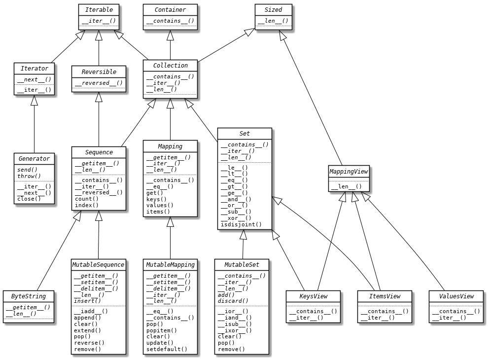

# 抽象

抽象是解决问题的法宝。良好的抽象策略可以简化问题的复杂度，并且提高系统的通用性和可扩展性。在面向对象程序设计出现直接，面向过程的程序设计多是针对的过程抽象。所谓过程抽象是将问题域中具有明确功能定义的操作抽取出来，将其定义为函数。而面向对象程序设计针对的是数据抽象，是较过程抽象更高级别的抽象方式，通过将描述客体的属性和行为绑定在一起，实现统一的抽象，从而达到对现实世界客体的真正模拟。

类是具有相同属性（数据元素）和行为（功能）的对象的抽象。因此，对象的抽象是类，类的具体化就是对象，也可以说**类是抽象数据类型，对象是类的实例**。类具有属性，它是对象的状态的抽象，用数据结构来存储类的属性。类具有操作，它是对象的行为的抽象，用操作名和实现该操作的方法来描述。类的每一个实例对象都具有这些数据和操作方法。

抽象可以具有层次性，由类的继承结构所体现。高层次的抽象封装行为，为低层次的抽象提供签名，可以不实现具体细节，比如抽象基类或接口。低层次的抽象实现具体细节，提供对象实例化功能。通过抽象的层次性和结构性，可以减小问题求解的复杂度。

从 C++ 2.0 起（1989 年发布），这门语言开始使用抽象类指定接口。Java 的设计者选择不支持类的多重继承，这排除了使用抽象类作为接口规范的可能性，因为一个类通常会实现多个接口。但是，Java 设计者提供了 interface 这个语言结构，以更明确的方式定义接口，并允许一个类实现多个接口 —— 这是一种多重继承。自 Java 8 起，接口可以提供方法实现，即默认方法，使得 Java 中的接口与 C++ 和 Python 中的抽象基类更像了。但它们之间有个关键的区别：Java 的接口没有状态。Java 之后使用最广泛的 JVM 语言要数 Scala 了，它就实现了性状（trait）。不管怎么说，让我们先从抽象基类开始，了解 Python 中的高层次抽象类型。

#### 抽象基类

在引入抽象基类（Abstract base classes，缩写 ABC）之前，Python 就已经很成功了。Python 倡导使用**鸭子类型和协议**，忽略对象的真正类型，转而关注对象有没有实现所需的方法、签名和语义。这使得 Python 编码更加宽松，不需要严格的类型限制。因此抽象基类并不是 Python 的第一选择，大概也因为此，直至 Python 语言诞生 15 年后，Python 2.6 中才引入抽象基类。

但这并不意味着抽象基类一无是处，相反，它被广泛应用于 Java、C# 等面向对象语言中。抽象基类的常见用途是实现接口时作为基类使用，它与普通基类的区别在于：

* 抽象基类不能实例化；
* 具体子类必须实现抽象基类的抽象方法。

正是由于抽象基类限定了子类必须实现特定的方法，它被经常用于构建框架。你可以在 Python 标准库的 `collections.abc` 和 `numbers` 模块中见到抽象基类的身影。

Python 中定义抽象基类需要用到标准库提供的 `abc` 模块，该模块由 [PEP 3119 -- Introducing Abstract Base Classes](https://www.python.org/dev/peps/pep-3119/) 提案所引入。它支持两种方式定义抽象基类，一种是使用 `abc.ABCMeta` 作为元类。声明元类的 `metaclass` 关键字参数是 Python 3 引入的，在此之前 Python 2 还得使用 `__metaclass__` 类属性。另一种是直接继承 `abc.ABC` 类，需要注意 ABC 的类型仍然是 ABCMeta。

```python
>>> from abc import ABC, ABCMeta
>>> type(ABC)
<class 'abc.ABCMeta'>
>>> class MyABC(metaclass=ABCMeta): 
...     pass
... 
>>> class MyABC(ABC):
...     pass
... 
```

一般通过继承 `ABC` 来简单地创建抽象基类，当遇到可能会导致元类冲突的多重继承时，也可以使用 `ABCMeta` 作为元类来定义抽象基类。

`abc` 模块还提供了用于声明**抽象方法**的装饰器 `@abstractmethod`。抽象方法定义体中通常只有文档字符串。在导入时，Python 不会检查抽象方法是否被实现，而是在实例化时检查。如果没有实现，将抛出 `TypeError` 异常提示无法实例化抽象类。如下所示：

```python
>>> from abc import abstractmethod
>>> class MyABC(ABC):
...     @abstractmethod
...     def my_abstract_method(self):
...         """My abstract method"""
... 
>>> class C(MyABC): 
...     pass
... 
>>> C()
Traceback (most recent call last):
  File "<stdin>", line 1, in <module>
TypeError: Can't instantiate abstract class C with abstract methods my_abstract_method
```

抽象方法可以有实现代码，但即便实现了，子类也必须覆盖抽象方法。通常这样做的目的是在子类中使用 `super()` 复用基类的方法，为它添加功能而不是从头实现。其实在抽象基类出现之前，抽象方法会抛出 `NotImplementedError` 异常，提示子类必须实现该抽象方法。

除了 `@abstractmethod` 之外，`abc` 模块还定义了 `@abstractclassmethod`、`@abstractstaticmethod` 和 `@abstractproperty` 装饰器，可用于装饰类方法、静态方法和特性。但自 Python 3.3 起这三个装饰器就被废弃了，因为可以使用装饰器堆叠达到同样的效果。在堆叠时，要保证 `@abstractmethod` 是最内层的装饰器，即最靠近函数定义体。如下所示：

```python
class MyABC(ABC):
    @classmethod
    @abstractmethod
    def my_abstract_classmethod(cls, *args, **kwargs):
        pass
        
    @staticmethod
    @abstractmethod
    def my_abstract_staticmethod(*args, **kwargs):
        pass

    @property
    @abstractmethod
    def my_abstract_property(self):
        pass
        
    @my_abstract_property.setter
    @abstractmethod
    def my_abstract_property(self, value):
        pass
```

**注**：PEP 3119 提案同时也引入并定义了集合类型的抽象基类，包括容器和迭代器类型，可以参考提案的 [ABCs for Containers and Iterators](https://www.python.org/dev/peps/pep-3119/#abcs-for-containers-and-iterators) 一节。这些集合类型被统一定义在 `collections.abc` 模块中。为了减少加载时间，Python 3.4 在 `collections` 包之外实现了这个模块，即 `_collections_abc.py`，所以在导入时要使用 `collections.abc` 与 `collections` 分开导入。

#### 注册虚拟子类

Python 中的抽象基类还有一个重要的实用优势：可以使用 register 将某个类声明为一个抽象基类的“虚拟”子类，这样就不用显式继承。这打破了继承的强耦合，与面向对象编程的惯有知识有很大出入，因此在使用继承时要多加小心。

虚拟子类不会从抽象基类中继承任何方法和属性，但类型检查函数 `issubclass()` 和 `isinstance()` 都会通过。Python 不会检查虚拟子类是否符合抽象基类的接口，即便实例化时也不会检查，但会在调用时抛出异常。因此，为了避免运行时错误，虚拟子类要实现抽象基类的所有抽象方法。

注册虚拟子类的 `register()` 方法可以作为普通函数调用，也可以作为装饰器使用。如下定义的抽象基类 Drawable 中定义了一个抽象方法 draw，可以随机抽取一个元素。我们实现了一个扑克类 Poker，使用装饰器形式将 Poker 类注册为 Drawable 的虚拟子类。

```python
import random
from abc import ABC, abstractmethod

class Drawable(ABC):
    @abstractmethod
    def draw(self):
        """Random draw an item."""

@Drawable.register
class Poker:
    def __init__(self):
        self.suits = ('Spade', 'Heart', 'Diamond', 'Club')
        self.numbers = (*range(2, 11), 'J', 'Q', 'K', 'A')

    def __len__(self):
        return 52

    def draw(self):
        suit = self.suits[random.randint(0, 3)]
        number = self.numbers[random.randint(0, 12)]
        return suit, number
```

使用 `@Drawable.register` 与直接调用方法的 `Drawable.register(Poker)` 效果相同，这样即使不用显式继承，Poker 类也会被解释器视为 Drawable 抽象基类的子类型。

```python
>>> poker = Poker()
>>> poker.draw()
('Diamond', 'Q')
>>> issubclass(Poker, Drawable)
True
>>> isinstance(poker, Drawable)
True
```

注册虚拟子类被广泛应用于 `collections.abc` 模块中，比如将内置类型 tuple、str、range 和 memoryview 注册为序列类型 Sequence 的虚拟子类：

```python
Sequence.register(tuple)
Sequence.register(str)
Sequence.register(range)
Sequence.register(memoryview)
```

**`__subclasshook__` 钩子方法**

有时甚至不需要手动注册，抽象基类也能将一个类绑定为虚拟子类。比如 Poker 类会被绑定为 `collections.abc.Sized` 的虚拟子类：

```python
>>> from collections.abc import Sized
>>> issubclass(Poker, Sized)
True
```

这是由于 Sized 抽象基类内部实现了一个名为 `__subclasshook__` 的钩子方法。这个方法会去检查类中是否包含 `__len__` 方法，如果包含，那么类型检查 `issubclass()` 和 `isinstance()` 会返回 True。

同理，我们可以为 Drawable 类实现此钩子方法，方法的两个参数指代的均是类对象 `__class__`。这样即使不手动注册，实现了 draw 方法的扭蛋机类 Capsule 也会被判定为 Drawable 的子类：

```python
class Drawable(ABC):
    @abstractmethod
    def draw(self):
        """Random draw an item."""

    @classmethod
    def __subclasshook__(cls, C):
        if cls is Drawable:
            return 'draw' in dir(C)
        return NotImplemented
        
class Capsule:
    def draw(self):
        ...
        
# >>> issubclass(Capsule, Drawable)
# True
```

实际上，很少需要为自己编写的抽象基类实现 `__subclasshook__` 方法，虽然这符合 Python 对于“鸭子类型”的定义，但这样做可靠性很低。好比说，不能指望任何实现了 draw 方法的类都是 Drawable 类型（可随机抽取元素），因为 draw 可能还指代其他语义，比如画图。

类型检查函数 `issubclass()` 和 `isinstance()` 之所以会返回 True，是由于定义在 ABCMeta 类中的 `__subclasscheck__` 和 `__instancecheck__` 特殊方法会覆盖其行为。在 ABCMeta 的构造方法中定义了一些 WeakSet 类型的类属性：`_abc_registry`、`_abc_cache` 和 `_abc_negative_cache`，它们会动态的存放抽象基类的虚拟子类（类型检查时会动态添加）。可以通过调试接口 `_dump_registry()` 查看一个抽象基类的虚拟子类。

```python
>>> Drawable._dump_registry()
Class: __main__.Drawable
Inv. counter: 45
_abc_registry: set()
_abc_cache: {<weakref at 0x10b0e5220; to 'type' at 0x7f9c88f3e380 (Poker)>, <weakref at 0x10b0fe9a0; to 'type' at 0x7f9c88cb0dc0 (Capsule)>}
_abc_negative_cache: set()
_abc_negative_cache_version: 45
```

**注**：ABCMeta 类的 Python 源码可以在 `_py_abc` 模块中查看。CPython 提供了一套基于 C 语言的更高效实现，仅在其导入失败时，才导入 `_py_abc` 模块中的 ABCMeta。

**白鹅类型**

最早提出“鸭子类型”的 Alex Martelli 建议在鸭子类型的基础上添加“白鹅类型”。白鹅类型是指，只要 cls 是抽象基类，即 cls 的元类是 `abc.ABCMeta`，就可以使用 `isinstance(obj, cls)`。事实上，虚拟子类就是一种白鹅类型，当我们向抽象基类注册一个虚拟子类时，ABCMeta 会将该类保存在抽象基类的类属性中，以供类型检查使用。

虚拟子类是抽象基类动态性的体现，也是符合 Python 风格的方式。它允许我们动态地改变类的属别关系。抽象基类定义了一系列方法，并给出了方法应当实现的功能，在这一层次上，“白鹅类型”能够对类型进行甄别。当一个类继承自抽象基类时，语言本身限制了该类必须完成抽象基类定义的语义；当一个类注册为虚拟子类时，限制则来自于编写者自身（成年人）。两种类都能通过“白鹅类型”的校验，不过虚拟子类提供了更好的灵活性与扩展性。例如，一个框架允许第三方插件时，采用虚拟子类即可以明晰接口，又不会影响内部的实现。

#### 自定义抽象基类

在各类编程语言中，基础的数据结构都必不可少，比如链表、堆栈、集合等，对于这些数据结构，语言会对它们进行抽象，定义接口并设计一套继承体系。Java 将这些数据结构统称为容器（意指用于容纳数据），从最底层的 List、Set、Map 等接口，到 AbstractList、AbstractSet、AbstractMap 等抽象类，再到最上层的 ArrayList、HashSet、HashMap 等具体实现类，越靠近上层的类方法越丰富，但底层的接口和抽象类是框架的骨架，构成了整个容器框架。同时，接口和抽象类也是体现 Java 语言多态性（向上转型）的重要设计。

Python 的容器抽象基类定义在 `collections.abc` 模块中，其 UML 类图如下所示：



下面我们尝试使用 Python 中的抽象基类实现一个自定义的容器类型。为了简化，这个容器类型仅支持新增 `push()` 和删除 `pop()` 两个操作。由于不同子类的具体实现不同，比如栈是先进后出，队列是先进先出，所以这两个方法被定义为抽象方法。此外还提供了检视容器元素的 `inspect()` 方法，由于实现逻辑相同，因此 `inspect()` 可以是具体方法。

```python
from abc import ABC, abstractmethod

class Container(ABC):
    def __init__(self, iterable=None):
        if iterable:
            self._items = list(iterable)
        else:
            self._items = []

    @abstractmethod
    def pop(self):
        """Remove and return item. Raises IndexError if container is empty."""

    @abstractmethod
    def push(self, item):
        """Add item."""

    def inspect(self):
        return self._items
```

可以看到，抽象基类既可以拥有抽象方法，也可以拥有具体方法。代码中的初始化方法 `__init__` 和 `inspect()` 方法都是具体方法，但子类依然可以覆盖具体方法，或者使用 `super()` 调用它们进行功能增强。

#### 自定义抽象基类的子类

接下来我们实现 Container 抽象基类的两个具体子类：栈和队列。

```python
class Stack(Container):
    def pop(self):
        if not len(self._items):
            raise IndexError('Stack is empty.')
        return self._items.pop()  # remove last item

    def push(self, item):
        self._items.append(item)


class Queue(Container):
    def pop(self):
        if not len(self._items):
            raise IndexError('Queue is empty.')
        return self._items.pop(0)  # remove first item

    def push(self, item):
        self._items.append(item)
```

由于具体子类继承自抽象基类 Container，所以在类声明时必须明确指定类扩展自 Container 类。并且覆盖抽象基类中的两个抽象方法。栈和队列的 `pop()` 行为不同，栈满足先进后出，而队列满足先进先出，并在容器为空时均抛出 IndexError 异常。接下来验证栈和队列的特性：

```python
>>> stack = Stack([1, 2])
>>> stack.push(3)
>>> stack.pop()
3
>>> stack.inspect()
[1, 2]
>>> queue = Queue([1, 2])
>>> queue.push(3)
>>> queue.pop()
1
>>> queue.inspect()
[2, 3]
```

#### 何时使用抽象基类

对于简单的个人应用，优先使用现有的抽象基类，而不是自己编写抽象基类，因为这很容易造成过度设计。毕竟对于 Python 来说，“简单”永远是这门语言的核心，滥用抽象基类会造成灾难性后果，太注重语言的表面形式对于以实用和务实著称的 Python 可不是好事。

抽象基类可以约束各个子类实现相同的一套 API。除此之外，抽象基类的一个用途是运行时的类型检查，可以使用 `isinstance()` 检查某个对象是否是抽象基类的子类型，即是否实现了特定的接口。这便于我们对于不同的情形进行分支处理或异常捕获。

尽管抽象基类使得类型检查变得更容易了，但也不该过度使用它。Python 的核心在于它是一门动态语言，如果处处都强制实现类型约束，那么会使代码变得复杂且丑陋。我们应该拥抱 Python 的灵活性。

因此对于抽象基类的使用，要着重声明：除非构建的是允许用户扩展的框架，否则不要轻易定义抽象基类。日常使用中，我们与抽象基类的联系应该是创建现有抽象基类的子类。当你拥有像创建新的抽象基类的想法时，首先尝试使用常规的鸭子类型来解决问题。
